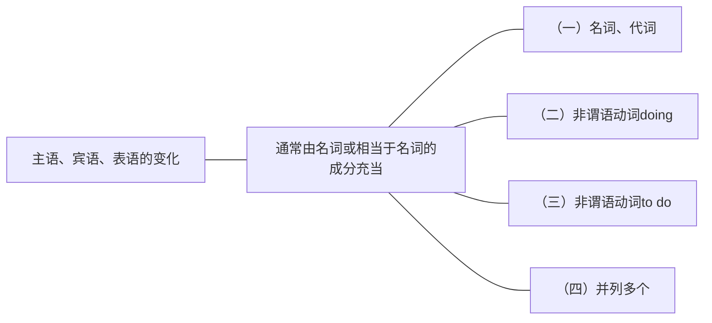

简单句中，除了重点掌握谓语动词的变化之外，同学们还要注意主语、宾语、表语的变化。主语、宾语、表语的部分通常由名词或代词来充当，也可以换成其他相当于名词的形式，可以是非谓语动词doing或to do，又或者是从句（从句的部分详见第二部分第二章）。

## （一）名词、代词
- 最常见的是名词或名词词组来作主语、宾语、表语，其次是代词来代替上下文中提过的名词，来作这些成分。
	- 例：The process is natural selection．（2008，Use of English）
	glish)[^1]
	名词The process作主语，名词词组natural selection在系动词后作表语。
	- 例：But most law graduates never get a big-firm job．（2014，Reading Comprehension，Part A Text 2）[^2]
	名词词组most law graduates作主语，名词词组a big-firm job在及物动词后作宾语。 
	- 例：They financed them．（2001，Reading Comprehension，Passage 2）[^3]
	代词They作主语，而代词them在及物动词后作宾语，二者指代上文中提过的对象。

[^1]:翻译：其过程是自然的选择。
[^2]:翻译：但是绝大多数的法学院的毕业生并未能进入大公司工作。
[^3]:翻译：他们（这些国家）给他们提供资金。
# （二）非谓语动词doing
“非谓语动词”，顾名思义就是“不作谓语的动词”，可以充当除了谓语之外的其他成分，如：主语、宾语、表语、定语、状语等。非谓语动词一共有三种形式：doing、done、to do。其中doing和to do都可以相当于名词来用，即可以在句子中作主语、宾语、表语的成分。注意：动词一般作谓语，如果要在句子中作主语、宾语等，需要变成非谓语的形式。
## 1.doing作主语
例：…suffering is inevitable…（2014，Reading Comprehension，Part C）[^4]

例：…laughing probably has little influence on physical fitness．（2011，Use of English)[^5]
动词suffer和laugh不能直接作主语，因此要把它们变成相当于名词形式的非谓语动词suffering和laughing才能作主语。

- 【补充】doing作主语，谓语动词用单数（如上两句）。除非有多个doing并列，用复数。然而，doing作成分时不一定只有一个词，如果是及物动词的话，要后接宾语，因此词组“doing sth.／sb.”会作为一个整体出现，来作主语、宾语等成分。有时还会有其他修饰限定的成分伴随doing，例如形容词、副词、介词短语等。
	- 例：Making friends is extremely important to teenagers…（2003，Use of English）[^6]
	make是及物动词，后接宾语friends，再变为doing词组Making friends，作为一个整体来充当主语。
	- 例：Broadcasting his ambition was ＂very much my decision，''…（2011，Reading Comprehension,Part A Text 2)[^7]
	broadcast是及物动词，要后接宾语his ambition，再变为doing词组Broadcasting his ambition，作为一个整体来充当主语。
	- 例：On the other hand，putting your faith in the wrong place often carries a high price．（2018， Use of English)[^8]
	此句中doing词组putting your faith in the wrong place作为一个整体，来充当该句的主语。其中put为及物动词，所以后接了宾语your faith，并且在其后加了介词短语in the wrong place补充 说明位置。

[^4]:翻译：……苦难是不可避免的……
[^5]:翻译：……笑很可能对身体健康影响甚微。
[^6]:翻译：交友对青少年极为重要……
[^7]:翻译：（McGee说）宣布志向就是“自己的决定”……
[^8]:翻译：另一方面，把你的信任放在错误的地方经常会付出很高的代价。
## 2.doing作宾语
宾语成分一般有两种位置：动宾或介宾（即位于及物动词后或介词后）。因此doing作宾语也有这两种位置。

例：Americans stopped taking prosperity for granted．（2000，Reading Comprehension， Passage1)[^9]
及物动词stopped（stop的过去式）后面要接宾语，宾语则由doing词组taking prosperity for granted来充当。

例：Thinking is essentially a process of making connections in the brain．（2014，Use of English）[^10]
介词of后面要接宾语，宾语则由doing词组making connections in the brain来充当。其中 make是及物动词，后接宾语connections，然后再加上介词短语in the brain表示位置。注意句首的Thinking是doing作主语。

[^9]:翻译：美国人不再将繁荣视为理所当然。
[^10]:翻译：思考本质上是在大脑中建立联系的一个过程。
# （三）非谓语动词to do
除了doing之外，非谓语动词todo也可以相当于名词来用，充当主语、宾语、表语等成分。
## 1.to do作主语
to do和doing作主语时，意思差别不大，可以互换。但要注意位置有两种：to do和doing作主语，如果较短（单词数量较少）则都可以直接放在句首；反之，较长（单词数量较多或词组较长）的话可以挪到句尾，句首用形式主语it来占位置。虽然两者作主语位于句首句尾都可以，并且意思一样，但其实在考研真题中最常考查的是doing作主语位于句首，而to do作主语常位于句尾（句首用形式主语it）。

例：…to decide is to kill off all possibilities but one…（2009，Reading Comprehension，PartA Text1)[^11]
此句中to decide作主语，由于比较短，可以直接置于句首。而to do词组to kill off all possibilities but one位于系动词is后作表语。 ^rbnm0s

【补充】to do作主语，谓语动词用单数（如[[句句真研/Part1 简单句/第一章 简单句的核心/主语、宾语、表语的变化#^rbnm0s|上句]]）。有多个to do并列时，用复数。

- 【补充】主系表结构中，主语和表语都可以用非谓语动词doing或to do。但如果前后同时使用时，请注意前后保持一致，即主语和表语同时都用doing，或同时都用to do。如下：
	- Seeing is believing.√
	- To see is to believe.√
	- Seeing is to believe.×
	- 翻译：眼见为实。

- to do作成分时不一定只有这两个词，如果是及物动词的话，要后接宾语，因此词组“to do sth.／sb.”会作为一个整体出现，来作主语、宾语、表语等成分。有时还会出现其他修饰限定的成分伴随不定式，例如形容词、副词、介词短语等
	- 例：...to anticipate every imaginable driving situation is a difficult programming problem.（2019，Read Comprehension,Part A Text 3）[^12]
	句中anticipate是及物动词，后接宾语situation，situation前又加入了修饰限定的成分every imaginable driving，整个to do词组to anticipate every imaginable driving situation作主语，表示 “预测每一个可以想象得到的驾驶情况”。

- 在考研真题中，to do或to do词组作主语直接置于句首的情况比较少，绝大多数的情况下都是置于句尾，句首用形式主语it来代替，这个非常重要。
	- 例：It is important to do so．（2002，Use of English）[^13]
	原句应为To do so is important.其中主语为to do so，但作主语常常后置，因此前面就用形式主语it来代替。
	- 例：It is painful to read these roundabout accounts today．（2010，Reading Comprehension， Part C）[^14]
	此句中真正的主语后置，前面用了形式主语it来代替。真正的主语为to do词组to read these roundabout accounts today，其中read为及物动词，后接宾语these roundabout accounts，副词 today表示时间。
	- 例：…it took Beaumont decades to perfect her craft…（2013，Reading Comprehension，Part A Text 1)[^15]
		- 此句中真正的主语to do词组to perfect her craft后置，前面用了形式主语it来代替。
		- 此句也是考研真题中常出现的一个句型：It takes sb.some time to do sth.表示“花费某人多长时间做某事”。其中谓语动词takes可以根据具体的时间调整为相应的时态。
	- 例：So it seems paradoxical to talk about habits in the same context as creativity and innovation.(2009,Reading Comprehension,Part A Text 1)[^16]
	此句中真正的主语后置，前面用了形式主语it来代替。真正的主语为to do词组to talk abouthabits in the same context as creativity and innovation，这个to do主语比较长，其中包含三个介词 about、in、as引出的介词短语作补充信息。

[^11]:翻译：……决定是保留一种可能性而扼杀其他全部……
[^12]:······预测每一个可以想象得到的驾驶情况是一个困难的编程问题。
[^13]:翻译：做到这一点是非常重要的。
[^14]:翻译：现在读这些拐弯抹角的陈述是令人痛苦的。
[^15]:翻译：Beaumont用了几十年的时间去完善自己的手艺……
[^16]:翻译：因此，将习惯同创造性和创新在同一语境下讨论似乎是矛盾的。
## 2.to do作宾语
- to do作宾语，只位于及物动词后，不能位于介词后（介词后要用doing）。但及物动词后究竟用doing还是to do作宾语，主要是由及物动词来决定，取决于它的习惯搭配，例如：有些动词后只能选择其中之一作宾语，例如："enjoy+doing" "want+to do"；但有些动词后 doing或to do两者都可作宾语，例如："start+doing"或"start+to do"。
	- 例：They may then decide to go elsewhere．（2011，Reading Comprehension，Part B)[^17]
	此句中to go elsewhere位于及物动词decide后，作宾语，构成decide to do sth.的形式。
	- 例：Fortunately，the White House is starting to pay attention．（2005，Reading Comprehension,Part A Text 2)[^18]
	此句中to pay attention位于及物动词start后，作宾语，构成start to do sth.的形式。 

- 【补充】to do作宾语还可以后置，而形式宾语也用it。但后置的条件除了真正的宾语to do比较长之外，还有一个条件就是要在主谓宾补的句型中（因为如果是在主谓宾的句型中，即使宾语再长，它也已经是最后一个成分，不需要再后置）。 ^zvgnwe
	- 例：The decisions made it more difficult for states to collect sales tax on certain online purchases.(2019,Reading Comprehension,Part A Text 4)[^19]
	The decisions made it more difficult为主谓宾补句型，it是形式宾语，代替了真正的宾语to collect sales tax on certain online purchases。此句真正的宾语是一个较为复杂的to do词组，因此被后置。其中to collect sales tax是动宾结构（及物动词＋宾语），表示“征收销售税”，on certain online purchases是介词短语来补充说明“征收在什么方面的销售税”。 

[^17]:翻译：他们之后可能会决定另谋出路。
[^18]:翻译：幸运的是，白宫开始关注这件事了。
[^19]:翻译：这些决定使各州更难以对某些网络购物征收销售税。
## 3.to do作表语
to do作表语，主要位于系动词后，通常是be动词后。考研英语中出现得非常少，简单了解即可。

例：The trick is to direct these funds better．（2013，Reading Comprehension，Part B）[^20]
to do词组to direct these funds better位于系动词is后，作表语。

例：The commission was also to consider possible arrangements for the War and Navy Departments.(2018,Reading Comprehension,Part B)[^21]
to do词组to consider possible arrangements for the War and Navy Departments位于系动词was 后，作表语。

例：...one benefit of a “national” organization would be to negotiate better prices...with drug manufacturers.(2005,Reading Comprehension,Part B)[^22]
to do词组to negotiate better prices...with drug manufacturers位于系动词（would be，即be动词 的过去将来时）后，作表语。其中negotiate为及物动词，后接了宾语prices，prices前又加上了形容词的比较级better修饰，构成to do词组to negotiate better prices；然后再接介词短语with drug manufacturers进一步补充说明“与谁谈判”。

[^20]:翻译：诀窍在于更加合理地去管理这些资金。
[^21]:翻译：该委员会还考虑了陆军和海军部的可能安排。
[^22]:翻译：·····“国家”级机构的好处之一就是能够通过谈判从医药生产商那里获得······更优惠的价格。
# （四）并列多个
- 通常简单句中的主语、宾语、表语都是一个对象，即一个名词或代词、一个doing或todo。如果想表述多个对象（作为一个整体），也可以把多个名词、代词、doing或to do并列在一起作主语、宾语、表语。并列多个对象时，通常会在中间加上并列连词（或词组），最常用的就是and和or，如下：
	- 例：Science and technology would cure all the ills of humanity……（2013，Reading Comprehension,Text 3)[^23]
		此句中想表达“科技”，即“科学和技术”，因此主语并列了两个对象science和technology，它们作为一个整体，通过并列连词and连接。
	- 例：Second，they are mostly bright and well-educated．（2012，Reading Comprehension，Part A Text 4)[^24]
		此句中表语为两个形容词bright和well-educated，通过并列连词and连接。
		
注意：表语不仅可以由名词或相当于名词的成分（代词或非谓语动词）来充当，同时也可以用形容词或介词短语等来充当。

- 如果并列连词相同，并列多个对象时可以把前面的连词省略，用逗号代替，最后一个对象前再加上并列连词，如下：
	- 例：Consequently，our feelings，thoughts and emotions have undergone a corresponding change.(2000,Reading Comprehension,Passage 3）[^25]
	此句中，主语为三个对象：our feelings，thoughts，emotions。但不要写成our feelings and thoughts and emotions，因为并列连词都相同，所以省略前面的连词，换成逗号连接，就变成了our feelings,thoughts and emotions。
	- 例：Social science disciplines include geography, economics,political science,psychology, and sociology.(2003,Reading Comprehension,Part B)[^26]
	此句中，及物动词include后的宾语为五个对象：geography，economics，political science， psychology，sociology。但不需要在中间依次加上四个一样的并列连词and，所以省略前面的连词，换成逗号连接，就变成了geography，economics，political science，psychology，and sociology。

- 但是如果并列连词不同，并列多个对象时则不能省略并列连词，如下：
	- 例：That doesn't mean lying down and becoming fooled,or letting foreign corporations run uncontolled.(2001,Reading Comprehension,Passage 2)[^27]
	- 此句中，及物动词mean后的宾语（doing作宾语）为三个对象：lying down，becoming fooled，letting foreign corporations run uncontrolled。但前两者之间是并列的关系（“和”）， 用并列连词and连接；后两者之间是选择的关系（“或者”），用并列连词or连接。由于要表达的意思不同，使用的两个并列连词不同，所以不能省略，要依次加上，就变成了lying downand becoming fooled,or letting foreign corporations run uncontrolled。

考研真题中，并列多个主语、宾语、表语时，常用的并列连词（或词组）主要分为两类：

[^23]:翻译：科学和技术会治愈人类的所有疾病……
[^24]:翻译：第二，他们大多数聪明并受过良好的教育。
[^25]:翻译：因此，我们的情感、想法和情绪也经历了相应的变化。
[^26]:翻译：社会科学的学科包括地理学、经济学、政治学、心理学和社会学。
[^27]:翻译：这并不意味着卑躬屈膝和任人愚弄，或是对外国公司不加控制。
## 1.表示并列（顺接）
|并列连词（或词组）|表达含义|
|:---:|:---:|
|…and…|…和…|
|both…and…|…和…|
|not only…but also…|与“…和…”意思相同，但更书面化|

例：New skills and unfamiliar business models are needed too．（2010，Reading Comprehension,Part B)[^28]
并列两个名词词组，作主语，通过and连接。

例：it involves setting specific goals， obtaining immediate feedback and concentrating... technique...(2007,Reading Comprehension,Part A Text 1)[^29]
并列三个doing词组，作宾语（及物动词involves后），通过逗号和and连接。

例：In both oral （English） and written English，talking is triumphing over speaking， spontaneity over craft.(2005,Reading Comprehension,Part A Text 4)[^30]
并列两个名词词组，作宾语（介词in后），通过both...and...连接。

例：The researchers mapped not only the city's vast and ornate ceremonial areas， but also hundreds of simpler apartment complexes…(2014,Reading Comprehension,Part B)[^31]
并列两个名词词组，作宾语（及物动词mapped后），通过not only...but also...连接。

[^28]:翻译：（他们）也需要掌握新的技能和不熟悉的商业模式。
[^29]:翻译：……它包括设定明确的目标、获得及时的反馈以及专注于技术……
[^30]:翻译：无论是在口语还是在书面语的英语中，随意言谈胜过雅致的言辞，自我发挥也胜过精心准备。
[^31]:翻译：研究人员不仅绘制出这座城市宽阔华丽的仪式地区，还绘制出数百座较为简陋的公寓大楼……
## 2.表示选择
|并列连词（或词组）|表达含义|
|:---:|:---:|
|…or…|…或者…（二选一）|
|either…or…|…或者… （二选一，同or）|
|neither…or…|既不…也不…（两者都不选）|

例：But demanding too much of air travelers or providing too little security in return undermines public support for the process.(2017,Reading Comprehension,Part A Text 1)[^32]
并列两个doing词组，作主语，通过or连接。

例：...the amateurs have tended either to remain in local societies or to come together nationally in a different way.(2001,Reading Comprehension,Passage 1)[^33]
并列两个to do词组，作宾语（及物动词tended后），通过either...or...连接。

例：...today's immigrationis neither at unprecedented levels nor resistant to assimilation. (2006,Reading Comprehension,Part A Text 1)[^34]
并列两个短语，作表语（系动词is后），通过neither..nor...连接。

[^32]:翻译：但是（这一措施）对航空旅客要求过多，或者为其回报的安全性太少，逐渐削弱了人们对这一安检过程的支持程度。
[^33]:翻译：而业余的（地质学家）或者留在地方性团体中，或者以不同方式组成全国性的团体。
[^34]:翻译：······如今的移民既未达到历史最高峰，也不排斥同化。
# 内容小结
1. 考研真题中，主语、宾语、表语的变化主要有四种：
	1. 名词、代词；
	2. 非谓语动词doing；
	3. 非谓语动词to do；
	4. 并列多个主语、宾语、表语。
2. 非谓语动词doing或to do作成分时，注意其完整性，及物动词要后接宾语，表示修饰限定还可以加副词、形容词、介词短语。
3. 并列多个主语、宾语、表语时，注意根据并列连词找到并列的多个对象，并且把它们看作一个整体（因为作同一个成分）。
# 真题演练
1. Getting the print edition seven days a week costs nearly $500 a year...(2016,Reading Comprehension,Part A Text 4)
翻译：每周七天获得印刷版的费用每年近500美元·
解析：doing词组Getting the print edition seven days a week作主语。

2. To read such books today is to marvel at the fact...(2010,Reading Comprehension,Part A Text 1) 
翻译：今天我们阅读这样的书籍，会惊讶于这样的一个事实...
解析：to do词组To read such books today作主语。

3. Nevertheless,·a person's early life and its conditions are often the greatest gift to an individual.(2011,Reading Comprehension,Part C)
翻译：不过，···一个人的早期生活和生活环境往往是他个人得到的最珍贵的礼物。
解析：并列名词词组a person＇s early life和lits conditions作主语。

4. It would be a shame to raise prices too much...(2006,Reading Comprehension,Part A Text 2) 翻译：把价格提高太多将是一件令人遗憾的事·..
解析：to do词组to raise prices too much作真正的主语，被后置，it作形式主语放在 句首。
5. …spending on legal services in America grew twice as fast as inflation.(2014,Reading Comprehension,Part A Text 2)
翻译：在美国，法律服务的价格的增长速度是通货膨胀的两倍。解析：doing词组spending on legal services in America作主语。

6. It is fair to criticize and question the mechanism…(2014,Reading Comprehension,Part A Text 3) 
7翻译：对于机制的质疑和批评都有它的合理性···.
解析：to do词组to criticize and question the mechanism作真正的主语，被后置，it作形式主语放在句首。

7. Trail blazes,tire tracks, and other features can lead you to civilization.(2019,Use of English) 
翻译：火的痕迹、轮胎痕迹和其他特征可以引导你走向文明（找到路）。
解析：名词词组Trail blazes、tire tracks和other features并列作主语。

8. It is not easy to talk about the role of the mass media in this overwhelmingly significant phase in European history.(2005,Reading Comprehension,Part C)
翻译：在欧洲历史上这个意义非凡的阶段里，谈论大众媒体的作用并非易事。
解析：to do词组to talk about the role of the mass media in this overwhelmingly significant phase in European history作真正的主语，被后置，it作形式主语放在句首。

9. Setting the proper investment level for security, redundancy, and recovery is a management issue,not a technical one...(2007,Reading Comprehension,Part A Text 4)
翻译：为数据安全、数据备份以及数据恢复设立合适的投资标准是一个管理问题，不是技术问题·....
解析：doing词组Setting the proper investment level for security，redundancy，and recovery作主语。

10. Terrorism,economic uncertainties and general feelings of insecurity have increased people's anxiety.(2005,Reading Comprehension,Part A Text3)
翻译：恐怖主义、经济上的不确定因素及通常的不安全感都增加了人们的焦虑。
解析：并列名词（词组）Terrorism、economic uncertainties和general feelings of insecurity作 主语。

11. But privacy is not the only angle in this case and not even the most important(2018, Reading Comprehension,Part A Text 3)
翻译：但在这种情况下，隐私并不是唯一的角度，甚至不是最重要的（角度）。
解析：并列词组not the only angle in this case和lnot even the most important作表语，位于 系动词is后。

12. ...artists' only job is to explore emotions...(2006,Reading Comprehension,Part A Text 4)
翻译：·····艺术家唯一的工作就是探索情感…
解析：to do词组to explore emotions作表语，位于系动词is后。

13. Americans have generally stopped growing(2008,Reading Comprehension,Part A Text3)
翻译：美国人（的身高）总体上已经停止了增长。
解析：growing作宾语，位于及物动词stopped后。 

14. …the best strategy is to use the agent as a kind of tip service...(2004,Reading Comprehension, Part A Text 1)
翻译：……最佳的策略是把搜索引擎当作一种提示服务……
解析：to do词组to use the agent as a kind of tip service作表语，位于系动词is后。

15. Quicker turnarounds mean less wasted inventory,more frequent releases, and more profit. (2013,Reading Comprehension,Part A Text 1)
翻译：更快的周转意味着浪费更少库存，发布更多新品并获得更多利润。
解析：并列名词词组less wasted inventory、more frequent releases和more profit作宾语， 位于及物动词mean后。
# 考场攻略
主宾表语的四种变化中，doing和to do建议重点掌握。
攻略：看懂复杂多变的主宾表语

考研真题中有些句子很难看懂，其中一个主要原因就是同学们很难找到句子所描述的对象—主语、宾语、表语等，因为这些成分常常有很多复杂的变化。怎么解决这个问题？

首先，要准确地定位谓语动词；其次，要通过谓语动词的位置找到其前面的主语和后面的宾语或表语，并且看懂是什么成分来充当的。

如果是名词或代词来作主宾表语，相对来讲比较容易看懂；但如果是doing或to do作主宾表语，则较难识别和看懂，尤其要注意把doing和to do整体的调组完整找到。

例：In adulthood，looking at someone else in a pleasant way can be a complimentary sign of paying attention.(2020,Reading Comprehension,Part B)[^35]
上句中，先找到谓语动词can be（情态动词＋动词原形，是一个整体的谓语），那么之前的looking at someone else in a pleasant way自然就是主语，是一个doing词组作主语，这个主语复杂的原因在于它不仅仅有doing，其后还包含了两个介词短语表示补充说明。
谓语动词中的be是系动词，那么其后的a complimentary sign of paying attention则是表语。 表语还可以再细分，其中名词词组a complimentary sign很容易看懂，但要注意介词of后的payingattention，是doing词组作介词的宾语。所以此句中有两个doing词组，分别作的是主语和（表语中的）介词后的宾语。
在此要特别提醒各位同学，不要纠结于句子成分到底是宾语、表语还是介词宾语等，这些不重要；重要的是同学们能够把句子里面的“词”聚合成“意思群”来看，这样能够帮助大家看懂句子。例如上句中的looking at someone else in a pleasant way，要能看出这些词是一个“意思群”。 

例：The main purpose of this “clawback＂ rule is to hold bankers accountable for harmful risk-taking and to restore public trust in financial institutions.(2019,Reading Comprehension,Part A Text 1)[^36]
上句中，先找到谓语动词is，那么之前的The main purpose of this “clawback” rule自然就是主语，是一个名词词组作主语，A of B的结构有“B的A”这一含义。
谓语动词is是系动词，那么其后的to hold bankers accountable for harmful risk-taking and to restore public trust in financial institutions则是表语，但表语部分比较复杂，是由两个并列的to do词组 通过and连接而成。所以大家掌握了主宾表语的变化之后，就可以把复杂的句子迅速简化，本句就可以直接简化为“主语 is to do l and to do 2”，更容易看懂并理解。

例：...building new educational systems there and putting enough people through them to improve economic performance would require two or three generations.(2009,Reading Comprehension, Part A Text 3)[^37]
上句中，先找到谓语动词would require，那么之前的building new educational systems there and putting enough people through them to improve economic performance 自然就是主语，但主语部分比较 复杂，是由两个并列的doing词组通过and连接而成。谓语动词中的require是及物动词，那么其后的two or three generations则是宾语，这个很容易看懂。
通过以上的例子，同学们会发现主宾表语虽然多变，但是万变不离其宗，只要掌握了给大家总结的四种变化就可以轻松应对。

[^35]:翻译：在成年期，以愉快的方式看着别人可能是一种表示关注的赞美信号。
[^36]:翻译：该“补偿性”规则的主要目的是要求银行家对有害的冒险行为负责，并恢复公众对金融机构的信任。
[^37]:翻译：在那里（这些国家）建立新的教育体制并通过这种体制培养足够的人才来提高经济效益需要两三代人的时间。