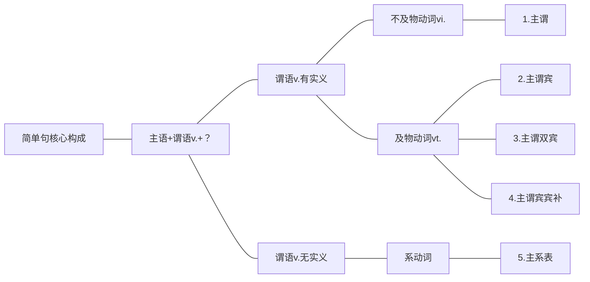

# 语法评解
想表达清楚一件事，写成一个简单句，就需要连词成句。而一件事最核心的两个构成部分就是“物质”和“运动”（马克思主义哲学中指出“世界是物质的，物质是运动的”，因此有了物质和运动就可以把一件事描述清楚），所以构成简单句的核心就是“名词”和“动词”。其中，名词作主语（表述的对象），动词作谓语（表述的内容）。由于简单句描述的是一件事，所以其核心构成就是“一主一谓，一一搭配”（谓语动词不能多，也不能少）。

谓语动词作为简单句的核心，它的不同就决定了简单句的不同，因此简单句可以再细分成五类不同的核心构成：主谓、主谓宾、主谓双宾、主谓宾补、主系表。

谓语动词主要分成两大类：实义动词和非实义动词。其中，谓语动词有实义（实义动词），是指谓语动词有实在的动作含义，例如：swim、dance对应着动作“游泳”和“跳舞”。谓语动词无实义（非实义动词），是指谓语动词没有实在的动作含义，例如：be、seem不对应任何的动作。

实义动词可再细分成两类：及物动词（vt.）和不及物动词（vi.）。通常同学们会认为它们的区别在于是否后接宾语，但是及物动词和不及物动词最根本的区别在于这个动作是否可以由主语独立完成。所谓“及物”，即“涉及别的物”，也就是主语不能自己独立完成这个动作，后面需要加上动作涉及的物（动词的宾语）。所谓“不及物”，即“不涉及别的物”，也就是主语能自己独立完成这个动作，后面不需要加上任何对象，即不接宾语。

根据谓语动词的不同分类，简单句细分如下：

## 1.主谓＝主语+不及物动词（vi.）
例：Everybody else loses．（2019，Reading Comprehension,Part B)[^1]
谓语动词loses，表示“失败”，指主语自己失败，动作不涉及别的物，即不及物动词，则不需要后接宾语，主谓两部分就可以构成完整的简单句。

例：Smaller species survived．（2006，Reading Comprehensiosion,Part A Text 3)[^2]
谓语动词survived，表示“幸存，活下来”，指主语自己活下来（独立完成的动作），不及物动词，因此该句是主谓结构的简单句。

[^1]:翻译：其余的每个人都失败了。
[^2]:翻译：较小的物种存活了下来。
## 2.主谓宾＝主语+及物动词（vt.）＋宾语
例：Eveverybody loves a fat pay rise.(2005.Reading Comprehension,Part A Text 1)[^3]
谓语动词loves，表示“爱，喜欢”，后面需要接爱的是“谁”或“什么”，及物动词。因为动作涉及别的物，则需要把涉及的对象（动词的宾语）接在后面，主谓宾三部分才能构成完整的简单句。

例：In both cases，we need a rebalancing of power．（2020，Reading Comprehension，Part A Text 2)[^4]
谓语动词need，表示“需要”，后面需要接“需要什么”，及物动词，因此该句是主谓宾结构的简单句。

 例：Yet science has a cultural history，too…（2017，Reading Comprehension，Part A Text 2）[^5]
谓语动词has，表示“有”，后面需要接“有什么”，及物动词，此句为主谓宾结构的简单句。

例：Several of his staff members have military-intelligence backgrounds．（2003，Reading Comprehension,Part A Text 1)[^6]
谓语动词have，表示“有”，用法同上句，此句也为主谓宾结构的简单句。
【补充】对比上面两个例句，同学们会发现：从表面上来看，句子的内容、长度和难度大不相同。但是从本质上来讲，结构是完全相同的，同样是“主谓宾”结构的简单句，只不过换成了不同的单词组成。因此，只要大家掌握了句子的核心构成，就能发现组成句子的单词无论如何变化，结构都是万变不离其宗的。

[^3]:翻译：人人都喜欢丰厚的加薪。
[^4]:翻译：在这两种情况下，我们都需要重新平衡权力。
[^5]:翻译：然而，科学也有文化历史……
[^6]:翻译：他的一些职员有军事情报工作背景。
## 3．主谓双宾=主语＋及物动词(vt.)+两个宾语（人＋物）
及物动词有时要涉及两个对象，就需要后接两个宾语（通常双宾语是“人＋物”）。

例：They gave justices permanent positions...(2012,Use of English)[^7] 
谓语动词gave，表示“给予”，及物动词。它涉及两个对象，一是法官，二是永久的职位，因此后接了两个宾语，构成了主谓双宾结构的简单句。

例：…railroads charged all customers the same average rate...(2003,Reading Comprehension,Part A Text 3)[^8]
谓语动词charged，表示“收取”，及物动词。它涉及两个对象，一是所有顾客，二是同样的平均费率，因此后接两个宾语，构成了主谓双宾结构的简单句。
【补充】主谓双宾结构中，由于有两个宾语（人＋物），且这两个宾语的前后顺序是可以调换的，既可以是“人＋物”，也可以是“物＋人”，因此主谓双宾结构的句子有两种写法，且表意相同。如下：

例：They gave justices permanent positions...
 vt.＋人＋物 
=They gave permanent positions to justices…
vt.+物+介词＋人
注意在“物＋人”的情况下，中间要加入介词，通常为to或者for，to强调动作的方向，for强调动作的目的。
【补充】主谓双宾结构中，无论两个宾语“人＋物”哪个位于前面，“物”永远是直接宾语，“人”永远是间接宾语，因为动作一定是直接作用在“物”上面，间接传递给“人”。但是这个不重要，在考研英语中不需要掌握。

[^7]:翻译：他们给予法官们终身（永久）任期……
[^8]:翻译：…铁路公司向所有顾客都收取同样的平均费率…

## 4.主谓宾补＝主语＋及物动词（vt.）＋宾语＋宾语的补足语（简称宾补）
有时“主谓宾”结构完整了，但是意思还有所残缺，就需要加入补充的成分。

例：You always keep your eyes open…（2004，Reading Comprehension，Part A Text 1)[^9]
“You always keep your eyes...”，如果只写到这，给人感觉话还没有说完，没说清楚“保持你的眼睛怎么样”，因此要加上补充说明的内容——“open”，把句意补充完整，就构成了主谓宾补结构的简单句。 ^k5z4h5

例：The spooks call it “open source intelligence，”…（2003，Reading Comprehension，Part A Text 1）[^10]
“The spooks call it”，表示“间谍们称它”，但没有说清楚“称它什么”，因此要加上补充说明的内容“open source intelligence”（公开来源的情报），补全句意，就构成了主谓宾补结构的简单句。

例：…changes in the economy…make gainful employment increasingly difficult…（2004， Use of English)[^11]
“changes in the economy... make gainful employment”，如果只写到这，给人感觉话还没有说全，要说完整“使（make）就业怎么样”，因此要加上“difficult”，补全句意，构成主谓宾补结构的简单句。
【补充】宾补是用来补充说明宾语的，因此它与宾语有逻辑上的主谓关系，简单来说就是在宾语和宾补的内容中间加上中文“是”，构成完整的句意。如[[第一节 简单句的核心构成#^k5z4h5|上面的例子]]：You always keep your eyes open...“，其中宾语your eyes和宾补open的关系为“your eyes是open”，即“你的眼 睛是睁开的”。

可以作宾补的词有形容词、名词（或词组）、介词短语、doing或to do等。但在考研英语中，宾补不重要，只要能够看懂它是补充说明宾语的即可。

[^9]:翻译：你要总是保持你的眼睛睁开……
[^10]:翻译：间谍们称它为“公开来源的情报”……
[^11]:翻译：……经济变化……使找到薪水丰厚的工作越来越困难。
## 主系表=主语+系动词+表语
有些句子的句意中，没有实在的动作含义出现（即没有实义动词），但是没有动词又不能构成句子（简单句中必须要具备一个谓语动词），因此需要加入一类特殊的动词—虽然无实义，但是可以把句子前后“连系”起来—这类动词简称“系动词”。

“这是一个危险的游戏。”
This ___ a dangerous game.
其中谓语动词的部分“是”，很明显无实义，但是必须要加入动词才能前后“连系”起来，构成完整的句子，因此就加入了最常用的一种系动词——be动词，来表示“是”这一含义，如下：
例：This is a dangerous game...(2005,Reading Comprehension,Part A Text 2) 

考研真题中常出现的系动词，总结如下：

|系动词|含义|真题例句|
|:---:|:---:|:---|
|be| 是（单独出现，无其他实义动词）|例：Trust is a tricky business．（2018，Use of English）  译：信任是一件难以捉摸的事情。  例：…many discussions are not so successful．（2019，Reading Comprehension,Part B) 译：····许多讨论不是非常成功。|
|get become turn go grow|变得，成为|例：…their behavior became markedly different．（2005， Reading Comprehension,Part A Text 1) 译：······他们的行为变得极其不同。  例：This courageous attitude in fact becomes a requirement for the performers of Beethoven's music.(2014,Reading Comprehension,Part C)  译：实际上，这种勇敢的态度是成为Beethoven（贝多芬）音乐的演奏者的必要条件。|
|look sound smell taste feel|看／听／闻／尝／感觉起来……（感官动词）|例：They look cute．（2005，Reading Comprehension，PartA Text 1）  译：他们看起来很可爱。  例：And most folks still feel pretty comfortable about their ability...(2004,Reading Comprehension,Part A Text 3)  译：而且大多数人仍然对他们的能力感到颇为满足......|
|seem appear keep remain prove|似乎…… 保持…… 证明，显示出……|例：The prospect seems remote．（2010，Reading Comprehension,Part A Text 1)  译：前景似乎很渺茫。  例：Nonetheless， unification of sorts remains a major goal. (2012,Reading Comprehension,Part C)  译：尽管如此，将多样性统一化依然是（保持为）主要目标。  例：…the retreat from predominance proved painful．（2000， Reading Comprehension,Passage 1) 译：·····这种领先地位的衰落证明是令人感到痛苦的。|

【补充】以上表格中四类动词出现时，不一定是系动词。必须在表示相应的含义时才是系动词。如果句子中出现be动词，它不一定是系动词，必须要是单独出现的，即句中无其他实义动词。

例：The social sciences are flourishing．（2013，Reading comprehension,Part B)[^12]
上句中虽然有be动词（are），但此处有实义动词flourish，be动词只是帮助实义动词构成现在进行时，所以此处的be动词是助动词，而不是系动词，此句也不是主系表结构。
如果句中有get，become，turn，go，grow这些词出现，不一定是系动词。必须要表达“变得”这一含义，才是系动词。
如果句中有look，sound，smell，taste，feel这些感官动词出现，也不一定是系动词。必须要表达“看／听／闻／尝／感觉起来······”的含义，才是系动词。

[^12]:翻译：社会科学正繁荣发展。
# 内容小结

# 真题演练
请用下划线标出谓语动词的部分，并判断谓语动词的种类及简单句的种类。

1. These views of arguments also ==undermine== reason.(2019,Reading Comprehension,Part B) 
翻译：这些论点的观点也破坏了理性。
解析：谓语动词为实义动词的及物动词，表示“破坏”，简单句为主谓宾结构。

2. More apparent reasonableness ==followed==.(2014,Reading Comprehension,Part A Text 1) 
翻译：更合理的跟在后面呢。
解析：谓语动词为实义动词的不及物动词，表示“跟随，随之而来”，简单句为主谓结构。

3. ....even the word“habit” ==carries== a negative implication.(2009,Reading Comprehension,Part A)
翻译：·····甚至“习惯”一词都带有贬义色彩。
解析：谓语动词为实义动词的及物动词，表示“携带、带有”，简单句为主谓宾结构。

4. The humiliation ==continues==.(Comprehension,Part A Text 2) 
翻译：这种羞辱会一直持续。
解析：谓语动词为实义动词的不及物动词，表示“持续”，简单句为主谓结构。

5. …they suddenly ==beame== extinct.(2006,Reading Comprehension,Part A Text 3)
翻译：······它们突然灭绝了。
解析：谓语动词为系动词，表示“变得”，简单句为主系表结构。

6. …poetry of many kinds ==gave== him great pleasure.(2008,Reading Comprehension,Part C) 
翻译：······各种诗歌带给他很大的享受。
解析：谓语动词为实义动词的及物动词，表示“给”，后面同时接人和物两个宾语，简单句为主谓双宾结构。

7. ...our president ==calls== himself"the Decider”.(2009,Reading Comprehension,Part A Text 1)
翻译：······我们的总裁称他自己为“决策者”。
解析：谓语动词为实义动词的及物动词，表示“叫作、称作”，“称他自己什么”后面接了补充说明的部分，简单句为主谓宾补结构。

8. The computer ==is== the 21st century's culture machine.(2012,Reading Comprehension,Part B) 
翻译：电脑已经是21世纪的文化机器。
解析：谓语动词为系动词，表示“是”，简单句为主系表结构。

9. Such characteristics ==make== them perfect candidates...(2005,Reading Comprehension,Part A Textl)
翻译：这些特点使她们成为理想的研究对象。
解析：谓语动词为实义动词的及物动词，表示“使得”，“使得她们怎么样”后面接了补充说明的部分，简单句为主谓宾补结构。

10. Such advances ==offer== the aging population a quality of life...(2003,Reading Comprehension, Part A Text 4)
翻译：这些进步给老年人提供（高）质量的生活……
解析：谓语动词为实义动词的及物动词，表示“给······提供”，后面同时接人和物两个宾语，简单句为主谓双宾结构。