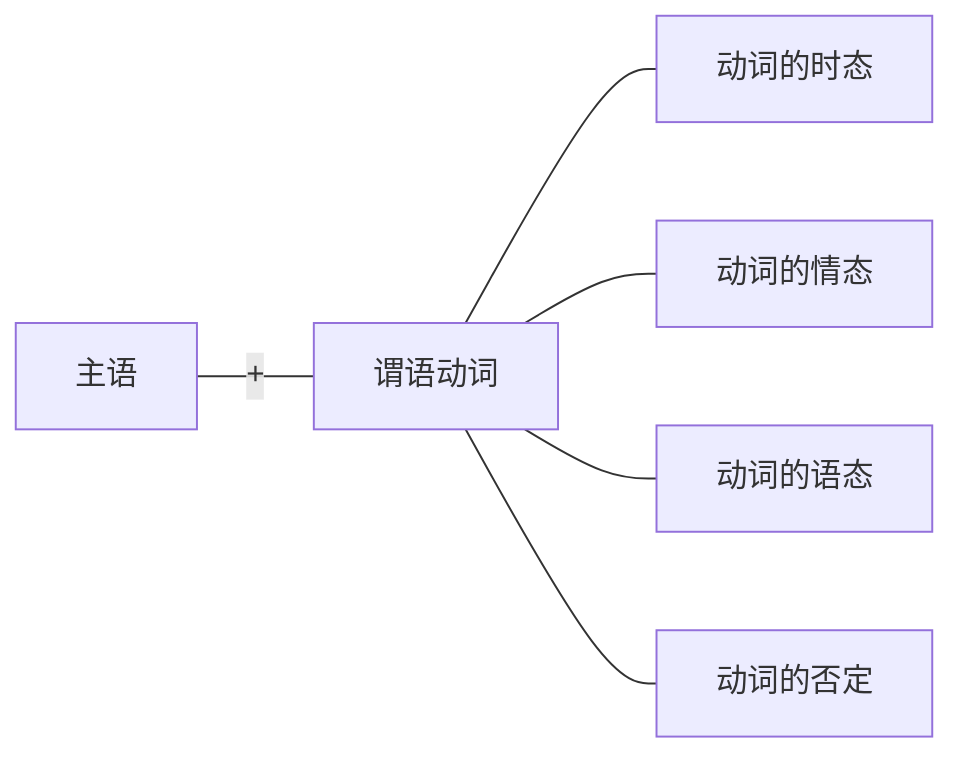

简单句中的最核心的构成部分就是“一主一谓”，它们可以有多种变化形式。

# 一、谓语动词的变化
谓语动词的变化共有四种—“三态加一否”。其中“三态”指的是时态、情态、语态，“一否”指的是否定。这四种变化，无论怎么变，最终都会作为一个整体的谓语动词出现，也就是说简单句中只能有一个谓语动词，但是谓语动词不一定是一个单词，有可能是几个单词组成的一个整体。这一点是分析考研英语长难句的基础。

语法详解 

## （一）谓语动词的时态
时态是表达事情发生的“时间”和“状态”，通过把谓语动词变成不同的形式来体现。谓语动词的四种变化中，只有时态是每一个谓语动词必有的（因为事情只要发生，就一定发生在一定的时间里并体现一定的状态）。时态一共分为十六种，但是建议同学们不要理解成独立的十六个，而应该将其分成两个维度：一是表达动作发生的“时间”，二是表述动作发生的“状态”。例如，现在进行时：动作发生的时间是现在，动作表述的状态是正在进行。因此时态就可以按照两个维度，划分如下：

>四种时间：过去、现在、将来、过去将来
四种状态：一般、进行、完成、完成进行
四种时间x四种状态＝十六种时态

其中，时间通常是以“现在”为出发点，现在的之前是“过去”，现在的之后是“将来”；唯一比较特别的是“过去将来”，它的出发点不是现在，而是站在过去，看过去的之后将要发生的事情。

时间这个维度比较容易理解，相对来说比较难以掌握的是“状态”这个维度。“状态”分为四种：一般、进行、完成、完成进行。接下来详述每一种状态所表达的含义：
### 1．“一般”时态
“一般”，即不特殊，没有任何的特殊强调，既不强调“进行”，也不强调“完成”，只表达事情发生在这个时间段内。例如：“一般过去时”，表示发生在过去这个时间段内的事情，不强调进行或完成等状态（因为如果强调某一种状态的话，则要换成对应的时态，即过去进行时或过去完成时等）。

【补充】“一般”时态是四种时态中最常用的一种，也是唯一一个没有统一的谓语动词公式的，因此需要逐一记住每种“一般”时态所对应的谓语动词形式。
#### （1）一般过去时：谓语动词=did
表示发生在过去的事情（通常表示完全发生在过去的事，即现在已经不再那样）。

例：India ==released== its AI ethics strategy this spring． （2019，Reading Comprehension，Part A Text 3)[^1]
此句想表明“印度发布了AI（人工智能）伦理战略”是发生在过去（今年春季），而且没有强调这个事情正在进行或已经完成，因此使用一般过去时。
注意一般过去时的句子不一定非要搭配明确的过去的时间，只要动作是发生在过去即可。

例：This scale ==took== numerous factors into consideration.（2013，Use of English）[^2]

例：…this city ==was== one of the largest human settlements in the world．（2014，Reading Comprehension,Part B)[^3]

[^1]:翻译：今年春季印度发布了它的AI（人工智能）伦理战略。
[^2]:翻译：该评分等级考虑了众多因素。
[^3]:翻译：····这座城市（过去）是世界上最大的人类居住地之一。
#### （2）一般现在时：谓语动词=do/does
表示发生在现在的事，可以表示现在的状态，也可以表示现在经常性、习惯性发生的事。

例：So far the results ==are== inconclusive.(2009,Use of English)[^4]
此句表明“答案是不确定的”，表示现在的状态，因此使用一般现在时。

例：The goal ==is== new-search,not re-search.(2012,Reading Comprehension,Text 3)[^5]
此句表明“目标是新研究”，表示现在的状态，因此使用一般现在时。注意使用be动词时需要根据主语从am、is、are中选择一个来表示一般现在时。

例：But most law graduates never ==get== a big-firm job．（2014，Reading Comprehension，Part A Text 2)[^6]
never表示“从来没有”，即经常性地没有，所以该句表示现在经常性或习惯性发生的事，用一般现在时。

例：Archaeologist commonly ==use== computers to map sites and the landscapes around sites. (2014,Reading Comprehension,Part B)[^7]
commonly表示“通常地、一般地”，即现在经常性或习惯性发生的事，所以用一般现在时。若主语为第三人称单数，则谓语动词要变为第三人称单数形式（be动词除外），如下：

例：Today it ==makes== almost no difference．（2000，Reading Comprehension,Passage 2)[^8]
由于主语是第三人称单数“it”，所以谓语动词要变为对应的第三人称单数，即把“make”变为“makes”。

例：Pearson also ==predicts== a breakthrough in computer-human links.(2001,Translation)[^9]
主语“Pearson”是一个人的名字，是第三人称单数的主语，所以谓语动词自然要变成第三人称单数“predicts“。
【补充】一般现在时中，谓语动词变为第三人称单数，是为了对应第三人称单数的主语。但第三人称单数的主语除了he、she、it之外，还有不可数名词和可数名词单数（如单个的人名、地名等）。

[^4]:翻译：迄今为止仍然没有确定的答案。
[^5]:翻译：（科学的）目标是新研究而不是重复研究。
[^6]:翻译：但是绝大多数的法学院的毕业生并未能进入大公司工作。
[^7]:翻译：考古学家通常用电脑绘制遗迹和周边地形的地图。
[^8]:翻译：现今它（体重）基本没有影响了。
[^9]:翻译：Pearson还预言，在计算机与人的连接上会有一个重大突破。
#### （3）一般将来时：谓语动词=will+do或am／is／are going to＋do 
- 表示发生在将来的事，注意是“现在的将来”，即现在的之后。
	- 例：We ==will have== a less civil society．（2004，Reading Comprehension，Part A Text 4）[^10]
	- 例：the pharmaceutical companies ==will scream==．（2005，Reading Comprehension，Part B）[^11]
	- 例：I don't know if other clients ==are going to abandon== me，too…（2004，Reading Comprehension,Part A Text 3)[^12]
	- 例：Who's ==going to pay== for the rest of the bill？ （2003，Reading Comprehension，Part A )[^13]

- 如果谓语动词是be动词，那么放在will或am／is／are going to后面，则用动词原形be。
	- 例：…the problems ==will be== different．（2002，Reading Comprehension，PartA Text 1)[^14]
	- 例：Clearly，only the biggest and most flexible television companies ==are going to== be able to compete in such a rich and hotly-contested market.(2005,Reading Comprehension,Part C)[^15]

【补充】will和am／is／are going to 都可以后接动词原形，表示（现在的）将来发生的事，通常可以互换使用。但两者之间其实强调的方面有所不同，“am/is/are going to+do”通常强调事先 有计划或有打算的，或事前有预兆的；而““will+do"强调个人的意愿，表示“将要愿意做某事”（will是情态动词）。由于两者本身差别不大，所以通常可互换，而且在考研中不需要掌握。

[^10]:翻译：我们社会的文明程度将会降低。
[^11]:翻译：·····医药公司将会抗议。
[^12]:翻译：我不知道其他的客户是否也会弃我而去···
[^13]:翻译：谁来支付这其余的费用呢？
[^14]:翻译：······问题将会不同。
[^15]:翻译：显然，只有最大最灵活的电视公司才能够在这个饱和的、竞争激烈的市场上竞争。
#### （4）（一般）过去将来时：谓语动词=would+do或going to+do
表示事情发生在过去的将来，即“过去的之后”。此时态通常与上下文的一般过去时搭配，表示在其之后发生的事情。

例：They ==gave== justices permanent positions so they ==would be== free to upset those in power... (2012,Use of English)[^16]
他们（过去）给予法官们终身任期，以便法官们（之后）将可以自由地打击当权者。此句中两个动作都发生在过去，先发生的“gave”使用了一般过去时，而在其之后发生的自然是“过去的之后”，所以“would be”为过去将来时。

例：……it simply ==didn't foresee== what ==would happen== next. (2012,Reading Comprehension,Part Text 2)[^17]
它只是（过去）没有预料到接下来（过去的之后）要发生的事。

例：For a while it ==looked== as though the making of semiconductors... ==was going to be== the next casualty.(2000,Reading Comprehension,Passage 1)[^18]

过去将来时除了用“would＋动词原形”之外，还可以用“was／were going to＋动词原形”，如上。

【补充】一般将来时和过去将来时，同样表示将来（之后的事情），差别在于出发点不同，一个是站在“现在”看之后将会发生的事，一个是站在“过去”看之后。因此他们的谓语动词形式大体一致，只要把一般将来时的公式对应地变成过去时，就是过去将来时的公式。

[^16]:翻译：他们给予法官们终身（永久）任期，以便法官们将可以自由地打击当权者……
[^17]:翻译：……它只是没有预料到接下来要发生的事。
[^18]:翻译：一段时间以来，半导体制造业似乎将成为下一个受害者……
### 2．“进行”时态
“进行”时态强调在某个时间段内正在进行或持续进行的事情，有统一的谓语动词公式“be doing”（其中be可根据所处的时间段不同，而换成不同时态的be动词）。
#### （1）过去进行时：谓语动词=was/were+doing
例：He ==was searching== for tiny engraved seals……（2014，Reading Comprehension，Part B）[^19]
此句用过去进行时，强调他是“过去正在寻找或持续寻找”微型雕刻印章。

例：Within two weeks，he ==was talking== for the first time with the board of Hartford Financial Services Group...(2011,Reading Comprehension,Part A Text 2)[^20]
此句用过去进行时，强调他是在过去的两周内与董事会“正在会谈或持续会谈”。

[^19]:翻译：他正在寻找微型雕刻印章……
[^20]:翻译：两周之内，他第一次与哈特福德金融服务集团的董事会会谈……
#### （2）现在进行时：谓语动词=am/is/are+doing
例：Home prices ==are holding== steady in most regions．（2004，Reading Comprehension，Part A Text 3)[^21]
此句用现在进行时，强调房价是“现在正在保持”稳定。

例：The astronomy community ==is making== compromises to change its use of Mauna Kea. (2017,Reading Comprehensension,Part A Text 2)[^22]
此句用现在进行时，强调天文学界“现在正在做出”妥协。

[^21]:翻译：大部分地区房价保持稳定。
[^22]:翻译：天文学界正在做出妥协，改变其对莫纳克亚山的使用。
#### （3）将来进行时：谓语动词=will be+doing
（其中be动词永远用原形be）

例：Now,rivals ==will be charging== sales tax...(2019,Reading Comprehension,Part A Text 4)[^23]
将来进行时可以表示将来某时正在进行，也可以表示确定要发生的将来。本句中就是表示“确定将要收取销售税”。

这种时态在考研真题中，极少出现，考生不必掌握。

[^23]:翻译：现在，竞争对手（确定）将收取销售税……
### 3．“完成”时态
“完成”时态是所有时态中最容易被误解的，也是同学们最不敢使用的，同时也是考研真题中经常出现的。之所以会误解“完成”时态，主要是因为同学们对“完成”两字的含义不清楚。“完成”不代表都做完了，它其实包含了两方面含义：一是“全部完成”，即事情都做完了；二是“部分完成”，即事情只完成了一部分，而没都做完。所以很多同学会误解完成时，片面地认为它表示都做完了，而忽略了它的第二种用法。

“完成”时态其实是表达一件事的“完成结果”：有可能“做完了”（全部完成），也有可能“没做完”（部分完成）。但是无论做完与否，这都是一种完成的结果。而“完成”时态的重点是看事情的角度：想要了解一件事的完成结果，就要站在某一个时间点回头看之前，才知道事情完成得怎么样了。因此，“完成”时态的用法为：“xx时间的之前”，一件事的完成结果（可能全部完成，也可能部分完成）。完成时有统一的谓语动词公式“have done”（其中have可换成不同时态）。
#### （1）过去完成时：谓语动词=had+done
表示“站在过去的时间点回头看之前发生的一件事的完成结果”。事情可能全部完成，也可能部分完成，但完成与否不重要，重要的在于这个时态所强调的角度——“过去的之前”。只要是“过去的之前”发生的事情都可以用过去完成时来表达，无论完成的结果如何。

例：He ==had== never ==gambled== before the casino sent him a coupon for ＄20 worth of gambling． (2006,Reading Comprehension,Part B)[^24]
上句中“赌场寄给他一个优惠券”使用的是一般过去时sent，即表示过去。句前又加上一个词before，表示在那之前，即表示过去的之前，所以在“过去的之前”发生的事使用过去完成时had gambled来表示。

【补充】使用过去完成时，要满足两大要素——“过去”和“之前”。但并非所有的“过去”都要求在同一个句子中伴随着出现一般过去时，有可能出现在它的上下文中。而“之前”也并非一定要出现before之类的表达，含义中隐含也可以。

例：The interviewers ==had rated== on a scale of one to five.(2013,Use of English) [^25]
上句中没有出现明显的“过去”和“之前”，已经隐含在其上下文中了。

- 【补充】很多同学认为，一般过去时与过去完成时都表达“过去”的事情，差别就在于一个强调“一般”，一个强调“完成”。其实在应试中，两者的区别可以想得更简单一些：
	- 过去完成时＝过去的之前（先发生）
	- 一般过去时＝过去 （后发生）

两个时态都表示过去，差别在于先后发生：“过去完成时”发生在先，而“一般过去时”发生在后。了解这个可以帮助同学们更好地理解考研真题上下文。

例：...he ==expressed== the opinion that in two or three respects his mind ==had changed== during the preceding twenty or thirty years.(2008,Reading Comprehension,Part C)[^26]
上句中出现了两个事情“他表达了观点”（expressed，一般过去时）和“他的想法改变了”（had changed，过去完成时）。尽管连接两个句子时，中间没有使用before或after这类表达，但可以根据时态判断两件事情的先后，他的想法改变（过去完成时）发生在先，而他表达观点（一般过去时）发生在后。

【补充】过去完成时表达“过去的之前”，即站在过去回头看之前发生的事，所以涉及了两个时间——“过去”和“过去的之前”。因此过去完成时其实表达的是一个时间段，从“过去的之前”到“过去”。

例：Roman Catholicism ==had been== the state releligion...(2007,Use of English)[^27]
此处使用的是过去完成时，因此表达的是从“过去的之前”到“过去”这一时间段内，罗马天主教一直是国教。

[^24]:翻译：在赌场送给他一张价值20美元赌资的优惠券之前，他从未赌博过。
[^25]:翻译：面试官把申请者划分成一到五这五个等级。
[^26]:翻译：他（Darwin）表达了这样一个观点：在之前的二三十年里，他的思想已经在两三个方面发生了变化。
[^27]:翻译：罗马天主教过去一直是国教……
#### （2）现在完成时：谓语动词=have/has+done
表示“站在现在的时间点回头看之前发生的一件事的完成结果”。事情可能全部完成，也可能部分完成，但完成与否不重要。重要的在于这个时态所强调的角度——“现在的之前”。只要是“现在的之前”发生的事情都可以用现在完成时来表达，无论完成的结果如何。

现在完成时是考研英语中经常出现的时态，因为人永远活在现在，而站在现在这个角度去回想之前发生的事情，都可以使用现在完成时。

例：The question of GDP and its usefulness ==has annoyed== policymakers for over half a century.(2017,Reading Comprehension,Part A Text 3)[^28]

例：The ethical judgments of the Supreme Court justices ==have become== an important issue recently. (2012, Use of English)[^29]

【补充】现在完成时表达“现在的之前”，即站在现在回头看之前发生的事，所以涉及两个时间—“现在”和“现在的之前”。因此现在完成时其实表达的是一个时间段，从“现在的之前”到“现在”，即“从过去到现在”

例:For the most part, the response ==has been== favorable... (2011, Reading Comprehension, Part A Text 1)[^30]
此处使用的是现在完成时，因此表达的是“从过去到现在”这一时间段内，反应一直是赞同的。

- 【补充】现在完成时表达“现在的之前”这一含义，所以在“have/has”和“done”中间常常夹着一些副词强调“之前”这一含义。例如:already “已经”、just “刚刚”、ever “曾经”never “从不”。还可以加人其他副词,例如:also “也”、nearly “几乎”、long “长期地”等。如下:
	- 例:Most leading retailers ==have already tried== e-commerce, with limited success, and expansion abroad. (2010, Reading Comprehension, Part B)[^31]
	- 例:Scientific publishing ==has long been== a licence to print money. (2020, Reading Comprehension, Part A Text 2)[^32]
	- 例:Families ==have also experienced== changes these years. (2004, Use of English)[^33]

- 【补充】现在完成时与一般过去时的区别：从宏观上来讲，两者涉及的时间不同，一般过去时只表示“过去”，而现在完成时表示的是“从过去到现在”这一时间段。例如：
	- ...the response ==has been== favorable...表示“从过去到现在”反应一直是赞同的。
	- ...the response ==was== favorable...则只表示“过去”反应是赞同的,而“现在”已经不再那样了。

- 从微观上来讲，可以把现在完成时的两种用法分别跟一般过去时进行比较：
	1. 现在完成时的“全部完成”VS.一般过去时（可互换使用，但强调不同）
		- 既然现在全部都完成了，就说明事情发生在过去，因此可以换成一般过去时。但两者表达同一件过去的事情时，强调的角度有所不同。
			- 现在完成时强调站在现在这个角度看过去的事情，虽然事情做完了，但影响持续到现在，通常会在上下文中体现出对现在的影响。例如：He has left，so I cannot find him now.他已经离开了（事情做完了），所以我现在找不到他，强调对现在有影响。
			- 一般过去时强调站在过去的角度看过去的事，通常会搭配出现过去的时间。例如：He left two hours ago.句中出现了two hours ago（两个小时前），强调过去的时间。
	2. 现在完成时的“部分完成”VS.一般过去时（不能互换使用）
		- 如果是只做完了一部分，没有全部做完，则说明现在还在做，就不能换成一般过去时。因为一般过去时表示完全发生在过去的事，现在已经不再那样，意思不同，所以不能互换。例如：
			- We ==have learned== English for 15 years．我们从过去到现在学了15年英语。（现在还在学）
			- We ==learned== English for 15 years．我们过去学了15年英语。（现在不学了）

[^28]:翻译：半个多世纪以来，国内生产总值和其效用问题一直困扰着政策制定者。
[^29]:翻译：最高法院法官的道德判断最近已成为重要议题。
[^30]:翻译：大部分人的反应一直是赞同的……
[^31]:翻译：绝大多数主要零售商已经开始尝试电子商务，但收效甚微,并开始开拓海外市场。
[^32]:翻译：科学出版长期以来一直是印钱的许可证（很赚钱）。
[^33]:翻译：这些年来家庭也在经历着变化。
#### （3）将来完成时：谓语动词=will have+done
表示“站在将来的时间点回头看之前发生的一件事的完成结果”。事情可能全部完成，也可能部分完成，但完成与否不重要，重要的在于这个时态所强调的角度—“将来的之前”。将来完成时在近16年的考题中，只出现了一次，不用重点掌握。

例：...relaxation will be in front of smell-television,and digital age ==will have arrived==.(2001, Translation)[^34]
后半句中用将来完成时will have arrived，表达“截止到将来那个时候的之前，数字化时代已经来临了”。

【补充】三种“完成”时态可以理解为“阶段性总结”，站在某个时间点回头看之前，总结一下事情完成的结果如何。只不过所处的时间点不同，便换成对应的不同的完成时，并且把公式“have+done”中的have换成对应的时态。例如：站在过去总结之前的事情，则使用过去完成时，公式变为“had+done”

[^34]:翻译：·····人们将在气味电视机前休闲，届时数字化时代已经来到了。
### 4.“完成进行”时态
顾名思义就是“完成”和“进行”两种时态的结合，即在“完成”时态的基础上又更进一步，强调了“进行”的过程。所以“完成进行”时态的用法为：xx时间的之前，强调一件事进行的过程。

【补充】“进行”的过程又分为三种：还在进行（事情没有全部做完）；持续进行（不间断地进行）；重复进行（一次又一次，断断续续地进行）。但是同学们不需要掌握这三种不同的“进行”，在考研中没必要，只需要记住“完成进行”时态是强调过程的即可。
#### （1）现在完成进行时：谓语动词=have/has been+doing
同学们不必纠结于语法书上写的各种用法，可以从应用的角度上更加简单地理解，把相同时间段的“完成时”和“完成进行时”放在一起来看。以“现在完成时”和“现在完成进行时”为例，两者看事情的角度相同（都是站在现在回头看之前的事），但强调的方面不同。比较如下：

|角度相同|都表示“现在的之前”||
|:---:|:---:|:---:|
|两种时态|现在完成时 have／has＋done|现在完成进行时 have／has been＋doing|
|强调不同|强调结果（做完与否都可以） We have not won the match.|强调过程 We have been working hard for several months.|

如上两个例句，“我们没有赢得比赛”和“我们努力了好几个月”都是现在的之前发生的事，差别只在于“努力”是强调过程，用现在完成进行时；而“没赢得比赛”是强调结果，用现在完成时。

由此得知：想表达“现在的之前”发生的事情，有两种选择—现在完成时和现在完成进行时，到底用哪一个取决于想强调什么。强调结果，用现在完成时；强调过程，用现在完成进行时。

例：That kind of electronic spying ==has been going== on for decades．（2003，Reading Comprehension,Part A Text 1)[^35]
根据阅读的上下文得知，这样的电子间谍活动“在现在的之前”已经存在，此处想强调“过程”持续了数十年，因此使用现在完成进行时has been going。

例：Bigchains ==have been collecting== sales tax nationwide...(2019,Reading Comprehension, Text 4)[^36]
大型连锁企业“现在的之前”就在全国范围内征收销售税，而且想强调“过程”一直持续进行，因此使用现在完成进行时have collecting。

[^35]:翻译：这样的电子间谍活动已经存在了数十年。
[^36]:翻译：大型连锁企业一直在全国范围内征收销售税。
#### （2）过去完成进行时：谓语动词=had been+doing 
#### （3）将来完成进行时：谓语动词=will have been+doing
“完成进行”时态一共有三种：现在完成进行时、过去完成进行时和将来完成进行时。它们的用法都是一样的，都可以和对应时间的完成时来比较使用。但同学们需要掌握的只有现在完成进行时，另外两种在考研真题中没有出现过，不用掌握。
## 内容小结
1. 时态=事情发生的“时间”+“状态”，通过谓语动词的变化来体现。注意：每一个谓语动词都一定有时态，因此很重要。
2. 时态共十六种（如下图）：其中背景为蓝色的八种为考研重点，画叉的三种完全不需要会，其余简单了解。
3. 学习时态要分成两个维度——时间和状态，重点学习“状态”的维度，共分四种：一般、进行、完成、完成进行。
4. 注意：不管表达时态的谓语动词的单词有几个，都算作一个整体，即一个谓语动词。

**时态的公式**

|时间/状态|过去|现在|将来|过去将来|
|:---:|:---:|:---:|:---:|:---:|
|一般|==[[第二节 简单句的核心变化#（1）一般过去时：谓语动词=did\|一般过去时]] did==|==[[第二节 简单句的核心变化#（2）一般现在时：谓语动词=do/does\|一般现在时]] do/does==|==[[第二节 简单句的核心变化#（3）一般将来时：谓语动词=will+do或am／is／are going to＋do\|一般将来时]] will+do am/is/are going to+do==|==[[第二节 简单句的核心变化#（4）（一般）过去将来时：谓语动词=would+do或going to+do\|一般过去将来时]] would+do was/were going to+do==|
|进行 be+doing|==[[第二节 简单句的核心变化#（1）过去进行时：谓语动词=was/were+doing\|过去进行时]] was/were+doing==|==[[第二节 简单句的核心变化#（2）现在进行时：谓语动词=am/is/are+doing\|现在进行时]] am/is/are+doing==|[[第二节 简单句的核心变化#（3）将来进行时：谓语动词=will be+doing\|将来进行时]] will be+doing|×|
|完成 have+done|==[[第二节 简单句的核心变化#（1）过去完成时：谓语动词=had+done\|过去完成时]] had+done==|==[[第二节 简单句的核心变化#（2）现在完成时：谓语动词=have/has+done\|现在完成时]] have/has+done==|[[第二节 简单句的核心变化#（3）将来完成时：谓语动词=will have+done\|将来完成时]] will have+done|×|
|完成进行 have+been+doing|过去完成进行时 had been+doing|[[第二节 简单句的核心变化#（1）现在完成进行时：谓语动词=have/has been+doing\|现在完成进行时]] have/has been+doing|将来完成进行时 will have been+doing|×|
## 真题演练
1. The use of this little-known practice ==has accelerated== in recent years...(2019,Reading Comprehension,Part A Text 2)
翻译：近年来，这种鲜为人知的做法的使用速度加快了··...
解析：时态为现在完成时，表示现在的之前（从过去到现在）已经发生的动作。

2. The human nose ==is== an underrated tool. (2005,Use of English)
翻译：人的鼻子是一种被低估的工具。
解析：时态为一般现在时，表示现在的客观状态。

3. Readers ==are migrating== away from print anyway.(2016,Reading Comprehension,Part A Text 4) 
翻译：无论怎样，读者正在远离印刷制品。
解析：时态为现在进行时，表示现在正在进行的动作。

4. Amazon.com ==received== one for its “one-click” online payment system.(2010,Reading Comprehension,Part A Text 2)
翻译：亚马逊公司的“一键式”在线支付系统获得了一个（专利）。
解析：时态为一般过去时，表示过去的动作。

5. But what ==will be== the nature of that difference?(2011,Reading Comprehension,Part A Text 1)
翻译：但是那种不同的本质将会是什么呢？
解析：时态为一般将来时，表示将来的状态。

6. Dr.Yehuda ==notes== another difference between the sexes.(2008,Reading Comprehension,Part A Text 1)
翻译：Yehuda医生还注意到了两性间的另一种差别。
解析：时态为一般现在时，表示现在的动作。

7. ...his explanation ==was== surprisingly straight up. (2011,Reading Comprehension,Part A Text 2) 
翻译：·····他的解释出乎意料的直白。
解析：时态为一般过去时，表示过去的状态。

8. We ==will become== a second-rate country.(2004,Reading Comprehension,Part A Text 4) 
翻译：我们将会变成一个二流国家。
解析：时态为一般将来时，表示将来的状态。

9. And a significant number of the homeless ==have== serious mental disorders. (2006,Use of English)
翻译：并且相当多无家可归的人患有严重的精神疾病。
解析：时态为一般现在时，表示现在的状态。

10. ...lots of working folks ==had== already ==seen== signs of the slowdown themselves.(2004,Reading Comprehension,Part A Text 3)
翻译：······众多的上班族自己已经看到了经济减速的迹象。
解析：时态为过去完成时，表示过去的之前已经发生的事情。

11. My wife and I ==lectured== about this looming danger twenty years ago.(2001,Reading Comprehension,Part A Text 2)
翻译：我和妻子曾在20年前，就这一正在逼近的危险发表过演讲。
解析：时态为一般过去时，表示过去的动作。

12. Americans' life expectancy ==has== nearly ==doubled== over the past century. (2003,Reading Comprehension,Part A Text 4)
翻译：过去的一个世纪里，美国人的寿命几乎延长了一倍。
解析：时态为现在完成时，表示现在的之前（从过去到现在）已经发生的动作。

13. A team of researchers... ==would submit== the results of their research to a journal. (2008, Reading Comprehension,Part A Text 2)
翻译：一组研究人员······将会把他们的研究结果呈递给一份专业刊物。
解析：时态为过去将来时，表示过去某个时间点之后将要发生的动作。

14. Foreign-made cars and textiles ==were sweeping== into the domestic market. (2000, Reading Comprehension,Passage 1)
翻译：外国制造的汽车和纺织品也涌入美国国内市场。
解析：时态为过去进行时，表示过去正在进行或持续进行的动作。

15. In recent years, railroads ==have been combining== with each other...(2003,Reading Comprehension,Part A Text 3)
翻译：近年来，铁路公司纷纷彼此联合·..·
解析：时态为现在完成进行时，表示现在的之前（从过去到现在）已经发生的事情，并且强调过程的持续。

16. By 1830 the former Spanish and Portuguese colonies ==had become== independent nations. (2007, Use of English)
翻译：在1830年之前，西班牙和葡萄牙的前殖民地已经成为独立的国家。
解析：时态为过去完成时，表示过去的之前已经发生的事情。

17. A good innovational thinker ==is== always ==exploring== the many other possibilities.(2009,Reading Comprehension,Part A Text 1)
翻译：一个出色的创新型思想者总在探寻其他的更多可能性。
解析：时态为现在进行时，表示现在正在进行或持续进行的动作。

18. This tendency in the natural sciences ==has== long ==been== evident in the social sciences too.(2012, Reading Comprehension,Part C)
翻译：自然科学的这种趋势在社会科学领域也一直是很明显。
解析：时态为现在完成时，表示现在的之前（从过去到现在）一直持续的状态。
## （二）谓语动词的情态
情态，顾名思义就是表示“情绪和态度”。针对不同的事情要表达不同的情绪和态度，需要在谓语动词前加上不同的情态动词。不同于时态和语态的变化（把谓语动词的形式进行改变），情态的变化是保持谓语动词不变（用动词原形），在它前面加上一个情态动词。

考研中常出现的情态动词如下：

|现在时|过去时|
|:---:|:---:|
|must|×|
|can|could|
|will|would|
|shall（考研真题中不常出现）|should|
|may|might|

- 情态动词的使用，有如下特点：
	- 一是情态动词后要接动词原形。若谓语动词是be动词，就用“情态动词+ be”
	- 二是情态动词一般只有现在和过去两种时态，可以成对地来记，例如can是现在时，而could是它对应的过去时。上表中只有must没有过去时。但要注意， could/would/should/might这四个词有两种用法，除了表示相应的过去时之外，还可以表示现在的一种更委婉和客气的语气。
		- 例如：
			- Can you help me now?
			- Could you help me now?
		- 同样表示“你可以帮我吗”，同样表示现在，只不过could 比can在语气上更委婉客气。
	- 三是情态动词没有人称的变化，也就是说无论主语是谁，情态动词永远用原形，即没有第三人称单数。
	- 四是情态动词变否定，直接在情态动词后加not；变疑问，直接把情态动词提到主语前。
### 1.情态动词表示“情态”
|情态动词|含义|真题例句
|:---:|:---:|:---|
|must|必须|例：……we must also act with caution．（2012，Reading Comprehension,Part B) 译：······我们同样必须谨慎行事。  例：Human drivers sometimes must make split-second decisions. (2019,Reading Comprehension,Part A Text 3) 译：人类驾驶员有时候必须要一瞬间做出决定。|
|can could|能够/可以|例：...and the right mental workouts can significantly improve our basic cognitive functions.(2014,Use of English) 译：······而正确的思维训练能够大幅度地提高我们的基本认知机能。  例：Could a hug a day keep the doctor away？（2017，Use of English）  译：一天一个拥抱可以让你远离医生吗？|
|will would|愿意/将要 （表示“将要”时常用于将来时态）|例：Will you marry me？ 译：你愿意嫁给我吗？（求婚时常用，表示意愿，而非将来）  例：The first draft will appear on the page……（2008，Reading Comprehension,Part B) 译：……初稿将会跃然纸上。  例：Potential home buyers would cheer for lower interest rates. (2004,Reading Comprehension,Part A Text 3) 译：潜在的买房人将会因低利率而欢呼。|
|may might|可以/可能|例：...expressions may influence emotions rather than just the other way around.(2011,Use of English) 译：·····表情可以影响情绪而非只能是情绪影响表情。|
|may might|可以/可能|例：Such bodily reaction might conceivably help moderate the effects of psychological stress.(2011,Use of English) 译：这样的身体反应可能能够帮助缓解心理压力带来的影响。|
|should|应该|例：America should follow．（2014，Reading Comprehension，Part A Text 2) 译：美国应该紧随其后。  例：Those suffering from persistent nightmares should seek help from a therapist.(2005,Reading Comprehension,Part A Text 3)  译：那些长期受到噩梦折磨的人应该向专家寻求帮助。|
### 2.情态动词表示“推测”
- 除了表示“情绪和态度”之外，每一个情态动词都能表示推测。其中推测的可能性最高的为must，表示“肯定、一定”；可能性最低的为can't／couldn't，表示“不可能”；其他表示推测的，皆可理解为“可能、也许”。
	- 例：The details ==may be== unknowable…（2010，Reading Comprehension，Part A Text 4）[^37]
	- 例：Such searches ==can take== years．（2014，Reading Comprehension，Part B）[^38]
	- 例：It ==might be== poetic， philosophical， sensual， or mathematical， but in any case it ==must==... ==have== something to do with the soul of the human being.(2014,Reading Comprehension,Part C)[^39]
	- 例：this loss of mental focus ==can== potentially ==have== a damaging impact on our professional， social,and personal wellbeing.(2014,Use of English)[^40]

- 【补充】除了“情态动词+do"”之外，还有一些变体的结构，如下：
	- “情态动词＋have done”表示“针对之前的事情表达情态或推测”。
	- “情态动词＋be doing”表示“针对正在进行的事情表达情态或推测”。这种变体的用法简单了解含义即可，出现得不多。
	- 例：...the peculiar way of conducting the experiments ==may have led== to misleading interpretations of what happened.(2010,Use of English)[^41]
	- 例：...the community ==should be grasping== the opportunity to raise its influence in the real world.(2013,Reading Comprehension,Part B)[^42]
	- 例：Now something similar ==could be happening== in the oceans．（2006，Reading Comprehension,Part A Text3)[^43]

- 【补充】除了以上的情态动词之外，还有一些常用的情态动词词组，能够辨认并了解含义即可。例如：have to（不得不，必须），ought to（应该）等。
	- 例：They ==have to== be careful not to come across as disappointed in their child．（2007，Reading Comprehension,Part B)[^44]
	- 例：public-health advocates ==ought to== take a page from advertisers…（2012，Reading Comprehension,Part A Text 1)[^45]
	
- 【补充】情态动词还可以用于虚拟，稍后会在第二部分第三章第三节中详细展开讲解。

[^37]:翻译：细节也许不得而知…
[^38]:翻译：这种搜寻可能需要数年的时间。
[^39]:翻译：它可能是富有诗意的、富于哲理的、纯粹享乐的或是精准无误的······但不管怎样它都一定与人类的灵魂有关。
[^40]:翻译：······这种精神注意力的丧失可能会对我们的职业发展、社交生活和个人幸福产生有害的影响。
[^41]: 翻译：进行实验的特殊方式可能导致了实验者对所发生事实的误导性解释。
[^42]: 翻译：……社会科学界应该抓住这一机遇来提升自己在现实世界的影响力。
[^43]: 翻译：现在类似的事情可能正在海洋里发生。
[^44]: 翻译：他们必须非常谨慎，不要对孩子表现出失望的态度。
[^45]: 翻译：……公共健康的倡导者应该向广告商们学习……
### 内容小结
1. 情态动词的用法主要有两种：
	- 一是表达“情绪和态度”；
	- 二是表达“推测”。
1. 考研常用的情态动词：must，can，could，will，would，should，may，might。
2. 注意：“情态动词＋动词原形”算作一个整体，即一个谓语动词。
### 真题演练
1. Online education can supplement the traditional kind.(2018,Reading Comprehension,Part A Text 1)
翻译：网络教育可以补充传统的教育。
解析：情态动词can表示情态，“可以”。

2. …the new nations should be sovereign and independent states...(2007,Use of English)
翻译：……新国家应该是独立自主的国家……
解析：情态动词should表示情态，“应该”。

3. He must store a large quantity of grain instead of consuming all his grain immediately.(2000, Cloze Test)
翻译：他必须储存大量粮食而不是立即消耗完所有粮食。
解析：情态动词must表示情态，“必须”。

4. This could add value to their businesses in three ways.(2016,Reading Comprehension,Part A Text 3) 
翻译：这可以从三个方面增加他们企业的价值。
解析：情态动词could表示情态，“可以”。

5. Upcoming reforms might bring the price to a more reasonable level.(2017,Reading Comprehension,Part A Text 1)
翻译：即将到来的改革可能会使价格达到更合理的水平。
解析：情态动词might表示猜测，“可能”。

6. Employers wouldn't mind a little fewer bubbles in the job market.(2004,Reading Comprehension,Part A Text 3)
翻译：雇主将不会介意人才市场少些泡沫。
解析：情态动词would表示情态，“将要”，此处出现的是否定形式wouldn't表示“将不会”。

7. ...but we cannot escape the context of our unique life experience.(2012,Reading Comprehension,Part A Text 3)
翻译：·····但我们不能摆脱我们自身独特的生活经历。
解析：情态动词can表示情态，“能够”，此处出现的是否定形式cannot表示“不能”。

8. ...we must press forward on deeper atmospheric and oceanic research.(2005,Reading Comprehension,Part A Text 2)
翻译：······我们必须推进对大气和海洋的更深入的研究。
解析：情态动词must表示情态，“必须”。

9. In such a case, the company's response may not be sufficiently quick or thoughtful... (2011, Reading Comprehension,Part A Text 3)
翻译：在这种情况下，公司的反应可能不够迅速周到……
解析：情态动词may表示猜测，“可能”，此处出现的是否定形式may not表示“可能不”。

10. Your outline should smoothly conduct you from one point to the next... (2008,Reading Comprehension,Part B)
翻译：你的提纲应该指引你从一个观点自然地过渡到下一个观点……
解析：情态动词should表示情态，“应该”。

11. Moreover, the integration of the European community will oblige television companies to cooperate more closely in terms of both production and distribution.(2005,Reading Comprehension,Part C)
翻译：另外，欧共体的形成将迫使电视公司在制作和发行方面进行更加密切的合作。解析：情态动词will表示情态，“将要”，用于构成一般将来时。
12. …this very difficulty may have had the compensating advantage of forcing him to think long and intently about every sentence...(2008,Reading Comprehension,Part C)
翻译：···这种（语言表达上的）困难或许已经成了他的优点，因为他不得不花很长时间专注地思考自己要说的每句话···
解析：情态动词may表示猜测，“may have＋过去分词”表示推测过去，“或许已经”。