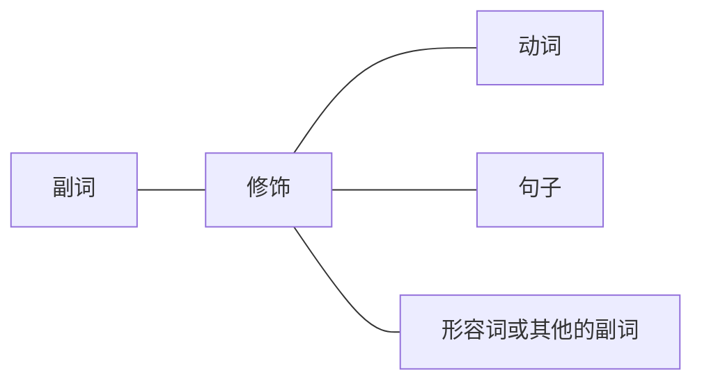

# 一、限定词
通常主语、宾语、表语可由名词来充当，而名词前常常用限定词来修饰限定。限定词主要包括冠词、数词、名词所有格等。

例：The roughly 20 million inhabitants of these nations looked hopefully to the future．（2007,Use of English)[^1]
此句中，名词inhabitants前用冠词The和数词20 million来限定。

例：More than two dozen companies sell DNA tests directly to the public， ranging in price from a few hundred dollars to more than $2,500.(2009,Reading Comprehension,Part A Text 2)[^2]
此句中，名词companies前用数词two dozen来限定，而名词dollars前用数词a few hundred来限定。

例：By the third generation，one third of Hispanic women are married to non-Hispanics，and 41 percent of Asian-American women are married to non-Asians.(2006,Reading Comprehension, Part A Text 1)[^3]
此句中，名词generation前用序数词the third（第三）来限定；而名词Hispanic women前用分数（分子用基数词，分母用序数词）one third of（三分之一的）来限定；名词Asian—American前用百分数41 percent of（百分之四十一的）来限定。

例：Mark Twain's Huckleberry Finn exemplified American anti-intellectualism.(2004, Reading Comprehension Text 4)[^4]
此句中，名词Huckleberry Finn前用名词所有格Mark Twain's来限定，表示“Mark Twain的 《哈克贝利·费恩历险记》”。

【补充】通常，这些限定词可以同时出现多个，放在名词前。除此之外，名词也可以修饰名词，起到修饰限定的作用，这在考研真题中很常见。如：
Merrill Lynch got legal protection for an asset allocation strategy.(2010,Reading Comprehension,Part A Text 2)[^5]
此句中，除了冠词an，名词asset和allocation也修饰名词strategy，起到修饰限定的作用， 表示“资产配置策略”。

[^1]:翻译：这些国家的大约两千万居民都满怀希望地展望着未来。
[^2]:翻译：直接向公众出售基因检测服务的公司超过24家，价格从几百美元到2500多美元不等。
[^3]:翻译：到了第三代，1／3的西班牙裔美国妇女嫁给了非西班牙裔人，41％的亚裔美国妇女与非亚裔人结婚。
[^4]:翻译：Mark Twain的《哈克贝利·费恩历险记》例证了美国的反智主义。
[^5]:翻译：美林公司的资产配置策略受到了法律的保护。
# 二、形容词、副词
## （一）形容词、副词作修饰成分
想把一件事表述得更加充分具体，可以加入形容词、副词进行修饰限定。其中形容词通常修饰名词，副词通常修饰动词、句子、形容词及其他的副词。对应到汉语中，形容词相当于“的”，副词相当于“地”。

例如：The angry boy shouted angrily.
译：生气的男孩生气地喊。
此句中，形容词angry修饰名词boy，副词angrily修饰动词shouted（shout的过去式）。 
### 1.形容词修饰名词

例：The idea seems promising，and Rosenberg is a perceptive observer．（2012，Reading Comprehension,Part A Text 1）[^6]
此句中，连词and连接了前后两个简单句（两件事）。第一个句子为主系表结构，seems（似乎）为系动词，形容词promising作表语，通过系动词的联系作用把表语与主语相连，相当于表语（形容词）在补充说明主语（名词），因此形容词作表语，也相当于在修饰名词。第二个句子中包含了一个名词词组a perceptive observer，其中名词observer为中心词，形容词 perceptive作定语修饰它，因此放在了它前面。

例：It's a stunning move．（2012，Reading Comprehension，Part A Text 2)[^7]
形容词stunning修饰名词move，作定语，表示“惊人的举动”。

例：Their thinking often had a traditional superstitious quality．（2009，Reading Comprehension,Part A Text 4)[^8]
形容词traditional和superstitious修饰名词quality，作定语，表示“传统的迷信的色彩”。 

[^6]:翻译：这个想法似乎很有前途，Rosenberg也是一位有洞察力的观察者。
[^7]:翻译：这是一个惊人之举。
[^8]:翻译：他们的思想中常常带有传统的（宗教）迷信色彩。
### 2.副词修饰动词、句子、形容词或其他的副词

#### （1）副词修饰动词
例：…and the right mental workouts can significantly improve our basic cognitive functions. (2014,Use of English)[^9]
副词significantly修饰动词improve，表示“大幅地提高”。

例：Such bodily reaction might conceivably help moderate the effects of psychological stress.(2011,Use of English)[^10]
副词conceivably修饰动词help，表示“可以想象地帮助”。

[^9]:翻译：······而正确的思维训练能够大幅提高我们的基本认知机能。
[^10]:翻译：这样的身体反应也许能够有助于缓解心理压力带来的影响。
#### （2）副词修饰句子
例：Similarly，the physical act of laughter could improve mood．（2011，Use of English）[^11]
副词Similarly修饰整个句子，表示“同样地”。

例：Strangely，it has involved little physical change．（2000，Reading Comprehension， Passage 2)[^12]
副词Strangely修饰整个句子，表示“奇怪地”。

[^11]:翻译：同样，笑这一身体行为能够改善情绪。
[^12]:翻译：奇怪的是，它（这一过程）基本没带来多少身体上的变化。
#### （3）副词修饰形容词或其他的副词
例：The tourist streams are not entirely separate．（2006，Reading Comprehension，Part A）[^13]
副词entirely修饰形容词separate，表示“完全地分离的”。

例：In such a case， the company's response may not be sufficiently quick or thoughtful... (2011,Reading Comprehension,Part A Text 3)[^14]
副词sufficiently修饰并列的两个形容词quick和thoughtful，表示“足够地迅速周到”。 

例：…because they are so closely tied．（2012，Use of English）[^15]
副词so修饰副词closely，表示“非常紧密”。

[^13]:翻译：游客的人流并不是完全分离的。
[^14]:翻译：在这种情况下，公司的反应可能不够迅速周到（越迅速周到越好）
[^15]:翻译：·····因为他们被联系得非常紧密。
## （二）形容词、副词的三种比较级别
形容词（adj.）、副词（adv.）表示修饰限定时，可以把两个或多个对象一起进行比较，分成三种比较级别，如下：
### 1.原级比较
>as＋adj.／adv.原形（比较的内容）＋as＋比较的对象
表示“和……相比一样的……”

例：Few people are as fertile as in the past．（2000，Reading Comprehension，Passage 2）[^16]
as fertile as in the past表示“和过去相比一样的多产（生育能力旺盛）”，其中第一个as后的fertile为比较的内容，而第二个as后的in the past为比较的对象。稍微注意一下句首的Few，表示否定的含义“没有几个人”。

例：The goals of the prize-givers seem as scattered as the criticism．（2014，Reading Comprehension,Part A Text 3)[^17]
as scattered as the criticism表示“和（遭受到的）批评相比一样分散”，其中第一个as后的 scattered为比较的内容，而第二个as后的criticism为比较的对象。

[^16]:翻译：现今没有几个人和过去一样有很强的生育能力。
[^17]:翻译：奖项投予者的目的和（遭受到的）批评一样分散。
### 2.比较级
>adj.／adv.的比较级＋（than比较的对象）
表示“（和……相比）更……”，通常用于两者之间的比较。
注意：比较级是在形容词或副词词尾加er或是前加more。

例：…younger，healthier people can realize their potential．（2003，Reading Comprehension， Part A Text 4)[^18]
younger和healthier都是比较级，表示“更年轻、更健康”，其后的比较对象被省略了。

例：Rich economies are also less dependent on oil than they were，and so less sensitive to swings in the oil price.(2002,Reading Comprehension,Part A Text）[^19]
less dependent是比较级，表示“更少地依赖（不那么依赖）”，比较对象为they were，即跟过去的他们相比。
less sensitive是比较级，表示“更少地敏感（不那么敏感）”，其后的比较对象被省略了。

[^18]:翻译：······更年轻、更健康的人能够发挥他们的潜能。
[^19]:翻译：发达国家也不像过去那样依赖石油，因此对油价的波动也不那么敏感了。
### 3.最高级
>adj.／adv.的最高级＋（介词短语表示比较的范围）
表示“（····范围内）最····”，通常用于三者或以上的比较。
注意：最高级是在形容词或副词词尾加est或前加most，并且在最高级前再加上the。

例：Some of the biggest developments will be in medicine...(2001,Translation)[^20]
形容词的最高级the biggest修饰名词developments，表示“最大的进展”。

例：The best lawyers made skyscrapers-full of money…（2014，Reading Comprehension，Part A Text 2）[^21]
形容词的最高级The best修饰名词lawyers，表示“最好的律师”。

例：The most obvious example is late-stage cancer care．（2003，Reading Comprehension， Part A Text 4)[^22]
形容词的最高级The most obvious修饰名词example，表示“最明显的例子”。 

【补充】三种比较的级别只针对形容词和副词，其他词性没有。

【补充】三种比较级别中，一般原级比较的比较对象都会加上，但是比较级和最高级的比较对象常可以省略，通常隐含在上下文中。

[^20]:翻译：一些最大的进展将（出现）在医学领域……
[^21]:翻译：最好的律师能赚到摩天大楼般高的钱……
[^22]:翻译：最明显的例子便是晚期癌症的护理。
## 真题演练
1. That is a necessary and practical approach.(2017,Reading Comprehension,Part C)
翻译：这是一种必要和实际的办法。
解析：形容词necessary和practical通过and并列在一起作定语，修饰名词approach。 

2. ...the means of expression is purely and exclusively physical:sound.(2014,Reading Comprehension,Part C)
翻译：……（音乐的）表达方式却很纯粹，并只有一种有形的形态……声音。
解析：形容词physical作表语，位于系动词is后；副词purely和 exclusively通过and并列在 一起修饰形容词physical。

3. In undeveloped social  groups,we find very little formal teaching and training.(2009,Reading Comprehension,Part C)
翻译：在不发达的社会群体中，我们几乎找不到正规的教育和培训。
解析：形容词undeveloped和social作定语，修饰名词groups；形容词little和formal作定 语，修饰并列名词teaching and training；副词very修饰形容词little。

4. Fundamentally, the USPS is in a historic squeeze between technological change...(2018, Reading Comprehension,Part A Text 4)
翻译：从根本上说，美国邮政正处于技术变革之间的历史性困境中……
解析：副词Fundamentally修饰整个句子；形容词historic作定语，修饰名词squeeze；形容词technological作定语，修饰名词change。

5. Every Justice rightly rejected this remarkable claim.(2013,Reading Comprehension,Part A Text 4)
翻译：每一个法官都合理地反对这一惊人的言论。
解析：形容词Every作定语，修饰名词Justice；形容词remarkable作定语，修饰名词claim；副词rightly修饰动词rejected。

6. And where is the nearest water source?(2019,Use of English)
翻译：最近的水源在哪里？
解析：the nearest是形容词near的最高级，表示“最近的”。

7. They'ii get less meaningful,less targeted ads.(2013,Reading Comprehension,Part A Text 2) 翻译：他们将会收到更无意义、更无针对性的广告。
解析：less meaningful和less targeted分别是形容词meaningful和targeted的比较级，表示 “更无（少）意义的”和“更无（少）针对性的”。

8. ...children as young as 14 months can differentiate between a credible person and a dishonest one.(2018,Use of English)
翻译：·····年仅14个月大的孩子可以区分一个可信的人和一个不诚实的人。
解析：as young as 14 months是形容词young的原级比较，比较的对象是14months，表示 “和14个月相比一样的年轻（年仅14个月大的）”。

9. For the first time in history more people live in towns than in the country.(2016,Reading Comprehension,Part A Text 2)
翻译：历史上，居住在城镇中的人第一次多于生活在农村的人。
解析：more是many的比较级，表示“更多的”，than后面接的是比较对象in the country。

10. Charles Dickens is probably the best-known and, to many people, the greatest English novelist of the 19th century.(2017,Reading Comprehension,Part B)
翻译：查尔斯·狄更斯可能是19世纪最著名的英国小说家，对许多人来说也是最伟大的英国小说家。
解析：the best-known和the greatest分别是well-known和great的最高级，表示“最著名 的”和“最伟大的”。

11. At the state level their influence can be even more fearsome.(2012,Reading Comprehension, Part A Text 4)
翻译：在州一级，他们的（工会的）影响甚至更加可怕。
解析：more fearsome是形容词fearsome的比较级，表示“更可怕的”。

12. The most advanced computer systems on Earth can't approach that kind of ability... (2002, Reading Comprehension,Part A Text 2)
翻译：世界上最先进的计算机系统也达不到这种能力……
解析：The most advanced是形容词advanced的最高级，表示“最先进的”。

13. …the Internet may well be the most powerful tool for combating world poverty...(2001, Reading Comprehension,Passage 2)
翻译：···互联网完全可以成为我们战胜世界贫困最强有力的工具..解析：the most powerful是形容词powerful的最高级，表示“最强有力的”。

14. No disciplines have seized on professionalism with as much enthusiasm as the humanities. (2011,Reading Comprehension,Part B)
翻译：没有学科和人文学科一样热切地关注职业化。
解析：as much enthusiasm as the humanities是形容词much的原级比较，并且修饰名词 enthusiasm，表示“和人文学科相比一样热切（一样多的热情）”。
15. Quicker turnarounds mean less wasted inventory, more frequent releases, and more profit. (2013,Reading Comprehension,Part A Text1)
翻译：更快的周转意味着浪费更少库存，发布更多新品并获得更多利润。
解析：Quicker、less wasted、more frequent和more分别是形容词Quick、wasted、frequent 和much的比较级，表示“更快的”“更少浪费的”“更频繁的”和“更多的”。
# 三、介词短语
“介词”谐音就是“接词”，顾名思义它后面要接词，不能单独使用。介词后面通常接名词、代词（宾格）、动名词（doing）来构成介词短语。介词短语又叫介宾短语，后接的成分作宾语。介词短语是简单句的扩展部分，是句子的非核心成分，常用来补充说明一件事发生的时间、地点、原因等。考研真题中经常考查的介词如下：
## 1.表示时间的介词
|介词|表达含义|
|:---:|:---:|
|at/on/in|在……时间点／时间上／时间内|
|before/after|在……时间之前／之后|
|from,since|自从……时间|
|by,until|截止到（直到）……时间|
|for|持续……时间|
|during|在……期间|

例：On a cold winter's day，few culinary pleasures can match it．（2020，Use of English）[^23]
On表示“在……时间上”，通常接“某一天”，此句中表示“在寒冷的冬季的一天”。而且此处的介词on正好是完形填空第一题所考查的出题点。

例：In March 1997 he lost S72,186．（2006，Reading Comprehension，Part B）[^24]
in表示“在····时间范围内”，此句中表示“在1997年3月份内”。

例：Journalistic tastes had changed long before his death…（2010，Reading Comprehension， Part A Text 1)[^25]
before表示“在·····时间之前”，此句中表示“在他去世之前”。

例：Since the days of Aristotle， a search for universal principles has characterized the scientific enterprise.(2012,Reading Comprehension,Part C)[^26]
since表示“自从·····时间”，此句中表示“自（亚里士多德）时代起”。

例：By 1854 slavery had been abolished everywhere except Spain's remaining colonies. (2007,Use of English)[^27]
by表示“截止到·····时间”，此句中表示“截止到1854年”。

例：For years executives and headhunters have adhered to the rule...(2011,Reading Comprehension,Part A Text 2)[^28]
“for+时间”表示“持续·····时间”，此句中表示“持续很多年”。

例：During his lifetime...he was also one of England＇s foremost classical-music critics... (2010,Reading Comprehension,Part A Te
Text 1)[^29]
during表示“在·····期间”，此句中表示“在他的一生中（在他的一生期间）”。

[^23]:翻译：在寒冷的冬季（的一天），很少有烹饪乐趣能与之匹敌。
[^24]:翻译：1997年3月，他输掉了72186美元。
[^25]:翻译：新闻业的品位早在他去世前很久就改变了……
[^26]:翻译：自亚里士多德时代起，对普通法则的探求一直是科学事业的特点。
[^27]:翻译：截止到1854年，除了西班牙剩余的殖民地外，其他地区都已废除奴隶制。
[^28]:翻译：多年以来（持续多年），高管们和猎头们都认同这样一个原则……
[^29]:翻译：在他的一生中……他也是英国顶尖级的古典音乐评论家之一……
## 2.表示地点或范围的介词
|介词|表达含义|
|:---:|:---:|
| at/in|在……地点／在……里面 |
|on,above,over/under,below,beneath|在……上面／下面  （考研中不需要区别这几个词的细微差别）|
| in front of/behind|在……之前／之后|
| near/by,beside,next to|在……附近／在……旁边（挨着）|
|between,among|在……之间 （between表示两者之间；among表示三者或以上的之间）|
|around|在……周围|
|into/out of|进入……里面／从……里面出去|
| onto/off|到……上面／脱离……|
| across,through/past|穿过……经过……|
|along|沿着……|
| from/to,towards|来自……朝着……去|
|beyond|超出、超过（指在范围外）|

例：Behind the scenes，they have been taking aim at someone else：the accounting standard-setters.(2010,Reading Comprehension,Part A Text 4)[^30]
behind表示“在……之后”，此句中表示“在这背后（在幕后）”。at表示“在……地点（方向）”，此句中表示“在其他人那里”。

例：But many within the public sector suffer under the current system， too． （2012，Reading Comprehension,Part A Text 4)[^31]
under表示“在……之下”，此句中表示“在现在的体制下”。

例：The link between dreams and emotions shows up among the patients in Cartwright＇s clinic.(2005,Reading Comprehension,Part A Text 3）[^32]
between表示“在……之间”（通常指两者之间），常搭配成词组between...and...使用，表示“在……和……之间”，此句中表示“在梦和情绪之间”。among表示“在……之间”（通常指三者或以上的之间），此句中表示“在病人之间”（很多病人，所以用among而不用between）。in表示“在······里面”，此句中表示“在Cartwright诊所里”。

例：My definition revolves around the concept of ＂stickiness”…（2012，Reading Comprehen- sion,Part B)[^33]
around表示“在……周围”，此句中表示“在这一概念周围（围绕这一概念）”。

例：Television is a one-way tap flowing into our homes．（2012，Reading Comprehension， Part B)[^34]
into表示“进入·····里面”，此句中表示“进入我们的家里面（进入千家万户）”。

例：…lawyer Gant Redmon stumbled across CareerBuilder，a job database on the Internet. (2004,Reading Comprehension,Part A Text 1）[^35]
across表示“穿过······”，此句中结合上下文，表示“偶然发现（偶然穿过）CareerBuilder”。on表示“在······上面”，此句中表示“在网上”。

例：Information flows from the media to the influentials and from them to everyone else. (2010,Reading Comprehension,Part A Text 3)[^36]
from表示“来自……”，常搭配成词组from...to...使用，表示“从……到……”。

[^30]:翻译：在这背后，他们把矛头指向了其他人：会计准则制定者。
[^31]:翻译：但是，公共部门的许多人在现在的体制下日子也不好过。
[^32]:翻译：梦和情绪之间的联系在Cartwright诊所的病人身上显露出来了。
[^33]:翻译：我的定义围绕“黏性”这一概念展开……
[^34]:翻译：电视是进入千家万户的单向媒体。
[^35]:翻译：Gant Redmon律师偶然发现了CareerBuilder，它是网上的一个求职数据库。 
[^36]:翻译：信息从媒体流向有影响力的人，再从他们流向其他每一个人。
## 3.其他用法的介词
|介词|表达含义|
|:---:|:---:|
|of|……的……（表示属性） （“A of B”通常翻译为“B的A”）|
|about|关于……|
| with/without|伴随着有……／没有……|
|for|为了……（表示目的） 因为……（表示原因） 对于……（表示对象）|
|by|通过……方式或方法 被……做（被动语态＋by＋动作的发出者） 相差了……（表示变化的差额）|
|as|作为…… 像……一样，如同……|
|like|像……一样|
| despite,in spite of|尽管……|

例：They perpetuate the myth of the lone genius．（2014，Reading Comprehension，Part A Text 3)[^37]
of表示属性，翻译成“的”。考研中出现最多的结构为“A of B”，翻译为“B的A”，此句中the myth of the lone genius则译为“个人天才的神话”。

例：It also sent a clear message to the outside world about his aspirations．（2011，Reading Comprehension,Part A Text 2)[^38]
about表示“关于……”，此句中表示“关于他的求职志向（抱负）”。

例：……most people stick with default settings．（2013，Reading Comprehension，Part A Text 2)[^39]
with表示“伴随着有……”，此句中表示“伴随着默认设置”。

例：First，they can shut things down without suffering much in the way of consequences. (2012,Reading Comprehension,Part A Text 4)[^40]
without表示“伴随着没有……”，此句中表示“伴随着没有承担后果（受折磨）”。注意此处介词后接的是动名词suffering。

例：One inventor patented a technique for lifting a box．（2010，Reading Comprehension，Part A Text 2）[^41]
for表示“因为……”（表示原因），此句中表示“因为提箱子”。注意此处介词后接的是动名词lifting。

例：The growth in public money for academic research has speeded the process……（2011，Reading Comprehension,Part B)[^42]
for表示“为了……”（表示目的），此句中表示“目的是学术研究的”。

例：In some ways，this quest for commonalities defines science．（2012，Reading Comprehension,Part C)[^43]
for表示“对于······”（表示对象），此句中表示“对于普遍性”。

例：In the past decade，the Japanese divorce rate…has increased by more than 50 percent… (2000,Reading Comprehension,Passage 4)[^44]
by表示变化的差额，此句中搭配了动词increase，increased by表示“上升了……”。 

例：The latter was seen as a consequence of genetic isolation．（2008，Use of English）[^45]
as表示“作为……”，此句与be seen搭配构成been seen as...结构，表示“被视为（被看作）”。of表示属性，a consequence of genetic isolation译为“遗传隔离的结果”。

例：Like physical fights，verbal fights can leave both sides bloodied．（2019，Reading Comprehension,Part B)[^46]
like表示“像……一样”，此句中表示“像肢体冲突一样”。

例：Despite these factors，many social scientists seem reluctant to tackle such problems．（2013， Reading Comprehension,Part B)[^47]
despite表示“尽管……”，此句中表示“尽管有这些因素”。

[^37]:翻译：他们使个人天才的神话长久以来存在着。
[^38]:翻译：同时，这也很明确地向外界传递他的求职志向（抱负）。
[^39]:翻译：大部分人坚持使用默认设置。
[^40]:翻译：第一，他们能在不承担任何后果的情况下罢工。
[^41]:翻译：一个发明者因为提箱子的技术获得一项专利。
[^42]:翻译：用于学术研究的（目的是学术研究的）公共经费的增加加速了这一过程……
[^43]:翻译：从某些方面而言，这种对普遍性的追求界定了科学的含义。
[^44]:翻译：在过去十年中，日本的离婚率……已经上升50％多了……
[^45]:翻译：后者则被视为遗传隔离的结果。
[^46]:翻译：就像肢体冲突一样，言语冲突也会让双方流血受伤。
[^47]:翻译：尽管有这些因素，许多社会科学家似乎很不情愿去应对此类问题。
## 内容小结
1. 介词短语=介词+名词/代词/动名词（doing）。
2. 注意每一个介词不同的含义（见表格）。
3. 介词短语是句子的扩展成分，属于非核心成分，但却是极为常见的内容补充。
## 真题演练
1. Few of us just walk straight into the woods without a phone.(2019,Use of English) 
翻译：我们中很少有人在没有电话的情况下直接走进树林。
解析：介词短语of us表示“属于我们”，但A of B释译成“B的A”更好理解，因此Fewof us译成“我们中的少数”；into the woods表示“进入树林里面”；without a phone表 示“（伴随着）没有电话”。

2. For a time literature showed no interest in this public stage.(2018,Reading Comprehension,Part C)
翻译：一段时间以来，文献对这一公共舞台没有兴趣。
解析：介词短语For a time表示“持续一段时间”；in this public stage表示“在这一公共舞台”。

3. Star watchers were among the most esteemed members of Hawaiian society.(2017,Reading Comprehension,Part A Text 2)
翻译：天文学家在夏威夷社会中享有很高的地位（在最受尊敬的人之中）。
解析：介词among the most esteemed members表示“在最受尊敬的人之中”；of Hawaiian society表示“在夏威夷社会中（属于夏威夷社会）”。

4. Immigrants are quickly fitting into this common culture...(2006,Reading Comprehension, Part A Text 1)
翻译：移民正在快速融入这种大众文化……
解析：介词短语into this common culture表示“进入了这种大众文化”。 

5. There is no gap between mind and matter.(2011,Reading Comprehension,Part C) 
翻译：在精神和物质之间没有差距。
解析：介词短语between mind and matter表示“在精神和物质之间”。

6. Carter sifted through rubble in the Valley of the Kings for seven years...(2014,Reading Comprehension,Part B)
翻译：Carter在国王谷的废墟中筛选了七年·...
解析：介词短语through rubble表示“穿过废墟”；in the Valley of the Kings两个介词短 语合并在一起，表示“在国王的山谷中”；for seven years表示“持续了七年”。

7. The study of law has been recognized for centuries as a basic intellectual discipline in European universities,(2007,Reading Comprehension,Part C)
翻译：几个世纪以来，法律的研究一直被认为是欧洲大学的一门基本知识学科。
解析：介词短语of law表示“法律的”；for centuries表示“持续了几个世纪”；as abasic intellectual discipline表示“作为一门基本知识学科”；in European universities表示 “在欧洲大学”。

8. Their sometimes sensational findings were filled with warnings about the growing competition from overseas.(2000,Reading Comprehension,Passage 1)
翻译：他们有时轰动一时的发现充满了对来自海外日益激烈的竞争的警告。
解析：介词短语with warnings表示“（伴随着）有警告”；about the growing competition 表示“关于日益激烈的竞争”；from overseas表示“来自海外”。
# 考场攻略
介词短语建议重点掌握，形容词副词要会使用，限定词简单了解。

攻略：去掉扩展，找到简单句的核心

简单句中最核心的构成部分是名词和动词。除此之外，还可以加入限定词、形容词、副词和介词短语，表示进一步的修饰限定和补充说明，对句子的内容进行扩展。但在考研真题中，往往因为这些扩展成分的出现，而造成即使是一个简单句（一件事）也很难看懂的情况。所以在看真题的句子时，请各位同学们记住：首先要简化句子—去扩展，找核心。核心就是名词和动词（一主一谓）。要去掉的修饰包括：限定词、形容词、副词和介词短语。
尤其要注意介词短语，它是简单句的扩展功能中最强大的一种，同时也是考研英语长难句中最大的障碍。如下：
例：The decision of the New York Philharmonic to hire Alan Gilbert as its next music director has been the talk of the classical-music world ever since the sudden announcement of his appointment in 2009.(2011,Reading Comprehension,Part A Text 1)[^48]
看起来非常难的一句话，但是其实就是一个简单句（只有一个谓语动词，只描述了一件事）。那为什么看起来那么难呢？正是因为有了介词短语的扩展，句子变得非常长。同学们可以先把介词短语划出来，如下：
The decision ==of the New York== Philharmonic to hire Alan Gilbert ==as its next music director== has been the talk ==of the classical-music world== ==ever since the sudden announcement== ==of his appointment== ==in 2009==.
去掉介词短语的扩展部分后，简化之后的句子就很容易看懂了，如下：
The decision to hire Alan Gilbert has been the talk.
前后对比之后，就会发现介词短语具有强大的扩展句子的能力，因此掌握了介词短语，便能极大地帮助大家简化绝大部分考研长难句。

[^48]:翻译：纽约爱乐乐团决定聘请Alan Gilbert作为其下一任音乐总监的决定，自2009年突然宣布以来就一直是古典音乐界谈论的话题。