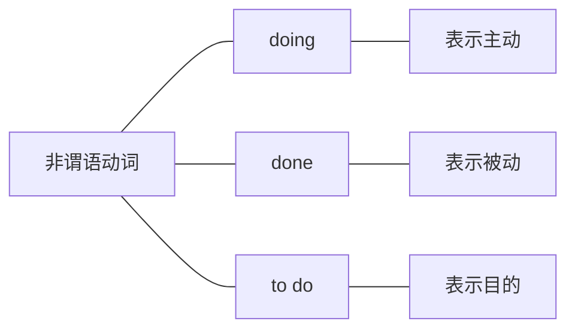
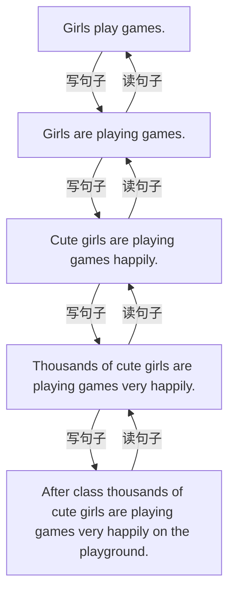

简单句核心的必备成分有主语、谓语、宾语、表语、补语。除此之外，为了把一件事描述得更加充分具体，还可以在此基础上加入扩展的成分。例如：加入定语，修饰名词；加入状语，修饰动词、句子等；还可以加入同位语、插入语，表示对额外信息的补充。

在考研英语当中，考生不需要掌握所有的补充扩展的成分，仅需要重点学会以下三类：非谓语动词、同位语、插入语。
# 一、非谓语动词作定语、状语
非谓语动词，顾名思义还是动词，但是不作谓语了，它是动词的一种变形形式。之所以不作谓语来使用，主要是因为简单句中一主一谓已经搭配好了（只能一一搭配），所以多余的动词就要变成不作谓语的动词形式，即非谓语动词。

非谓语动词一共有三种，如下图：

以上这三种形式的非谓语动词必须单独出现才是非谓语，即旁边没有其他动词。如果和其他动词结合，就可以作谓语，例如：doing前面加上be，就是进行时态；done前面加上了have／has，就变成了完成时态；done前面加上了be，就变成了被动语态，这些都是谓语动词。简言之，doing、done、to do这三种形式只有单独出现，旁边没有其他动词，才是非谓语动词。

动词不作谓语，可以作其他的很多成分，例如作主语、宾语、表语、定语、状语。非谓语动词doing或to do作主语、宾语、表语已经在上一章中讲过，此处我们重点讲解非谓语动词作定语和状语。
## 1.非谓语动词作定语
非谓语动词作定语，指的是修饰限定名词。非谓语动词既然修饰这个名词，那么它的逻辑主语（意思上的主语）就是这个名词，换句话来说，就是想确定非谓语动词表示的是主动、被动或目的，要去看非谓语动词与逻辑主语（即这个名词）的关系。

例：It also raises questions concerning "values"．（2002，Reading Comprehension，Part B）[^1]
句中It raises 一主一谓已经搭配好，所以多余的动词concern要变成非谓语动词。由于concern修饰前面名词questions，且与该名词的关系为主动（意思是“问题涉及……”，而不是“问题被涉及”），所以把它变成主动形式的非谓语concerning。
注意：非谓语动词不一定只有一个词doing，如果它是及物动词，就要后接宾语。还可以再加上形容词、副词表示修饰，加上介词短语表示补充，构成一个较复杂的非谓语动词词组。此句中就是“及物动词＋宾语”构成了非谓语动词词组concerning values，修饰名词questions作定语，表示“涉及价值的问题”。

例：A team of researchers working together in the laboratory would submit the results of their research to a journal.(2008,Reading Comprehension,Part A Text 2)[^2]
句中A team of researchers would submit一主一谓已经搭配好，所以多余的动词work要变成 非谓语。由于work修饰名词researchers，表示主动（意思是“研究人员工作”，而不是“研究人员被工作”），所以把它变成主动形式的非谓语动词working。
注意：非谓语动词不一定是一个词，还可以加上修饰和补充的成分。此句中表达“一起工作”，在working后加上了together，而且补充了地点in the laboratory，所以写成了一个非谓 语词组working together in the laboratory，修饰名词词组A team of researchers，表达“实验室中 一起工作的一组研究人员”。

例：The human nose is an underrated tool．（2005，Use of English）[^3]
句中The human nose is一主一谓已经搭配好，所以多余的动词underrate要变为非谓语。由于它修饰名词tool，表示被动（意思是“工具被低估”，而不是“工具主动去低估别的”），所以把它变成被动形式的非谓语underrated。此句中非谓语动词underrated修饰名词tool，作定语，表示“被低估的工具”。

例：The networked computer is an amazing device…（2012，Reading Comprehension，Part B）[^4]
句中The computer is一主一谓已经搭配好，所以多余的动词network要变为非谓语。由
于它修饰名词computer，表示被动（意思是“电脑被联网”，而不是“电脑主动去联网别的”），所以要把它变成被动形式的非谓语networked。此句中非谓语动词networked修饰名词computer，作定语，表示“被联网的电脑”。

例：Permission to run a nuclear plant is a public trust．（2012，Reading Comprehension，Part A Text 2)[^5]
句中Permission is一主一谓已经搭配好，所以多余的动词run要变为非谓语，由于它修饰名词Permission，表示目的（意思是“这个许可的目的是要去经营核电站”），所以把它变成非谓语to run。run为及物动词，要后接宾语，所以构成非谓语词组to run a nuclear plant，修饰名词Permission，作定语，表示“经营核电站的许可”。

例：America's new plan to buy up toxic assets will not work… （2010，Reading Comprehension,Part A Text 4）[^6]
句中America's new plan will not work一主一谓已经搭配好，所以多余的动词buy要变为非 谓语，由于它修饰名词plan，表示目的（意思是“这个计划的目的是去收购不良资产”），所以把它变成非谓语to buy。buy为及物动词，要后接宾语，所以构成非谓语词组to buy up toxicassets，修饰名词plan，作定语，表示“收购不良资产的计划”。 ^4ft8yc

【补充】非谓语动词修饰名词作定语，通常翻译到名词前，译成“……的……”，[[句句真研/Part1 简单句/第二章 简单句的扩展/第二节 成分角度的扩展#^4ft8yc|如上]]。

[^1]:翻译：这也引发了关于“价值”（涉及“价值”）的问题。
[^2]:翻译：实验室中一起工作的一组研究人员将他们的研究结果呈递给一份专业刊物。
[^3]:翻译：人的鼻子是一种被低估的工具。
[^4]:翻译：联网的电脑是一台神奇的设备……
[^5]:翻译：核电站的经营许可是一个公众信任问题。
[^6]:翻译：美国要去收购不良资产的新计划将不会起作用……
## 2.非谓语动词作状语
作状语指的是修饰限定一个句子。既然非谓语动词修饰句子，所以它的逻辑主语（意思上的主语）自然就是句子的主语，换句话来说，如果想确定非谓语动词表示的是主动、被动或目的，要去看非谓语动词与逻辑主语（即句子主语）的关系。

例：In just one generation，millions of mothers have gone to work，transforming basic family economics.(2007,Reading Comprehension,Part A Text 3)[^7]
句中mothers have gone一主一谓已经搭配好，所以多余的动词transform要变为非谓语。由于它修饰整个句子，所以要看它和句子主语之间的逻辑关系是主动、被动还是目的。此句中transform和mothers之间的关系为主动（意思是“母亲们去改变”，而不是“母亲们被改变”），所以把它变成表示主动形式的非谓语transforming。transform为及物动词，所以要后接宾语economics，再加上修饰的成分，就构成非谓语动词的词组transforming basic family economics，用来修饰句子，表示对整个句子的补充说明。 ^ags3n4

【补充】非谓语动词修饰句子作状语时，通常可以翻译成独立的一句，[[句句真研/Part1 简单句/第二章 简单句的扩展/第二节 成分角度的扩展#^ags3n4|如上]]。

例：Enraged by Entergy's behavior，the Vermont Senate vo ^sx282kted 26 to 4 last year against allowing an extension.(2012,Reading Comprehension,Text 2)[^8]
句中the Vermont Senate voted一主一谓已经搭配好，所以多余的动词enrage要变为非谓语。 由于它修饰整个句子，所以要看它和句子主语之间的逻辑关系是主动、被动还是目的。此句中enrage和the Vermont Senate之间的关系为被动（意思是“Vermont州参议院被激怒”，而不是 “Vermont州参议院去激怒别人”），所以把它变成表示被动形式的非谓语Enraged。后再加上介词短语by（强调被谁激怒），就构成非谓语动词的词组Enraged
by Entergy's behavior，用来 补充说明整个句子。

例：To promote this idea, he turned to the university-admissions process.(2013,Use of English)[^9]
句中he turned一主一谓已经搭配好，所以多余的动词promote要变为非谓语。由于它修饰整个句子，所以要看它和句子主语之间的逻辑关系是主动、被动还是目的。此句中想表达promote和he之间的关系为目的（意思是“他的目的是为了推广”），所以把它变成非谓语动词to promote表示目的。promote为及物动词，要后接宾语this idea，所以就构成非谓语动词的词组To promote this idea，用来补充说明整个句子。

【补充】非谓语动词作状语修饰句子时，为了更加明确地表达补充的是什么内容，可以在非谓语动词前加上从属连词，突出表达和句子间的逻辑关系。如下：
例：People are...poor at considering background information when making individual decisions.(2013,Use of English)[^10]
句中People are一主一谓已经搭配好，所以多余的动词make要变为非谓语。由于它修饰整个句子，表达make和句子主语People之间的关系为主动（意思是“人们去做决定”，而不是“人们被决定”），所以把它变成非谓语动词making。make为及物动词，要后接宾语，再加上修饰的形容词，就构成非谓语动词的词组making individual decisions修饰句子。
此句中，为了强调“做出个人决定”，是补充说明句子的时间，因此在非谓语动词前又加上从属连词when，突出强调非谓语动词的作用是补充说明时间。

【补充】有时一个句子中常常出现多个非谓语动词，此时要逐个分析，如下：
例：Depending on the comments received，the editor would accept the paper for publication or decline it.(2008,Reading Comprehension,Part A Text 2)[^11]
句中the editor would accept一主一谓已经搭配好，所以多余的动词depend和receive要变 为非谓语。received（被动）修饰前面的名词comments作定语，表示“收到的评论（被接收到的）”；而depending（主动）修饰整个句子作状语，因此它的逻辑主语就是句子的主语editor，表示“编者（主动）依靠得到的评论，来决定……”。

[^7]:翻译：仅仅大约一代人的时间里，数百万名母亲出去工作，从而改变了基本的家庭经济状况。
[^8]:翻译：由于被Entergy公司的行为所激怒，Vermont州参议院去年以26:4的投票（获胜）否决了该核电站的延期申请。
[^9]:翻译：为了推广这一想法，他转而关注大学招生程序。
[^10]:翻译：人们在做个人决定时，并不擅长（全面）考虑背景信息。
[^11]:翻译：根据（依靠）得到的评论，主编将会决定是否刊登这篇论文。
## 内容小结
### 1.非谓语动词共有三种：doing／done／to do。 
### 2.非谓语动词作修饰成分：

 看懂非谓语动词，要先确定它修饰什么（详见考场攻略）。
### 3.注意非谓语动词词组的完整性。
## 真题演练
1. Sixty toddlers were each introduced to an adult tester holding a plastic container.(2018,Use of English)
翻译：60名幼儿每人被介绍给一个拿着塑料容器的成人测试者。
解析：非谓语动词的词组holding a plasticcontainer表示主动，修饰名词词组an adult tester作定语，意思是“一个（主动）拿着塑料容器的成人测试者”。

2. Passengers must pay $85 every five years to process their background checks.(2017,Reading Comprehension,Part A Text 1)
翻译：乘客必须每五年支付85美元去进行背景调查。
解析：非谓语动词的词组to process their background checks表示目的，修饰整个句子作 状语，意思是“（目的是）去进行背景调查”。

3. …researchers seeking knowledge of the results would have to subscribe to the journal.(2008, Reading Comprehension,Part A Text 2)
翻译：·想了解该研究结果的（寻求对该研究结果的了解的）研究人员只能订阅此刊物。解析：非谓语动词的词组seeking knowledge of the results表示主动，修饰名词researchers 作定语，意思是“（主动）寻求对该研究结果的了解的研究人员”。

4. But a comparative study of linguistic traits published online today supplies a reality check. (2012,Reading Comprehension,Part C)
翻译：但是，今天在线发布的一项语言特征的比较研究审视了现实情况。
解析：非谓语动词的词组published online today表示被动，修饰名词词组a comparative study of linguistic traits作定语，意思是“今天被发布在网上的一项语言特征的比较研究”。

5. ...it would use a particular case to conduct a broad review of business-method patents. (2010, Reading Comprehension,Part A Text 2)
翻译：···它将用一个特殊的案件对商业方法专利展开广泛的重审。
解析：非谓语动词的词组to conduct a broad review of business-method patents表示目的， 修饰整个句子作状语，意思是“（目的是）对商业方法专利展开广泛的重审”。

6. The first thing needed for innovation is a fascination with wonder...(2009,Reading Comprehension,Part A Text 1)
翻译：创新首先需要的就是充满好奇·...
解析：非谓语动词的词组needed for innovation表示被动，修饰名词词组The first thing作 定语，意思是“创新首先需要的（针对创新被需要的第一个东西）”。

7. The ideals of the early leaders of independence were often egalitarian, valuing equality of everything.(2007,Use of English)
翻译：早期独立运动领导人的理想通常是平等主义，重视一切平等。
解析：非谓语动词的词组valuing equality of everything表示主动，修饰整个句子作状语， 意思是“（主动）重视一切平等”。

8. Paid and owned media are controlled by marketers promoting their own products. (2011, Reading Comprehension,Part A Text 3)
翻译：付费媒介和自有媒介受到推销他们自己产品的营销人员的控制。
解析：非谓语动词Paid 和owned表示被动，并列在一起修饰名词media作定语，意思是“被付费的和被自己拥有的媒介”；非谓语动词的词组promoting their ownproducts表示 主动，修饰名词marketers作定语，意思是“推销他们自己产品的营销人员”。
## 考场攻略
非谓语动词建议重点掌握，阅读和翻译中必考。
在考研真题的长难句中，非谓语动词是非常重要的成分。所以在处理非谓语动词时，要准确地找到非谓语动词的完整结构，同时还要准确地判断出它的作用，才能帮助大家进一步地分析句子。
### 攻略1：非谓语动词词组的完整性
非谓语动词出现时，不一定只有doing、done、to do。如果是及物动词的话，那么就要后接宾语，而且还可以再加上形容词、副词、介词短语等表示进一步的修饰限定，这样就构成了一个非谓语动词的词组。因此在分析句子时，遇到了非谓语动词，就一定要找到完整的非谓语动词的词组，才能理清句意。

例：The networked computer offers the first chance in 50 years to reverse the flow，to encourage thoughtful downloading and...meaningful uploading.(2012,Reading Comprehension,Part B)[^12]
此句中The computer offers一主一谓已经搭配好，所以多余的动词都要变为非谓语。其中，networked是单个的非谓语动词；而to reverse the flow是非谓语动词的调组，因为reverse是及物 动词，所以要后接宾语。尤其要注意非谓语动词的词组to encourage thoughtful downloading and... meaningful uploading，因为encourage是及物动词，所以要后接宾语，此句中是接了两个并列的宾语 downloading and uploading，而且还在前面分别加了一个形容词进行修饰，所以才使得这个非谓语动词的词组这么复杂。

[^12]:翻译：联网电脑提供了50年来第一次可以转变这种流向的机会，鼓励人们认真思考后下载……鼓励有意义的上传。
### 攻略2：准确找到非谓语动词所修饰的对象
非谓语动词作定语或状语，相同点是都表示修饰，不同就在于修饰的对象不同，作定语修饰一个名词（逻辑主语为此名词），而作状语是修饰一个句子（逻辑主语为句子主语）。

- 其实分清楚非谓语动词是作定语还是作状语这个完全不重要，重要的是同学们在考研真题中能够判断清楚它是修饰什么的，这样才能看懂句意。要想准确找到非谓语动词所修饰的对象，可以根据三种方法来判断：
	- 一是非谓语动词的位置；
	- 二是与句子间是否有逗号隔开；
	- 三是代入法，把前后的名词或句子主语分别代入到非谓语，看意思是否合适。
	- 详解如下：
		- 在判断非谓语动词doing和done修饰什么时，有个秘诀就是观察它的位置和逗号。如果前后直接挨着名词，则修饰名词作定语；如果前后不直接挨着名词，或有逗号把非谓语跟句子隔开，则修饰句子作状语。
		- I saw a passing plane. 
		Passing the cafe,I saw a friend.
			- 上面第一句中：passing挨着名词plane，所以修饰名词作定语，表示“我看见了一架经过的飞机”。
			- 上面第二句中：Passing没有挨着名词cafe（中间有the隔开），且有逗号把非谓语跟句子隔开，那么非谓语就修饰句子作状语，表示“经过那个咖啡馆时，我看见了一个朋友”。
		- 在判断非谓语动词to do修饰什么时，要注意：to do位于句首时，通常修饰整句话，有逗号隔开；但是to do位于句子中间或后面时，不管是修饰一个词还是整句，都没有退号隔开，此时就需要采用代入法，看看todo的逻辑主语（意思上的主语）应该是前面的名词合适，还是句子的主语更合适，通过代入法判断意思，进而确定非谓语动词修饰什么。
			- 例：Archaeologists commonly use computers to map sites and the landscapes around sites．（2014． Reading Comprehension,Part B)[^13]
			- 此句中非谓语动词的词组to map sites and the landscapes around sites，前面没有逗号隔开， 所以不清楚它究竟是修饰整个句子，还是修饰前面的一个名词。因此，采用代入法来判断它的意思，到底是Archaeologists to map sites（考古学家去绘制遗迹地图）还是computers to map sites（电 脑主动去绘制遗迹地图）呢？很明显，电脑不能主动去绘制遗迹地图，所以根据意思可以确定tomap的逻辑主语是Archaeologists（即句子主语），然后根据逻辑主语可以判断出这个非谓语动词修饰句子（作状语）。
### 攻略3：非谓语动词的去留
如果非谓语动词在句子中作主语、宾语、表语（通常位于谓语动词前或后），那么它就是句子的核心构成，因此在简化句子时要保留。

但如果非谓语动词在句中作定语或状语（通常位于名调或整个句子前或后），只是修饰的成分，那么在简化句子时可以先去掉不看，先去看句子的核心部分。

[^13]:翻译：考古学家通常用电脑绘制遗迹和周边地形的地图。
# 二、同位语、插入语
## （一）同位语
同位语，用来解释说明名词，通常放在其解释的名词之后。可以用一个词，一个词组甚至是一句话来作同位语（一个句子作同位语，即同位语从句，在本书的第二部分进行讲解）。同位语是进一步解释说明，因此不是句子的核心信息，所以在考研的句子中可以去掉先不看，但是首先同学们必须能够辨别出来才行。

例：…the number of papers including the keywords “environmental change＂ or “climate change"have increased rapidly since 2004.(2013,Reading Comprehension,Part B)[^14]
“environmental change” or “climate change”为同位语，进一步地解释说明前面的名词 keywords指的是什么。

例：In another case，American archaeologists René Million and George Cowgill spent years systematically mapping the entire city...(2014,Reading Comprehension,Part B)[^15]
René Million and George Cowgill为同位语，解释说明前面的名词词组American archaeologists 的含义。

- 【补充】考研真题中，专有名词常后接同位语，表示对专有名词的解释说明；还有可能反过来，普通名词后，专有名词作同位语表示解释说明，如下：标注下划线的部分是同位语，解释说明前面的名词。
	- 例：It said that Internet Explorer 10，the version due to appear with Windows 8，would have DNT as a default.(2013,Reading Comprehension,Part A Text 2)[^16]
	- 例：Bob Liodice，the chief executive of the Association of National Advertisers，says consumers will be worse off if the industry cannot collect information about their preferences. (2013, Reading Comprehension,Part A Text 2）[^17]
	- 例：It's current leader，Ed Miliband，owes his position to votes from public-sector unions. (2012,Reading Comprehension,Part A Text 4)[^18]

- 【补充】同位语表示进一步的解释说明，常伴随着一些标志性的标点符号，如：逗号，破折号，冒号。这也可以作为判断的标志。
	- 例：Brendon Lynch，Microsoft's chief privacy officer,blogged:“We believe consumers should have more control.”(2013,Reading Comprehension,Part A Text 2)[^19]
	- 例：It usually leads to no good——drinking，drugs and casual sex．（2012，Reading Comprehension,Part A Text 1)[^20]
	- 例：Behind the scenes，they have been taking aim at someone else：the accounting standard-setters.(2010,Reading Comprehension,Part A Text 4)[^21]

[^14]:翻译：自2004年以来，含有关键词“环境变化”或者“气候变化”的论文的数量迅速增长。
[^15]:翻译：在其他的考古实例中，美国考古学家René Million和George Cowgill花费数年时间系统地绘制了整个城市的地图……
[^16]:翻译：它（微软）声称说，与Windows 8系统一同推出的IE10浏览器将会把“不要跟踪”作为默认设置。
[^17]:翻译：美国国家广告协会的首席执行官Bob Liodice称，如果广告行业不能收集关于消费者喜好的信息，那么消费者的情况会更糟。
[^18]:翻译：它现在的领导人Ed Miliband凭借公共部门工会的选票坐上现在的位置。
[^19]:翻译：微软的首席隐私官 Brendon Lynch在其博客中写道：“我们相信消费者应该拥有更多的控制权。”
[^20]:翻译：通常它所带来的绝非好事——酗酒、吸毒和滥交。
[^21]:翻译：在这背后，他们把矛头指向了其他人：会计准则制定者。
## （二）插入语
插入语，顾名思义就是后来插入句子中的成分，表示想补充说明的内容。插入语是非核心成分，而且它的插入会造成原句的分裂，加大了看懂句子的难度，因此在进行长难句分析时，可以先去掉不看。通常插入语两端会出现成对的逗号、破折号或括号，但有时候没有标点隔开。
考研真题中的插入语一般有几种常用的形式，如下：
### 1.主谓结构作插入语，表示“某人说，某人认为……＂
例：No one，he submits， could have written it without possessing some power of reasoning. (2008,Reading Comprehension,Part C)[^22]

例：You can，Mr. Menand points out， become a lawyer in three years and a medical doctor in four.(2011,Reading Comprehension,Part B)[^23]

例：This speeding up of life， says the Futurist， requires a new form of expression． （2000， Reading Comprehension,Passage3)[^24]

[^22]: 翻译：他认为能写出这样一本书的人必定具备某种推理能力。
[^23]: 翻译：Menand先生指出，你可以在三年内成为一名律师，在四年内成为一名医生。
[^24]: 翻译：未来主义者宣称，这种快节奏生活需要一个新的表达方式。
### 2.副词作插入语
例：These facts，however，have previously been thought unrelated．（2008，Use of English）[^25]

例：Politics or，more broadly， the functioning of the state， is a major subject for journalists. (2007,Reading Comprehension,Part C)[^26]

例：A deal is a deal-except，apparently，when Entergy is involved．（2012，Reading Comprehension,Part A Text 2)[^27]

[^25]: 翻译：然而之前人们认为这些事实之间并不是相关联的。
[^26]: 翻译：政治，或者更广泛一些，国家的职能，是新闻记者报道的一个主要方面。
[^27]: 翻译：协议就是协议—但Entergy公司显然是个例外。
### 3.介词短语作插入语
例：Justice Antonin Scalia，for example，appeared at political events．（2012，Use of English）[^28]

例：Other standardized tests， such as the Scholastic Assessment Test（SAT）and the Graduate Record Exam(GRE),capture the main aspects of IQ tests.(2007,Reading Comprehension,Part A Text 2)[^29]

例：Amateurs，on the other hand，have continued to pursue local studies in the old way．（2001， Reading Comprehension,Passage 1)[^30]

- 【补充】同位语和插入语放在句子中间时很像，都是后插进来的补充成分，唯一的区别在于同位语与前面的名词有关系，它们说的是同一个人或同一件事；而插入语与左右两边的内容都没有直接关系。如下：
	- Tony,my teacher,is coming here.
	my teacher是同位语，解释说明Tony是谁，Tony与my teacher说的是同一个人。 
	- Tony,with his students,is coming here.
	with his students是插入语，补充说明Tony和谁一起来。Tony与with his students不是同一个人。 

[^28]: 翻译：比如，大法官 Antonin Scalia就曾参与过一些政治活动。
[^29]: 翻译：其他标准测试，比如学术能力评估测试以及研究生入学考试，都充分体现了智商测试的主要特点。
[^30]: 翻译：另一方面，业余科研人员继续以传统方式从事局部的研究。
## 内容小结
1. 同位语：解释说明前面的名词。
插入语：后插入句子中的成分，表示补充说明。
2. 同位语和插入语都是对于句子的补充说明，因此都是非核心部分，在考研的长难句分析当中可以先略去不看。尤其是旁边有逗号或破折号隔开的时候，可以率先省掉，降低句子难度。
## 真题演练
1. That,at least,is the hope.(2012,Reading Comprehension,Part C) 
翻译：至少，那是一种希望。
解析：at least为插入语，前后两个逗号隔开。

2. His concern is mainly with the humanities: literature, languages,philosophy and so on.(2011, Reading Comprehension,Part B)
翻译：他把关注的焦点主要集中在人文学科：文学、语言、哲学，等等。
解析：literature，languages，philosophy and so on为同位语，解释说明前面的名词 humanities，冒号引出。

3. …positive health habits-as well as negative ones
spread through networks of friends via social communication.(2012,Reading Comprehension,Part A Text 1)
翻译：····积极的健康习惯，还有消极的，都会通过朋友网络中的社交得以传播。
解析：as well as negative ones为插入语，前后两个破折号隔开。

4. Sapir's pupil,Benjamin Lee Whorf, continued the study of American Indian languages.(2004, Reading Comprehension,Part B)
翻译：Sapir的学生，Benjamin Lee Whorf，继续研究美洲印第安语。
解析：Benjamin Lee Whorf为同位语，解释说明Sapir的学生，前后两个逗号隔开。

5. Every cat with an owner,for instance, is running a small-scale study in operant conditioning. (2009,Use of English)
翻译：例如，每只有主人的家猫都会进行小规模的操作条件反射研究。
解析：for instance为插入语，前后两个逗号隔开。

6. People are,on the whole,poor at considering background information... (2013,Use of English) 
翻译：总体说来，人们在做个人决定时，并不擅长考虑背景信息······
解析：on the whole为插入语，前后两个逗号隔开。

7. That compulsion has resulted in robotics-the science of conferring various human capabilities on machines.(2002,Reading Comprehension,Part A Text 2)
翻译：这种欲望导致了机器人学（即赋予机器以人的各种技能的科学）的诞生。
解析：the science of conferring various human capabilities on machines为同位语，解释说 明前面的名词robotics，破折号引出。

8. Many,like the Fundamental Physics Prize, are funded from the telephone-number-sized bank accounts of Internet entrepreneurs.(2014,Reading Comprehension,Part A Text 3)
翻译：就像基础物理学奖一样，许多奖项的经费都是来自互联网企业家的大量的银行存款。
解析：like the Fundamental Physics Prize为插入语，前后两个逗号隔开。 
# 考场攻略
攻略：如何利用简单句的核心和扩展攻克考研真题

考研真题无外乎就是五种题型：完形填空、阅读、新题型、翻译和写作。其中前四种考查的就是读句子，而最后一种考查的就是写句子。利用我们讲解过的简单句的知识，可以直接帮助大家提高写句子和读句子的能力。

在写句子时，请各位同学先写出句子的核心，然后再慢慢加上扩展的部分，表示修饰或补充；反之，在读句子时，要反过来，先去掉修饰，然后就可以找到核心。如下图：

考研真题中大部分的分数还是集中在对读句子的考查上，因此读懂句子尤为重要。考研中较难突破的“长难句”就是由一个个的“简单句”连接而成；而想要攻克“简单句”也不难，（参考上图）只需要：去修饰，找核心。

简单句最核心的构成是一主一谓，而简单句的修饰和补充的成分有很多：限定词、形容词、副词、介词短语、非谓语动词、插入语和同位语。

- 例：In response to these many unilateral measures，the Organization for Economic Cooperation and Development(OECD) is currently working with 131 countries to reach a consensus by the end of 2020 on an international solution.(2020,Reading Comprehension,Part A Text 4)[^31]
	1. 找到谓语动词，确定是否为简单句（一件事）：
		- 找到句中的谓语动词is working，确定只有一个谓语动词后，就可以判断出这是一个简单句，只表述了一件事。
		- 注意，其中的to reach是非谓语动词，在本句中不是句子的核心，只是扩展的成分。
	2. 去扩展，找核心：
		- In response to these many unilateral measures,the Organization for Economic Cooperation and Development(OECD)is currently working with 131 countries to reach a consensus by the end of 2020 on an international solution.
		- 句中的扩展成分（非核心的修饰成分）有：
			- 多个介词短语表示补充说明，如In response to these many unilateral measures，with 131 countries，by the end of 2020，on an international solution；
			- 副词currently（修饰动词is working）；
			- 非谓语动词to reach a consensus。
	3. 找到句子的核心：
		...the Organization for Economic Cooperation and Development(OECD)is...working...
		整个句子的核心意思就是“······经济合作与发展组织（OECD经合组织）正在工作……”。看懂核心后，再慢慢把修饰的内容加回来，补全完整意思。

- 例：Sharpening judgment by absorbing and reflecting on law is a desirable component of a journalist's intellectual preparation for his or her career.(2007,Reading Comprehension,Part C)[^32]
	1. 找到谓语动词，确定是否为简单句（一件事）：
		- 找到句中的谓语动词is，确定只有一个谓语动词后，就可以判断出这是一个简单句，只表述了一件事。
		- 注意，其中的Sharpening、absorbing和reflecting都是非谓语动词，详解见下一步。
	2. 去扩展，找核心：
		- Sharpening judgment by absorbing and reflecting on law is a desirable component of a journalist's intellectual preparation for his or her career.
			- Sharpening judgment虽然是非谓语动词，但是作主语，所以是句子的核心，要保留。
			- 句中的扩展成分（非核心的修饰成分）有：
				- 多个介词短语表示补充说明，如by absorbing and reflecting（其中包含两个非谓语动词），on law， of a journalist's intellectual preparation， for his or her career；
				- 形容词desirable（修饰名词 component)。
	3. 找到句子的核心：
	Sharpening judgment...is a...component... 
	- 整个句子的核心意思就是“提高判断力……是一个……组成部分”。看懂核心后，再慢慢把修饰的内容加回来，补全完整意思。

[^31]:翻译：为了应对这些单边措施，经济合作与发展组织（OECD经合组织）目前正在与131个国家合作，以在2020年底之前就国际解决方案达成共识。
[^32]:翻译：通过学习并思考法律来提高判断力，是一名新闻记者为其事业应该做的一项知识准备（一个组成部分）。