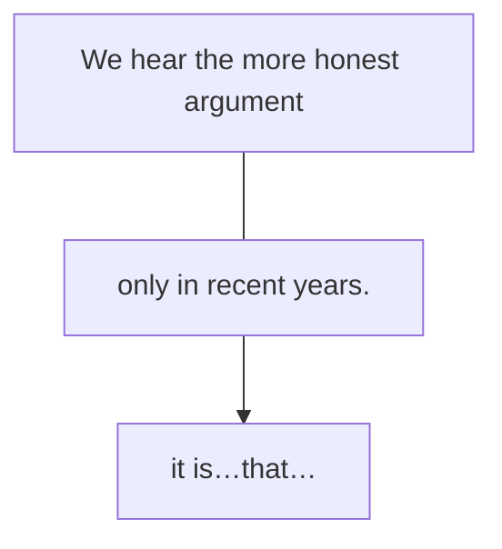

一个句子中会有很多个信息点，如果想把重要的信息准确地传递，就需要强调。口语中表示强调很简单，通过重音、拉长音、手势动作等都可以实现。但在书面语中想要表示强调，就需要用到一个特殊句式——强调句。
# 一、强调句的构成
强调句的基本构成为“It is…that…”。强调句的写法也非常简单，就是把一个普通的句子拆分成两部分，把“想强调的部分”放到“it is…that”中间，把句子余下的部分放到that后，就变成了强调句。注意：不能强调形容词和动词。

强调前：

想强调时间only in recent years（只有在最近几年），而不是其他时间，所以把强调的部分放入“it is...that...”，句子余下的部分放到that后，变为强调句。

强调后：
>例：It is only in recent years that we hear the more honest argument…（2010， Reading Comprehension,Part C)
译：只有在最近几年，我们才听到这种比较诚实的论点……

例：It is not by chance that the Funeral March is not the last movement of the Eroica Symphony… (2014,Reading Comprehension,Part C)[^1]

【补充】强调句不仅可以强调词或词组，也可以强调从句，如下：
例：It was only after I started to write a weekly column about the medical journals，and began to read scientific papers from beginning to end, that I realised just how bad much of the medical literature frequently was.(2019,Reading Comprehension,Part C)[^2]
此句中要强调的是时间状语从句only after I started to write...and began to read...，所以把它放到了强调句的It was...that...中间（其中was表示强调过去的事）。

[^1]:翻译：《葬礼进行曲》不是《英雄交响曲》的最后一个乐章，这不是偶然的……
[^2]:翻译：直到我开始写关于医学期刊的每周专栏文章，并开始从头到尾阅读科学论文之后，我才意识到很多医学文献常常有多么糟糕。
# 二、强调句的变化
It is/was…that/who…
强调句中，强调现在的事用is；强调过去的事用was。
不论强调的是什么成分，都可以用that；但如果强调的成分是人，可以把that换成who。

例:It is they, not America, who have become anti-intellectual. (2006, Reading Comprehension, Part C)[^3]
此句中强调的是“恰恰是他们，而非美国”。因为强调的成分是人，所以可以用who。

例:…it was not until the 19th century that the newspaper became the dominant pre-electronic medium… (2002, Use of English) [^4]
此句中强调的是“直到19世纪才……”，而不是其他时间。因为强调的是过去的时间，所以用was。

- 【补充】在考研真题中经常会出现“it is…that…”结构，但并不一定是强调句，也有可能是主语从句（后置）。有两种方法进行区别：
	- —是根据强调句的构成原理，如果去掉“it is… that…”，余下部分可还原成一个完整的句子，即为强调句；反之余下的部分不能还原成完整的句子则不是强调句，为主语从句(后置)。
		- 例:It is this implicit or explicit reference to nature that fully justifies the use of word garden… (2013, Reading Comprehension, Part C)[^5]
		- 去掉"It is...that...”后,句子余下的部分“...this implicit or explicit reference to nature...fully justifies the use of word garden..."可以构成一个完整的句子，因此判断该句为强调句。
	- 二是如果发现“it is...that...”中间是形容词或动词，则该句为主语从句，因为强调句不能强调形容词或动词。
		- 例:It is worrisome that society is medicalizing more and more behavioral problems…(2006, Reading Comprehension, Part B)[^6]
		- 此句中, "It is...that”中间是形容词worrisome,就可以判断该句不是强调句,因为强调 句不能强调形容词，所以该句为主语从句后置（It作形式主语）

[^3]:翻译：反对知识分子的恰恰是他们（知识分子自己），而非美国。
[^4]:翻译:直到19世纪，报纸才成为电子时代到来前主要的传播媒介。
[^5]:翻译：正是这种对自然的含蓄或明确的提及，完全证明了“花园”一词的使用（是合理的）
[^6]:翻译：令人不安的是，社会现在将越来越多的行为问题医学化……

