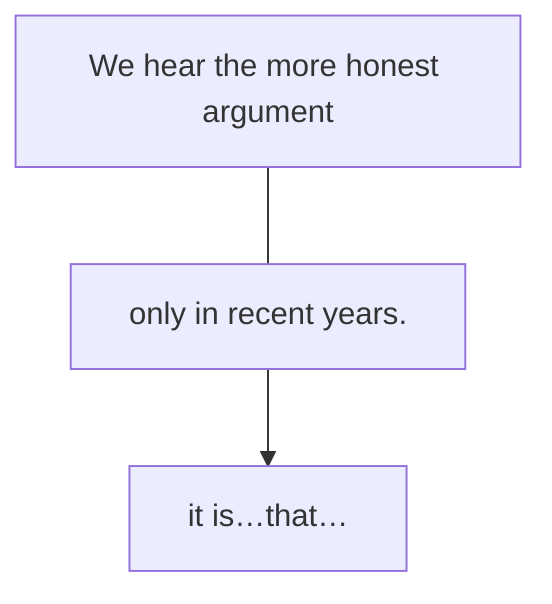

一个句子中会有很多个信息点，如果想把重要的信息准确地传递，就需要强调。口语中表示强调很简单，通过重音、拉长音、手势动作等都可以实现。但在书面语中想要表示强调，就需要用到一个特殊句式——强调句。
# 一、强调句的构成
强调句的基本构成为“It is…that…”。强调句的写法也非常简单，就是把一个普通的句子拆分成两部分，把“想强调的部分”放到“it is…that”中间，把句子余下的部分放到that后，就变成了强调句。注意：不能强调形容词和动词。

强调前：

想强调时间only in recent years（只有在最近几年），而不是其他时间，所以把强调的部分放入“it is...that...”，句子余下的部分放到that后，变为强调句。

强调后：
>例：It is only in recent years that we hear the more honest argument…（2010， Reading Comprehension,Part C)
译：只有在最近几年，我们才听到这种比较诚实的论点……

例：It is not by chance that the Funeral March is not the last movement of the Eroica Symphony… (2014,Reading Comprehension,Part C)[^1]

【补充】强调句不仅可以强调词或词组，也可以强调从句，如下：
例：It was only after I started to write a weekly column about the medical journals，and began to read scientific papers from beginning to end, that I realised just how bad much of the medical literature frequently was.(2019,Reading Comprehension,Part C)[^2]
此句中要强调的是时间状语从句only after I started to write...and began to read...，所以把它放到了强调句的It was...that...中间（其中was表示强调过去的事）。

[^1]: 翻译：《葬礼进行曲》不是《英雄交响曲》的最后一个乐章，这不是偶然的……
[^2]: 翻译：直到我开始写关于医学期刊的每周专栏文章，并开始从头到尾阅读科学论文之后，我才意识到很多医学文献常常有多么糟糕。