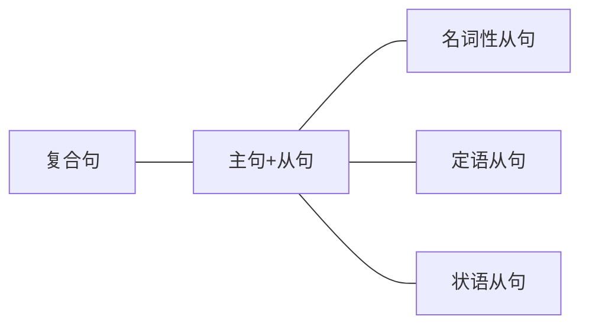

复合句，又称“主从复合句”，就是指多件事之间由于重要性的不同，分为“主句”和“从句”。主要表达的那件事叫主句，次要表达的事叫从句（从句可以有多个）。通常从句是为主句服务的，即从句对主句（或主句的部分）进行修饰限定或补充说明，或在主句中充当成分。尤其注意，从句前一般都有连接词引导（特殊情况下可省略，后面详解）。

- 例：America's new plan to buy up toxic assets will not work unless banks mark assets to levels which buyers find attractive.(2010,Reading Comprehension,Part A Text 4)[^1]
	- America's new plan to buy up toxic assets will not work主句
	- unless （从句1前的连接词） banks mark assets to levels从句1
	- which（从句2前的连接词） buyers find attractive. 从句2

虽然主句是主要表达的事，但是主句就是一个普通的句子，没有任何变化，因此同学们不需要重点分析。从句虽然不是主要表达的事，但是它形式多变、作用不同，会影响句子的顺序和表达的意思，是考研长难句分析的关键（看到长难句需要先找从句）。因此，在考研语法中我们重点研究从句。复合句中的从句分为三类，如下：

[^1]:翻译：美国要去收购不良资产的新计划将不会起作用，除非银行把资产的价格标到吸引买家的水平上。