名词性从句，是指一个句子相当于名词来使用，放到另外一个句子中。通常情况下，名词在句子中主要作四种成分：宾语、表语、主语、同位语。因此，名词性从句就分成四种：宾语从句、表语从句、主语从句、同位语从句。

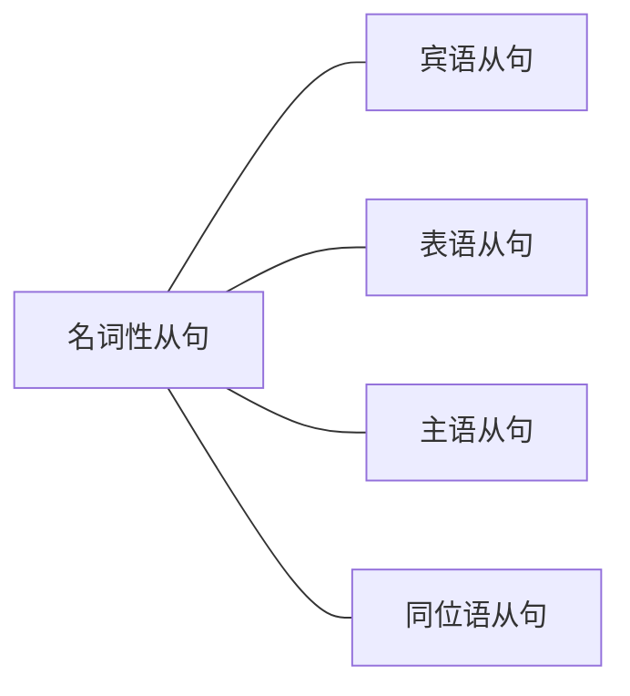

四种名词性从句写法基本相同，只是位置不同。学会其中任何一种名词性从句的写法，其他三种自然也就会了，差别只在于从句的位置。

四种名词性从句在考研英语中考查最多的是宾语从句，其次是主语从句和同位语从句，表语从句最少。
# 一、宾语从句
## （一）宾语从句的含义
一个句子作宾语，放在另一个句子（主句）中。例如：

例：Justice Anthony Kennedy wrote that the previous decisions were flawed．（2019，Reading Comprehension,Part A Text 4)[^1]

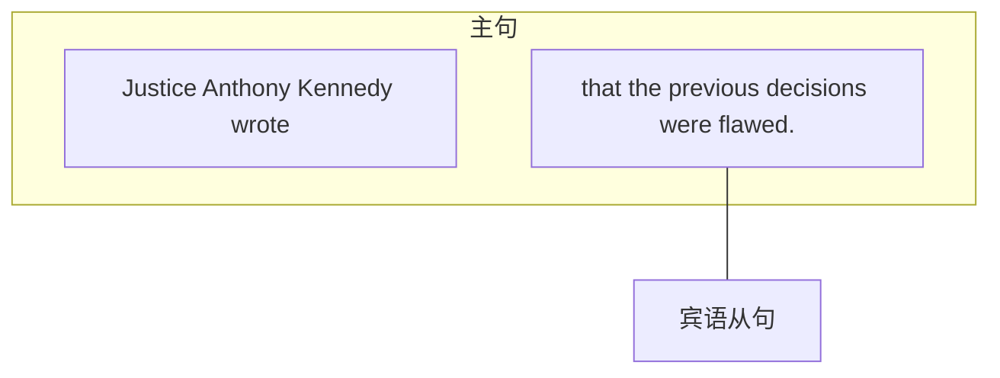

[^1]:翻译：Anthony Kennedy法官写道，以前的决定是有缺陷的。
## （二）宾语从句的写法
由于宾语从句是把一个句子放入另外一个句子（主句）中作宾语，因此想写出宾语从句，只需先写出一个简单句，再把它放入主句中作宾语即可。但要注意不同类型的句子放入的方法不同，分为如下三种：
### 1.陈述句变宾语从句
变化前：
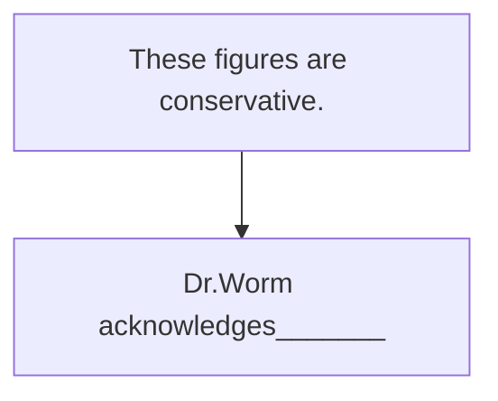
句子“Dr.Worm acknowledges___”为主谓宾结构，其中acknowledges （acknowledge的第三人称单数）是及物动词，它后面的横线部分是宾语。现在想把句子“These figures are conservative.”放到主句中作宾语，即变为宾语从句。由于它是陈述句，而主句也为陈述句，就说明放入前后的句子类型一样，那句子语序自然也一样，因此不需要调整，可以直接放入。但为了区分主句部分和从句部分，因此加入“分隔符”——that来隔开两个句子（that不作成分，只起到连接从句和主句的作用，可以省略）。

变化后：
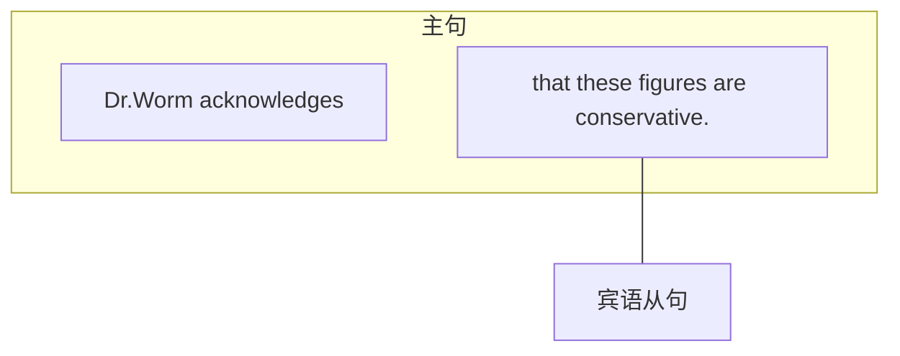

例：Dr．Worm acknowledges that these figures are conservative．（2006，Reading Comprehension,Part A Text 3)[^2]
结论：陈述句变宾语从句，前加that（that不作成分，可以省略）。

- 【补充】宾语从句里的that可以省略，但是建议同学们写的时候不要省。一是把that加上，更有利于分清主句和从句；二是名词性从句写法基本相同，但只有宾语从句中的that可以省略，而其他三种（主语从句、表语从句、同位语从句）都不能省略that，与其浪费时间去分辨能不能省略，不如都加上更保险。但在分析句子时要注意，考研真题中出现的宾语从句常省略that。
	- 例：We believe consumers should have more control． （2013，Reading Comprehension，Part A）[^3]
	- 例：As a physician，I know the most costly and dramatic measures may be ineffective and painful.(2003,Reading Comprehension,Part A Text 4)[^4]

[^2]:翻译：Worm博士承认这些数据是保守的。
[^3]:翻译：我们相信消费者应该拥有更多的控制权。
[^4]:翻译：作为一名医生，我深知最昂贵和最激进的措施可能是无效的和痛苦的。
### 2.特殊疑问句变宾语从句变化前：
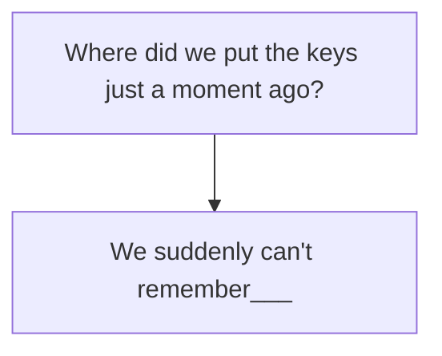

句子“We suddenly can't remember___”为主谓宾结构，其中remember是及物动词，它后面的横线部分是宾语。现在想把句子“Where did we put the keys just a moment ago?” 放到主句中作宾语，即变为宾语从句。由于它是特殊疑问句，而主句为陈述句，说明两者的句子类型不一样，要合并成一个新的句子，就需要调整句子的语序。中国有句古话叫作“入乡随俗”，既然是疑问句要放入陈述句中，自然要把疑问语序变成陈述语序（先主后谓），即把疑问句的主语提前到谓语动词前，其他不变，就变成了“Where we did put the keys just a moment ago”（注意，其中动词did和put可以合并成put的过去式，形式还是put）。放入后不需要加任何连接词，因为从句前有特殊疑问词。

变化后：
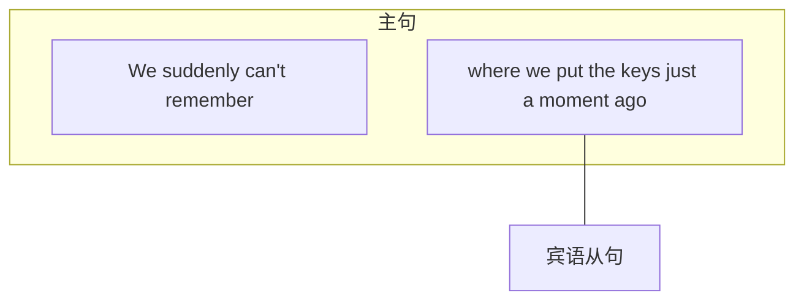

例：We suddenly can't remember where we put the keys just a moment ago…（2014，Use of  English）[^5]
结论：特殊疑问句变宾语从句，要调整语序（疑问语序变回陈述语序，即把疑问句的主语提前到谓语动词之前，其他不变）。

[^5]:翻译：我们突然记不起来就在片刻之前把钥匙放在哪里了……
### 3.一般疑问句变宾语从句
变化前：
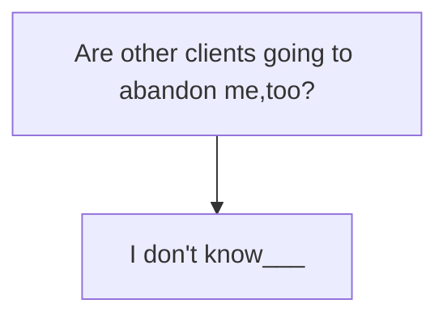

句子“I don't know”为主谓宾结构，其中know是及物动词，它后面的横线部分是宾语。现在想把句子“Are other clients going to abandon me，too？”放到主句中作宾语，即变为宾语从句。由于它是一般疑问句，而它放入的主句为陈述句，就说明两者的句子类型不一样，因此需要调整句子语序（同特殊疑问句），即把疑问语序变成陈述语序（主语提前，其他不变），就变成了“other clients are going to abandon me，too”。

此时语序虽然对了，但是意思不对。因为一般疑问句的答案有两种可能“是或不是（是否）”，若只调整了语序，那意思只表述了肯定的“是”，而没有保留原意的“是否”，所以调整语序后，还需要在前加“是否（whether或if）”。

变化后：
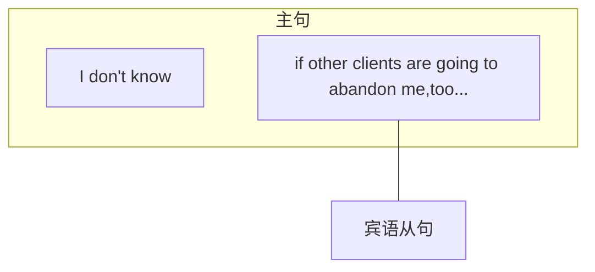

例：I don't know if other clients are going to abandon me，too…（2004，Reading Comprehension,Part A Text 3)[^6]
结论：一般疑问句变宾语从句，先调整语序（主语提前），再前加“是否（whether或if）”。
whether和if都能表示“是否”，但建议大家使用whether。因为if有时不能使用（例如主语从句中），而whether在各种情况下都可以用，所以建议使用最保险的whether。

- 【补充】上面的例子都是主句为陈述句，因此从句要调整成陈述语序再放入到主句中。若主句为疑问句，内部包含的宾语从句依然遵循此原则—变为陈述语序，如下：
	- 例：Why do so many Americans distrust what they read in their newspapers?(2001,Reading Comprehension,Passage 3)[^7]

- 其实写宾语从句时，没必要每次都写两个句子，再把其中一句调整后放入另一个句子中，这样太麻烦。完全可以直接写成“主句＋宾语从句”，只需要找到宾语从句的构成特点就可以。观察刚才变化后的三个宾语从句，看看有什么相同点。
	- Dr.Worm acknowledges that these figures are conservative.
	- We suddenly can't remember where we put the keys just a moment ago... 
	- I don't know if other clients are going to abandon me,too...

以上三个句子虽然变化之前类型不同（陈述句、特殊疑问句、一般疑问句），但是变成宾语从句后结构是一样的，都是“连接词＋陈述句（陈述语序的句子）”。其中陈述语序的句子很容易写，就是“一主一谓，先主后谓”。同学们需要注意的是连接词，而加哪个连接词取决于后面的陈述句中缺的内容（因为连接词和陈述句合在一起，构成一个完整的句子）。如果缺“谁”，加上连接词who；如果缺“地点”，加上where；如果缺“是否”，加上whether或if；如果什么都不缺，就加that（因为that在宾语从句中不作成分）。

结论：宾语从句＝连接词＋陈述句

[^6]:翻译：我不知道其他的客户是否也会弃我而去……
[^7]:翻译：为什么如此多的美国人怀疑自己在报纸上看到的东西？
## （三）宾语从句的位置
宾语从句的位置一共有三种，分别是及物动词后（动宾）、介词后（介宾）、形容词后。如下：

|位置|真题例句|
|:---:|:---:|
|动单宾：及物动词＋从句| 例：…scientists believe that intelligence can expand and fluctuate according to mental effort.(2014,Use of English) 译：······科学家认为智力能够通过思维锻炼而发展和波动。  例：This may also explain why we are not usually sensitive to our own smells... (2005,Use of English) 译：这也可以解释为什么我们总是对自己的气味不敏感……|
| 动双宾：及物动词＋人＋从句|例：…users could tell advertisers that they did not want to be followed．（2013， Reading Comprehension,Part A Text 2)  译：……用户可以告知广告商们他们不想被跟踪。|
|介宾（介词＋宾语从句）|例：This and other similar cases raise the question of whether there is still a line between the court and politics.(2012,Use of English) 译：这一事件及其他类似事件提出了一个问题：法院和政治之间是否还存在界限。  例：…those differences are swamped by how well each person ＂encodes＂ the information.(2007,Reading Comprehension,Part A Text 1) 译：……这些差异都会被个人的信息“编码”能力所掩盖（淹没）。|
|形容词＋宾语从句|例：…he felt certain that he never could have succeeded with mathematics．（2008， Reading Comprehension,Part C) 译：……他认定自己在数学方面根本不可能有大的作为。|

三种位置的宾语从句中，考研真题中考查得最多的是动宾，其次是介宾，而“形容词＋宾语从句”考查得最少，只需要简单了解。其实原本没有“形宾”这种结构，形容词后面之所以可接宾语从句，主要是因为此处省略了介词。本来应该是“形容词＋介词＋宾语从句”（介宾结构），但由于介词在这里没有实际的用途，去掉也不影响表意，因此被省略。

【补充】除了作为谓语的及物动词后可接宾语从句之外，非谓语动词后也可以接宾语从句，但是注意一定要是及物动词的非谓语后才可以接宾语从句。在考研中，最常出现的是doing或者是 to do 这两种非谓语动词后接宾语从句。

例：You might even be tempted to assume that humanity has little future to look forward to.(2013,Reading Comprehension,Part A Text 3)[^8]

例：she wanted to know if vaccines come from animal research.(2003,Reading Comprehension,Part A Text 2)[^9]

例：…they survey and sample... large areas of terrain to determine where excavation will yield useful information.(2014,Reading Comprehension,Part B)[^10]

例：Neither of these patterns is borne out by the analysis，suggesting that the structures of the languages are lineage-specific and not governed by universals.(2012,Reading Comprehension, Part C)[^11]

- 【补充】一个长难句中，有时会包含多个宾语从句，这属于难度较大的句子，看懂即可。如下：
	- 例：To filter out what is unique from what is shared might enable us to understand how complex cultural behavior arose and what guides it in evolutionary or cognitive terms. (2012, Reading Comprehension,Part C)[^12]
		- what is unique 位于及物动词词组filter out后，作动词后的宾语从句。what is shared位于介 词from后，作介词后的宾语从句。
		- how complex...arose 和what guides it...terms 由and连接，并列在一起，作及物动词understand后的宾语从句。

- 【补充】如果宾语从句过长，且在主谓宾补的句型中，则宾语从句后置，用形式宾语 it来替代（用法同[[句句真研/Part1 简单句/第一章 简单句的核心/主语、宾语、表语的变化#^zvgnwe|to do作宾语后置]]，见P36）。
	- 例：That kind of activity makes it less likely that the court's decisions will be accepted as impartial judgments.(2012,Use of English)[^13]
	- 例：He says medical licensing boards “must make it clear...that painful deaths are presumptively ones that are incompetently managed and should result in license suspension.”(2002, Reading Comprehension,Part A Text 4)[^14]

[^8]:翻译：你可能会禁不住推测说人类几乎没有未来可以期盼。
[^9]:翻译：……她想知道的是疫苗是否来自动物研究。
[^10]:翻译：……他们对大部分地区进行勘查抽样，来确定哪些地方会挖出有用的东西。
[^11]:翻译：两种理论模式均未通过此分析得以证实，表明语言的结构具有种系特异性，不受普遍性所支配。
[^12]:翻译：从共有特性中滤出独有特征，这使我们能够理解复杂的文化行为是如何产生的，并从进化和认知角度理解什么引导了它（的走向）。
[^13]:翻译：这种行为降低了法院判决被视作公正判断的可能性。
[^14]:翻译：他说，行医执照颁发委员会“必须明确表明……病人痛苦的死亡被推定是由于医生治疗不当造成的，应当吊销其行医执照”。
# 二、表语从句
## （一）表语从句的含义
一个句子作表语，放到另一个句子（主句）中。

例:This kind of thinking is why so many people try to avoid arguments…(2019, Reading Comprehension, Part B)[^15]

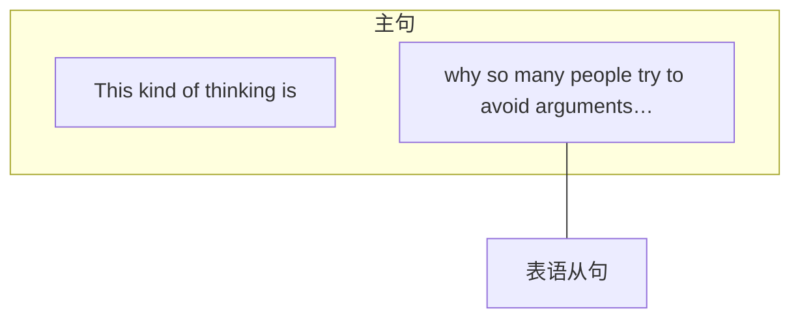

[^15]:翻译：这种想法就是这么多人试图避免争论的原因……
## （二）表语从句的写法
表语从句的写法同宾语从句。但连接词为that时，不作成分也不能省略。

例:Part of the issue is that airports have only so much room for screening lanes. (2017, Reading Comprehension, Part A Text 1)[^16]

例:This is where developing new habits comes in. (2009, Reading Comprehension, Part A Text 1)[^17]

例:This is why repeated attempts at reform legislation have failed in recent years… (2018,Reading Comprehension, Part A Text 4)[^18]

[^16]:翻译：部分问题是机场只能提供有限的空间来作安检通道。
[^17]:翻译：而这正是培养新习惯发挥作用的地方。
[^18]:翻译：这也就是为什么最近几年不断尝试改革法律都失败了……
## （三）表语从句的位置
- 表语从句位于系动词后（[[句句真研/Part1 简单句/第一章 简单句的核心/第一节 简单句的核心构成#^rram97|系动词表格]]见P6），通常位于系动词be后（如上），极少数情况下会出现在其他系动词后，如下：
	- 例:For Williams, those activities become what he calls "electronic heroin." (2006, Reading Comprehension, Part B)[^19]
	- 例:Yet the fact remains that the merger movement must be watched. (2001, Reading Comprehension, Passage 4)[^20]

【补充】除作为谓语使用的系动词后可接表语从句之外，作为非谓语动词的系动词后也可以接表语从句。但是注意，表语从句在考研英语中出现得非常少，它是四种名词性从句中出现频率最少的，简单了解即可。而“非谓语动词+表语从句”出现得更少，不用重点掌握。

例:Human nature being what it is, most people stick with default settings. (2013, Reading Comprehension, Part A Text 2)[^21]

例:The explanation for insensitivity to smell seems to be that the brain finds it inefficient to keep all smell receptors working all the time but can create new receptors if necessary. (2005, Use of English)[^22]

[^19]:翻译：对于Williams来说，这些活动变成了他说的“电子海洛因”。
[^20]:翻译：不过事实仍然是，我们必须关注这场合并运动（这场合并运动必须被关注）。
[^21]:翻译：人的本性就是这样，很多人坚持使用默认设置。
[^22]:翻译：对气味不敏感的解释似乎是大脑发现让所有的气味感受器一直工作效率太低，但是在需要时大脑仍可以产生新的感受器。
# 三、主语从句
## （一）主语从句的含义
一个句子作主语，放到另一个句子（主句）中。

例：What is being called artificial general intelligence…continues to elude scientists．（2019， Reading Comprehension,Part A Text 3)[^23]

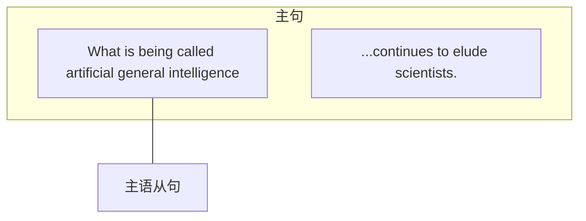

[^23]:翻译：被称为人工智能的东西……科学家们仍然无法使用。
## （二）主语从句的写法
主语从句的写法同宾语从句，但是that不作成分也不能省略，而且表示“是否”时，只能用whether，不能用if。

例：That the seas are being overfished has been known for years． （2006，Reading Comprehension,Part A Text 3)[^24]

例：What motivated him…was his zeal for ＂fundamental fairness＂…（2014，Reading Comprehension,Part A Text 1)[^25]

例：And whether the community's work contributes much to an overall accumulation of knowledge is doubtful.(2013,Reading Comprehension,Part B)[^26]

[^24]:翻译：人们很多年前就已经知道海洋生物被过度捕捞这个事实。（海洋生物被过度捕捞这个事实已经被知道很多年了。）
[^25]:翻译：激发他的……是他对于“基本公平”的追求（热情）……
[^26]:翻译：而且，社会科学界的工作是否对总体的知识积累做出了大量贡献仍然是令人怀疑的。
## （三）主语从句的位置
主语从句的位置有两种：位于句首或句尾。同一个主语从句位于两种位置时，意思相同。
### 1.位于句首
通常情况下主语从句较短时位于句首；个别情况下，主语从句较长时也可位于句首，但相对较少。

例：Just how people think is still far too complex to be understood…（2019，Reading Comprehension,Part A Text 3)[^27]

例：What is needed is a technology of behavior…（2002，Reading Comprehension，Part B）[^28]

[^27]:翻译：人们的想法（人们是怎么想的）还是过于复杂了，无法理解……
[^28]:翻译：我们需要的是一门行为技术（所被需要的是一门行为技术）……
### 2.位于句尾
为了避免因主语从句过长而造成整个句子头重脚轻，所以通常主语从句后置，句首用形式主语it来代替。考研真题中出现得最多的是主语从句位于句尾，因此要重点掌握。

例：It did not matter what was done in the experiment…（2010，Use of English）[^29]

例：It is becoming less clear，however，that such a theory would be a simplification…（2012， Reading Comprehension,Part C)[^30]

例：It makes no difference how you write…（2008，Reading Comprehension，Part B）[^31]

- 【补充】主语从句在考研真题中有两种特别重要且常用的句型模板，如下：
	- 模板1：It is done＋主语从句（表达人们对一件事的观点或看法）
		- 例：This year，it was proposed that the system be changed…（2013，Reading Comprehension,Part B)[^32]
		- 例：It was argued at the end of the 19th century that humans do not cry because they are sad...(2011,Use of English)[^33]
	- 模板2：lt is＋adj．／n．＋主语从句（表达对一件事的评价）
		- 例：It is not yet clear how much more effective airline security has become…（2017，Reading Comprehension,Part A Text 1)[^34]
		- 例：it is obvious that their views were less fully intellectualized．（2009，Reading Comprehension,Part A Text 4)[^35]
		- 例：Second， it is surely a good thing that the money and attention come to science rather than go elsewhere.(2014,Reading Comprehension,Part A Text 3)[^36]

[^29]:翻译：实验中做什么无关紧要……
[^30]:翻译：然而，这种理论是否是一种简化变得越来越模糊了……
[^31]:翻译：你写的方式（你怎么写）没有什么区别……
[^32]:翻译：今年，有人提议应该对该体制加以改变……
[^33]:翻译：19世纪末的观点认为，人们并不是因为悲伤而哭泣……
[^34]:翻译：机场安检已经变得多么有效还不清楚……
[^35]:翻译：……显然他们的观点不是那么有道理（智能的）。
[^36]:翻译：其次，金钱和注意力转向科学而不是其他地方当然是件好事。
# 四、同位语从句
## （一）同位语从句的含义
一个句子作同位语，放到另一个句子（主句）中。同位语从句的作用是解释说明一个抽象名词。

例：So does the idea that decisions made by AI systems should be explainable，transparent，and fair.(2019,Reading Comprehension,Part A Text 3)[^37]
句中的idea是一个抽象名词，所以需要进一步解释说明它指的是什么，因此后面加入了同位语从句“that decisions made by AI systems should be explainable，transparent，and fair”。（句 中So does＋主语，是一个倒装句，表示“……也是这样”。）

[^37]: 翻译：AI（人工智能）系统做出的决定应该是可以解释的、透明的和公平的，这一想法也是如此。
## （二）同位语从句的写法

同位语从句的写法同宾语从句。但最常用的一种同位语从句是由that引导的（that+完整的陈述句），虽然that在同位语从句中不作成分，但是不能省略。

例：Evidence that the LoveLife program produces lasting changes is limited and mixed. (2012,Reading Comprehension,Part A Text 1)[^38]
句子主语Evidence是一个抽象名词，所以需要进一步解释说明它到底指的是什么，因此后面加入了同位语从句“that the LoveLife program produces lasting changes”。同位语从句中，虽 然that不作成分，但是不能省略。

例：There is no reason why everyone cannot be welcomed on Mauna Kea to embrace their cultural heritage and to study the stars.(2017,Reading Comprehension,Part A Text 2)[^39]

例：For my part，I have no idea whether Gilbert is a great conductor or even a good one. (2011,Reading Comprehension,Part A Text 1)[^40]

[^38]: 翻译：“热爱生命”活动能带来持久变化的证据是有限的，并且毁誉参半。
[^39]: 翻译：每个人都有理由被邀请去莫纳克亚山上拥抱他们的文化遗产、研究星象。
[^40]: 翻译：就我看来，我不知道Gilbert是不是一位伟大的指挥家，甚至不清楚他是否是一位好的指挥家。
## （三）同位语从句的位置
同位语从句是用来解释名词的，所以放在名词后。但是并非所有的名词都需要解释，比如说apple，book等，这些不抽象的名词就不需要解释，因为大家都已经知道它们是什么了。所以说，需要解释说明的名词只有抽象名词，因此同位语从句要位于抽象名词后，考研真题中最常出现在同位语从句前的抽象名词有：idea，opinion，view，fact，evidence，question，doubt，reason， demand，theory，belief，possibility，chance，hope，contention，guarantee等。

例：Part of the fame of Allen's book is its contention that “Circumstances do not make a person,they reveal him.”(2011,Reading Comprehension,Part C)[^41]

例：In other words，they all share a view that the international tax system has failed to keep up with the current economy.(2020,Reading Comprehension,Part A Text 4)[^42]

例：But the idea that the journalist must understand the law more profoundly than an ordinary citizen rests on an understanding of the established conventions and special responsibilities of the news media.(2007,Reading Comprehension,Part C)[^43]

例：A century ago，Freud formulated his revolutionary theory that dreams were the disguised shadows of our unconscious desires and fears..(2005,Reading Comprehension,Part A Text 3)[^44]

【补充】有时一个长难句中不只包含一个名词性从句，此时可以根据连接词来找从句，并根据其位置来判断名词性从句的类型。如下，what从句为主语从句（句首），how从句为表语从句（系动词is后）。

例：What researchers such as Ransom Myers and Boris Worm have shown is just how fast things are changing.(2006,Reading Comprehension,Part A Text 3)[^45]

[^41]: 翻译：Allen著作的名声部分来自如下论点：环境不造就人，而是揭示人。
[^42]: 翻译：换句话说，他们都有共同的看法（认为）国际税收制度未能跟上当前经济的步伐。
[^43]: 翻译：与普通市民相比，记者必须更加深刻地了解法律，这一观点取决于对新闻媒体的既定常规和特殊职责的理解。
[^44]: 翻译：一个世纪前，Freud（弗洛伊德）阐述了革命性的理论，即梦是人们潜意识中欲望和恐惧经伪装后的影子……
[^45]: 翻译：而诸如 Ransom Myers和Boris Worm 这样的研究者让我们知道了事情变化得多快。
# 内容小结
## 1.名词性从句分为四类：宾语从句、表语从句、主语从句、同位语从句。
## 2.名词性从句的写法基本相同：名词性从句=连接词+陈述句
（后面的从句缺什么成分，则加上相应的连接词；如果从句不缺成分，则加that，that在宾语从句中可以省略）
### 3.名词性从句的位置不同：
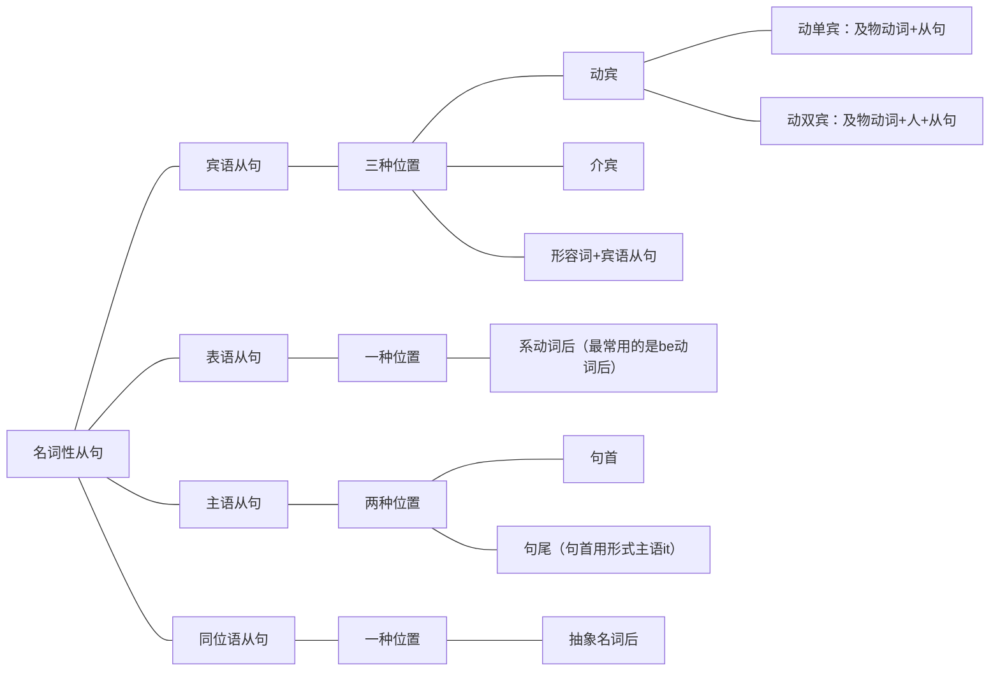
# 真题演练
1. In its latest survey of CEO pay, The Wall Street Journal finds that “a substantial part” of executive pay is now tied to performance.(2019,Reading Comprehension,Part A Text 1)
翻译：《华尔街日报》在其最新的首席执行官薪酬调查中发现，如今高管薪酬的“很大一部分”与业绩有关（被捆绑到表现上）。
解析：及物动词finds后，that引出宾语从句。

2. Part of the issue is that the government did not anticipate the steep increase in airline travel… (2017,Reading Comprehension,Part A Text 1)
翻译：部分问题是政府没有预料到航空出行会大幅增加……
解析：系动词is后，that引出表语从句。

3. The idea that “housing crisis" equals “concreted meadows"is pure lobby talk.(2016,Reading Comprehension,Part A Text 2)
翻译：“住房危机”等于“混凝土草地”的想法（用破坏原有草地建设房屋来解决住房困难）纯粹是游说的说辞。
解析：抽象名词idea后，that引出同位语从句表示解释说明。

4. What was less visible then, however,were the new,positive forces…(2001,Reading Comprehension,Passage 2)
翻译：然而，在当时看来并不十分明显的东西已成为……新的积极因素。
解析：What引出主语从句，位于句首。句中however是插入语，前后两个逗号隔开。

5. There's no doubt that our peer groups exert enormous influence on our behavior.(2012, Reading Comprehension,Part A Text 1)
翻译：同辈群体对我们的行为产生了巨大的影响，这一点是毋庸置疑的。
解析：抽象名词doubt后，that引出同位语从句表示解释说明。

6. Part of the problem is that many homeless adults are addicted to alcohol or drugs.(2006,Use of English)
翻译：部分问题是许多无家可归的成年人沉溺于酒精或毒品。
解析：系动词is后，that引出表语从句。

7. There's no question that the big are getting bigger and more powerful. (2001,Reading Comprehension,Passage 4)
翻译：无疑，大企业正在变得更大、更强。
解析：抽象名词question后，that引出同位语从句表示解释说明。

8. Ask anyone newly unemployed what they want and the answer is always: a job.(2014, Reading Comprehension,Part A Text 1)
翻译：问任何一个刚失业的人他最想要什么，答案总是：一份工作。
解析：及物动词Ask后，先接了人（anyone newly unemployed）作为一个宾语，然后又 接了what引出的宾语从句作为另一个宾语，双宾语结构。
9. …it is crucial that those new plants be environmentally sound (2005,Reading Comprehension, Part A Text 2)
翻译：……关键的是要让这些新发电厂对环境无害。
解析：it是形式主语，that引出主语从句后置。

10. It signals a change in what has, until now, been a key element of scientific endeavor. (2008, Reading Comprehension,Part A Text 2)
翻译：它标志着迄今为止科学研究中一个关键要素发生了改变。
解析：介词in后，what引出宾语从句。

11. The sobering aspect of Allen's book is that we have no one else to blame for our present condition except ourselves (2011, Reading Comprehension,Part C)
翻译：Allen的这本书让人清醒的一面就在于（它指出）对于我们当前的状况，我们不能问责旁人，只能归咎于我们自己。
解析：系动词is后，that引出表语从句。

12. However, it has been found that even people insensitive to a certain smell at first can suddenly become sensitive to it.. (2005, Use of English)
翻译：然而，研究发现，即使开始对某种特定气味不敏感的人也会突然变得对它敏感起来··..·
解析：it是形式主语，that引出主语从句后置。
（注意句中found虽然是及物动词，但后面的that也不是它的宾语从句，因为found被变成了被动的形式，所以它的宾语被提前了，那么后面的则不是宾语了。）

13. One of the federal government's studies predicts that the number of the homeless will reach nearly 19 million by the end of this decade (2006, Use of English)
翻译：联邦政府的一项研究预测，在这个十年结束之前，无家可归者的数量将接近1900万。
解析：及物动词predicts后，that引出宾语从句。

14. Is it true that the American intellectual is rejected and considered of no account in his society?(2006,Reading Comprehension,Part C)
翻译：美国社会中知识分子被排斥且不被重视，这是真的吗？解析：it为形式主语，that引出主语从句后置。

15. One basic weakness in a conservation system based wholly on economic motives is that most members of the land community have no economic value.(2010,Reading Comprehension, Part C)
翻译：一个完全基于经济动机的环境保护制度的基本缺陷是，土地群落的大多数成员都没有经济价值。
解析：系动词is后，that引出表语从句。

16. But what we forget... is that happiness is more than pleasure without pain.(2006,Reading Comprehension,Part A Text 4)
翻译：但是我们所忘记的·····是：幸福绝不仅仅是没有痛苦的欢乐。
解析：what引出主语从句，位于句首；系动词is后，that引出表语从句。

17. Spencer argued that all worldly phenomena, including human societies, changed over time, advancing toward perfection.(2009,Reading Comprehension,Part B)
翻译：Spencer认为，包括人类社会在内的世间万象都随着时间而变化，趋向完善。
解析：及物动词argued后，that引出宾语从句。

18. Even before Alan Greenspan's admission that America's red-hot economy is cooling,lots of working folks had already seen signs of the slowdown themselves. (2004, Reading Comprehension,Part A Text 3)
翻译：甚至在Alan Greenspan承认美国过热的经济开始降温之前，众多的上班族自己已经看到经济减速的迹象。
解析：抽象名词admission后，that引出同位语从句表示解释说明。

19. Two of the three objecting Justice-Samuel Alito and Clarence Thomas-agreed with this Constitutional logic but disagreed about which Arizona rules conflicted with the federal statute.(2013,Reading Comprehension,Part A Text 4)
翻译：三位投反对票的其中两位法官Samuel Alito和Clarence Thomas，同意这个宪法 的逻辑，但是在关于亚利桑那州的哪些规则和联邦法律相冲突的方面存在分歧。
解析：介词about后，which引出宾语从句。

20. What has happened is that people cannot confess fully to their dreams...(2000,Reading Comprehension,Passage 5)
翻译：事实是（发生的事情是）人们不能完全承认自己的梦想……
解析：What引出主语从句，位于句首；系动词is后，that引出表语从句。
# 考场攻略
宾语从句、主语从句和同位语从句建议重点掌握，表语从句会应用即可。

## 攻略1：找到从句（第三部分第一章还会有更详细的讲解）
找到连接词，就找到了从句的开始；而从句通常结束于标点或下一个连接词前，如：
例: In a social situation, eye contact with another person can show that you are paying attention in a friendly way. (2020, Reading Comprehension, Part B)[^46]
有时从句被包含在主句中间，这时只能依靠谓语动词来判断从句的结束。从句从连接词开始往后数，结束在第二个谓语动词之前。因为从句也是一个句子，所以只能包含一个谓语动词，因此不能包含第二个谓语动词。注意非谓语动词不算，忽略即可。

例: An awareness that they were being experimented upon seemed to be enough to alter workers' behavior by itself. (2010, Use of English)[^47]
该句中从句从连接词that开始,往后看,第一个谓语动词是were being experimented,第二个 谓语动词是seemed,所以从句结束在seemed之前。

[^46]: 翻译：在社交场合中，与他人的眼神交流可以表明你正在以友好的方式关注。
[^47]: 翻译：似乎仅仅是意识到自己被当作实验对象就足以促使工人改变行为。
## 攻略2：判断从句
句子较长时没有办法分析句子成分，此时也就不能通过分析句子结构来判断名词性从句的种类。想判断名词性从句的种类，只要确定名词性从句的位置就可以了——先找到从句，然后“往前看”根据它前面的词来判断名词性从句的种类（详见名词性从句内容小结位置图）。

例: On the contrary, constraints on improving productivity explain why education isn't developing more quickly there than it is. (2009, Reading Comprehension, Part A Text 3)[^48]
找到why从句后，往前看，前面是及物动词explain，因此这个从句是宾语从句。

例: Publishers have responded to the demand that they make their product free to readers by charging their writers fees to cover the costs of preparing an article. (2020, Reading Comprehension, Part A Text 2)[^49]
找到that从句之后，往前看，前面是抽象名词demand，且连接词that在从句中不作成分（从句完整，不缺成分），因此这个从句是同位语从句，解释说明前面的demand是什么。

[^48]: 翻译：相反，生产率的提高受到限制则解释了为什么这些国家的教育没有发展得更快一些。
[^49]: 翻译：出版商通过向作家收取费用来支付准备文章的费用，从而满足了他们向读者免费提供产品的要求。