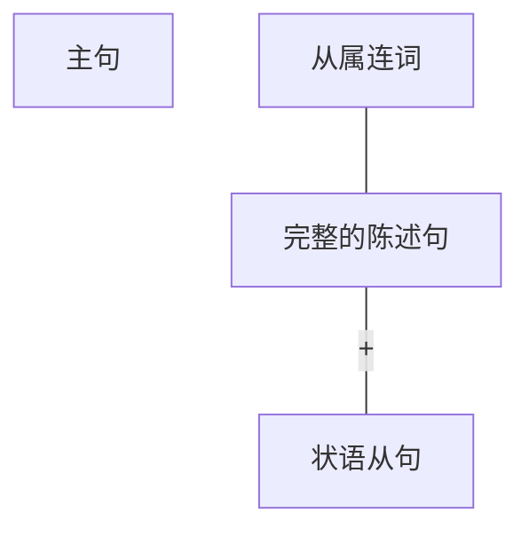
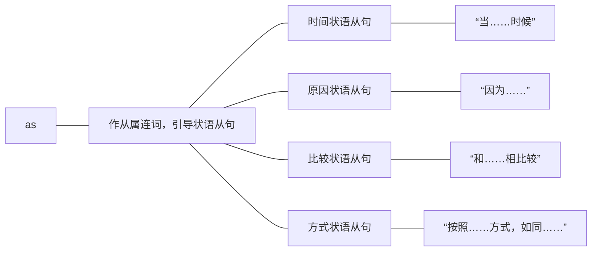

# 一、状语从句的概述
## （一）状语从句的含义
状语从句，指的就是一个句子作状语，表达“描述性的信息”，补充说明另一个句子（主句）。描述性的信息有很多种，可以描述时间、地点、原因、结果等等，因此，状语从句也相应分为九类。
## （二）状语从句的写法

状语从句是所有从句中写法最简单的，状语从句的构成为：一个完整的陈述句前面再加上一个从属连词。这个“从属连词”是比较特别的一种连接词，不作句子成分，但表示一定的逻辑关系，用来说明这个状语从句是描述何种信息的。

同时，状语从句的种类是由从属连词决定的，即从属连词表示什么含义（逻辑关系），那么从句就是什么状语从句。

例：When the United States built its industrial infrastructure,it didn't have the capital to do so.(2001,Reading Comprehension,Passage 2)[^1]
完整的陈述句前加上从属连词when，表示时间（当……时候），这个从句就是时间状语从句。

例：We did not evolve，because machines and society did it for us．（2000，Reading Comprehension,Passage 2)[^2]
完整的陈述句前加上从属连词because，表示原因（因为……），这个从句就是原因状语从句。

[^1]: 翻译：当美国建设自己的工业基础设施时，却没有资金。
[^2]: 翻译：我们没有进化，因为机器和社会替我们进化了。
## （三）状语从句的位置
状语从句既然是补充说明主句的，那它就要出现在主句周围，状语从句的位置通常有三种：主句前，主句后，主句中。同一个状语从句可以处于三种不同的位置，但意思相同。
### 1.主句前
例：As the economy picks up，opportunities will abound for aspiring leaders．（2011，Reading Comprehension,Part A Text 2)[^3]

[^3]: 翻译：随着经济的复苏，对于充满雄心壮志的高管们来说机会将会很多。
### 2.主句后
例：Opportunities will abound for aspiring leaders，as the economy picks up. 
### 3.主句中
例：Opportunities，as the economy picks up，will abound for aspiring leaders.
状语从句位于主句前后的情况比较常见，但在阅读和翻译题中为了增加句子的难度，也会出现状语从句插入主句中的情况（造成主句的分裂）。
# 二、状语从句的分类
状语从句表达描述性的信息，用来补充说明主句，共分为九种：时间状语从句、地点状语从句、原因状语从句、结果状语从句、目的状语从句、条件状语从句、让步状语从句、比较状语从句和方式状语从句。（其中加色的五种为考研重点）

通过学习状语从句的写法（从属连词＋一个完整的陈述句），同学们会发现：状语从句的核心不在于后面的陈述句，而在于前面的从属连词。从属连词表达什么含义（逻辑关系），那么从句就是什么状语从句。换言之，状语从句的种类是由从属连词来决定的。因此，研究状语从句的分类，其实就是研究从属连词的分类。为了让同学们方便识记，在此把考研英语中常考查的从属连词按照类别进行整理，如下：
## （一）时间状语从句
|从属连词|含义|真题例句|
|:---:|:---:|:---:|
|when while as|当······时候|例：But in some cases， one marketer's owned media become another marketer's paid media-for instance, when an e-commerce retailer sells ad space on its Web site.(2011,Reading Comprehension,Part A Text 3) 译：但是，在一些情况下—比如，当一个电子商务零售商在他的网站上出售广告空间时，一个营销商的自有媒介就转变成了另外一个营销商的付费媒介。  例：In 1995 the United States can look back on five years of solid growth while Japan has been struggling.(2000,Reading Comprehension,Passage 1) 译：在1995年，当日本还在苦苦挣扎的时候，美国已经连续五年稳步发展了。  例：As the brain fades,we refer to these occurrences as "senior moments". (2014,Use of English) 译：当大脑逐渐衰退，我们把这些事称作“瞬间性老年痴呆”。|
|before|在······之前|例：Carter sifted through rubble in the Valley of the Kings for seven years before he located the tomb in 1922.(2014,Reading Comprehension, Part B) 译：Carter花了七年的时间仔细搜寻帝王谷的碎石，直到1922年才确定了陵墓的位置。|
|after|在……之后|例：Witness payments became an issue after West was sentenced to 10 life sentences in 1995.(2001,Cloze Test) 译：自West在1995年被判处十年有期徒刑后，给证人付报酬的做法就成了颇有争议的问题。|
| since|自从......|例：And since the first Internet gambling site was created in 1995，competition for gamblers' dollars has become intense.(2006,Reading Comprehension,Part B) 译：自1995年第一个在线赌博网站创立以来，争夺赌徒们金钱的竞争愈演愈烈。|
|until|直到……|例：Grammar，punctuation，and spelling can wait until you revise．（2008， Reading Comprehension,Part B)  译：语法、标点和拼写可在你修改时（直到你修改时）再考虑。|
|as soon as|一……就……|例：As soon as that report runs,we'll suddenly get 500 new Internet sign-ups from Ukraine…(2003,Reading Comprehension,Part A Text 1)  译：这个报道一发布，我们将立刻从乌克兰获得500个新注册用户……|
|by the time|截止到……时候|例：…by the time 100 percent of the evidence is in，it may be too late． (2005,Reading Comprehension,Part A Text 2)  译：……到了有百分之百确凿证据的时候，可能就太晚了。|
|each time/every time|每一次……|例：“Every time you answer a question you eliminate a possibility，”says one expert.(2004,Reading Comprehension,Part A Text 1)  译：一位专家说：“每回答一个问题，你就丧失了一次机会。”|
|the next time|下一次……|例：…the next time it occurs，try to wake up just enough to control its course.(2005,Reading Comprehension,Part A Text 3) 译：……下次再发生时（做同样的梦时），试图及时醒来以控制它的进程。|
## （二）地点状语从句
|从属连词|含义|真题例句|
|:---:|:---:|:---:|
|where|在……地方|例：Now,rivals will be charging sales tax where they hadn't before. (2019,Reading Comprehension,Part A Text 4) 译：现在，竞争对手将在以前没有收过的地方征收销售税。  例："The traditional rule was it's safer to stay where you are，but that's been fundamentally inverted,"says one headhunter.(2011, Reading Comprehension,ParA Text 2) 译：一个猎头说：“传统规则是，待在你原来的地方会更加安全，但是现在已经彻底被改变了。”|

对于上句中stay where you are，很多同学不理解为什么不是宾语从句，注意stay是不及物动词，所以不接宾语。

地点状语从句不重要，只要根据where 能判断它引导从句，表示地点即可。
## （三）原因状语从句
|从属连词|含义|真题例句|
|:---:|:---:|:---:|
|because|因为……|例：Our legal system was designed to set law apart from politics precisely because they are so closely tied.(2012,Use of English) 译：我们的法律制度被设计为将法律与政治分离，正是因为二者之间紧密相关。   例：However，because these connections are made through effort and practice,scientists believe that intelligence can expand and fluctuate according to mental effort.(2014,Use of English) 译：然而，因为这些连接是通过努力和练习而形成的，所以科学家们认为智力能够通过思维锻炼而发展和波动。|
|since|因为……|例：Since desire and will are damaged by the presence of thoughts that do not accord with desire,Allen concluded:“We do not attract what we want,but what we are.”(2011,Reading Comprehension,Part C)  译：因为愿望和意志会因为那些与愿望不一致的思想的出现而遭到破坏，Allen得出如下总结：“我们所吸引的不是我们所想，而是我们本身所是。”|
|as|因为……|例：Now utopia has grown unfashionable， as we have gained a deeper appreciation of the range of threats facing us, from asteroid strike toepidemic flu and to climate change.(2013,Reading Comprehension, Part A Text 3) 译：现在乌托邦式的幻想已经过时了，因为我们已经对所面临的一系列的威胁——从小行星的撞击到流感再到气候变化——有了一个更深的认识。|
|now that|既然，由于……|例：Now that you have developed a topic into a tentative thesis,you can assemble your notes and begin to flesh out whatever outline you have made.(2008,Reading Comprehension,Part B)  译：既然已经把一个话题展开成为一个初步的论题，你就可以整理笔记，并开始充实已经制定好的提纲。|

以上四个从属连词都可以表示原因，其中最常用的是：because，since，as。这三个连词语气逐渐减弱，但是同学们不需要分辨，只需要知道它们都表示“因为”即可。从属连词nowthat后接的原因常 常是显而易见的事实，考研中不常见。
## （四）结果状语从句 
|从属连词|含义|真题例句|
|:---:|:---:|:---|
|such...that...|太……所以…… （such后接名词或名词词组）|例：Indeed，homelessness has reached such proportions that local governments can't possibly cope.(2006,Use of English)  译：实际上，无家可归的人数规模太大，所以连地方政府都无法应对了。|
|so…that…|太……所以…… （so后接形容词或副词）|例：We define such sold media as owned media whose traffic is so strong that other organizations place their content or e-commerce engines within that environment.(2011,Reading Comprehension,Part A Text 3)  译：我们把这样的出售媒介定义为自有媒介：它的访问量太大，所以其他机构也将其广告内容或电子商务引擎放置在它的网络环境当中。|
| so that…|所以……|例：Transitions should connect one paragraph to the next so that there are no abrupt or confusing shifts.(2008,Reading  Comprehension,Part B) 译：段落之间应有衔接，所以这样过渡就不会唐突或者令人困惑。|

以前学习时，同学们把“so／such…that…”理解为“如此……以致……”，但是这个含义不太好理解和应用，因此建议大家理解为“太……所以……”，表示因果关系，that后引出的就是结果状语从句。注意：“so／such...that...”意思相同，区别就在于so和such后接的词性不同（详见上表）。
## （五）目的状语从句
|从属连词|含义|真题例句|
|:---:|:---:|:---:|
|so that…/in order that…|目的是／为了......|例：To make revising easier， leave wide margins and extra space between lines so that you can easily add words,sentences,and corrections.(2008,Reading Comprehension,Part B) 译：为了便于修改，要留出足够的页边距和行间距，目的是你可以很容易地添字、加句和修改。  例：In December 2010 America's Federal Trade Commission  (FTC) proposed adding a “do not track” (DNT) option to internet browsers,so that users could tell advertisers that they did not want to be followed. (2013,Reading Comprehension,Part A Text 2) 译：2010年12月，美国联邦贸易委员会提议在互联网的浏览器上添加一个“不要跟踪”的选项，目的是用户用来告知广告商们他们不想被跟踪。|

目的状语从句中一般都会含有情态动词，请同学们特别注意一下。

从属连词词组so that…，既可以表示目的，又可以表示结果，区别就在于从句中是否含有情态动词（如果有，则表示目的；如果没有，则表示结果）。
## （六）条件状语从句 
|从属连词|含义|真题例句
|:---:|:---:|:---:|
|if|如果……|例：If the study of law is beginning to establish itself as part and parcel of a general education, its aims and methods should appeal directly to journalism educators.(2007,Reading Comprehension,Part C) 译：如果有关法律的研究正在开始成为普通教育的重要组成部分，那么它的目标和方法应该会立即吸引新闻学教育者。  例：We must speed up our literature too，if we want to interpret modern stress.(2000,Reading Comprehension,Passage 3) 译：如果我们想表达现代的压力，我们必须加快文学发展的步伐。  例：If connections can be bought， a basic premise of democratic society…is undermined.(2017,Reading Comprehension,Part A Text4) 译：如果金钱可以买到关系，民主社会的一个基本前提……就被破坏了。|
|unless|如果不，除非……|例：The US Supreme Court frowns on sex-based classifications unless they are designed to address an "important" policy interest.(2020,Reading Comprehension,Part A Text 3)  译：除非这些基于性别的分类旨在（被设计去）解决“重要”政策利益，否则美国最高法院不会赞成。|
|once|一旦……|例：Once a discovery claim becomes public,the discoverer receives intellectual credit.(2012,Reading Comprehension,Part A Text 3)  译：一旦发现声明公布于众，发现者就会获得知识信用。|
|as long as/so long as|只要|例：This is an adequate amount so long as it is aimed in the right direction. (2013,Reading Comprehension,Part B)  译：只要方向正确，这个数目足够了。|

- 有时一个句子中会出现不止一个条件状语从句，如下：
	- 例： 1f you see a conversation as a fight or competition, you can win by cheating as long as you don't get caught.(2019,Reading Comprehension,Part B)
	译：如果你把谈话看作是一场战斗或比赛，只要你不被抓，你就可以通过欺骗来获胜。
	- 例：you're a physician, you can risk your patient's suicide as long as you don't intend their suicide. (2002,Reading Comprehension,Part A Text 4)
	译：假定你是一名医生，只要你的目的不是想让病人自杀，你就会冒病人自杀的风险。
## （七）让步状语从句
|从属连词|含义|真题例句|
|:---:|:---:|:---:|
|although/though|尽管，虽然……|例：Although sadness also precedes tears,evidence suggest that emotions can flow from muscular responses.(2011,Use of English) 译：尽管悲伤也会先于眼泪产生，但是有证据表明情感是由肌肉反应引起的。  例：He could not confide them even to his wife，although they provide the unacknowledged foundation of his fiction.(2017,Reading Comprehension,Part B)  译：虽然这些不为人知的事情为他编写小说提供了素材，但即使是对他妻子，他还是不能说出真相。  例：After all， it has an ad business too， which it says will comply with DNT requests,though it is still working out how.(2013,Reading Comprehension,Part A Text 2) 译：毕竟，它（微软）也有广告业务，微软表示它的广告业务将会遵守DNT（不要跟踪）要求，尽管微软仍然在研究怎样实现该方案。|
|even if/even though|即使，虽然……|例：None of these will be easy but you can start even if others refuse to. (2019,Reading Comprehension,ParB)  译：这些都不容易，但即使别人拒绝，你也可以开始。  例：The definingterm of intelligence in humans still seems to be the IQ score,even though IQ tests are not given as often as they used to be. (2007,Reading Comprehension,Part A Text 2) 译：虽然现在智商测试已经不像以前那么频繁地使用，（但是）智商分数似乎仍然是定义人类智力的术语。|
|while|虽然，尽管|例：While the quality of legal journalism varies greatly,there is an undue reliance amongst many journalists on interpretations supplied to them by lawyers.(2007,Reading Comprehension,Part C) 译：尽管与法律相关的新闻报道的质量各不相同，（但是）许多新闻记者都过分依赖律师提供给他们的解释。|
|however/no matter how|不管怎样|例：A sacred place of peace，however crude it may be，is a distinctly human need,as opposed to shelter, which is a distinctly animal need.(2013,Reading Comprehension,Part C) 译：安宁的圣地（体现的）是人类特有的需要，无论它是怎样天然无修饰，仍与遮风挡雨之所不同，后者反映的是动物特有的需要。  例：No matter how formal or informal the work environment,the way you present yourself has an impact.(2016,Reading Comprehension,Part B)  译：不管你的工作环境多么正式或不正式，你展示自己的方式都会产生影响。|

让步状语从句，表示“明让步，暗转折”。although／though这半句表示“虽然（尽管）”，暗含着另一个半句表示“但是”，因为在中文里“虽然（尽管）但是……”是成对搭配的关联词语，但是在英语中成对的关联词语只能出现一个。因此，在翻译让步状语从句时，可以自行在另一个半句上加上“但是”，把“让步转折”的意思补充完整。
## （八）比较状语从句
|从属连词|含义|真题例句|
|:---:|:---:|:---:|
|than|和……相比较  （用在比较级中）|例：Rich economies are also less dependent on oil than they were…(2002,Reading Comprehension,Part A Text 3)  译：发达国家也不像过去那样依赖石油……  例：But phones run on batteries,and batteries can die faster than we realize.(2019,Use of English) 译：但手机是用电池运行的，电池没电（死亡）的速度比我们想象的要更快。|
|as| 和……相比较 （用在原级比较中）|例：In the general population today，at this genetic，environmental level,we've pretty much gone as far as we can go…(2008,Reading Comprehension,Part A Text 3)  译：就当今总人口而言，在现有基因和环境水平下，我们已经达到了（身高的）极限……（as far as we can go表示 “和我们能够达到的相比一样高”，即表示极限。）|

学习形容词副词的三种比较级别时，我们学过比较级和原级比较。比较级表示“和……相比更……”，后接“than＋比较对象”；而原级比较表示“和……相比一样……”，后接“as＋比较对象”。比较对象可以是词、词组或句子。如果比较的对象是一个句子（即有主有谓），那么than或as引出的就是比较状语从句。
## （九）方式状语从句 
|从属连词|含义|真题例句|
|:---:|:---:|:---:|
|as|按照……方式，如同……|例：During most of his waking life he will take his code for granted,as the businessman takes his ethics.(2006,Reading Comprehension,Part C)  译：如同商人看待自己的道德规范一样，科学家在生命中的大部分时间里，也会把自己的道德规范看作是理所当然的事情。|
|as if|似乎，好像……|例：Beethoven's music tends to move from chaos to order as if order were an imperative of human existence.(2014, Reading Comprehension,Part C) 译：Beethoven的音乐往往从混乱走向秩序，仿佛秩序对人类的存在至关重要。|

状语从句的从属连词中，尤其要注意一词多义的as，有四种常用用法：

在考研真题中，as究竟表示哪种含义，引导什么状语从句，就只能依靠代入法，看哪个意思代入句子中合适。但注意不管表示哪种含义，只要as后引导的是完整的句子，那么它引导的一定是状语从句。反之，如果as后引导的句子不完整，并且在从句中作成分，那么它引导的就是定语从句（通常为[[句句真研/Part2 长难句/第二章 复合句/第二节 定语从句#（二）特殊的非限定性定语从句（修饰整句话）|非限定性定语从句]]，有逗号，修饰前面整句话，见P102）。
# 内容小结
1. 状语从句的概述
	1. 状语从句的含义：一个句子作状语，表达描述性的信息。
	2. 状语从句的写法：从属连词＋一个完整的陈述句。
	3. 状语从句的位置：主句前、主句后、主句中。
2. 状语从句的分类共九种，属于哪种类型，取决于从属连词的含义（重点掌握从属连词的表格）。
# 真题演练
1. When this practice first started decades ago, it was usually limited to freshmen, to give them a second chance to take a class in their first year if they struggled in their transition to college-level courses. (2019, Reading Comprehension, Part A Text 2)
翻译：当这种做法在几十年前开始时，通常只限于新生，如果他们在向大学水平的课程过渡的过程中挣扎，在第一年里就给他们第二次机会去上一门课。
解析：此句中有两个状语从句：从属连词when表示“当……时候”，引出时间状语从句；从属连词if表示“如果”，引出条件状语从句。

2. Previous studies on CSR have had trouble differentiating these effects because consumers can be affected by all three. (2016, Reading Comprehension, Part A Text 3)
翻译：此前对CSR （corporate social responsibility企业社会责任）的研究难以区分这些影响，因为消费者可能会受到这三种影响。
解析：从属连词because表示“因为”，引出原因状语从句。

3. Now, boy babies survive almost as well as girls do. (2000, Reading Comprehension, Passage 2)
翻译：现在男婴的存活率基本和女婴一样。
解析：从属连词as表示“和……相比较”，引出比较状语从句。

4. "But we are taught instead to 'decide', just as our president calls himself  'the Decider'." (2009, Reading Comprehension, Part A Text 1)
翻译： “但我们却被教导‘做决定’，正如我们的总裁称自己为‘决策者’一样。”
解析：从属连词as表示“按照……方式”，引出方式状语从句。

5. The history of the EEOB began long before its foundations were laid. (2018, Reading. Comprehension, Part B)
翻译： EEOB （The Eisenhower Executive Office Building艾森豪威尔行政办公大楼）的历史早在莫定基础之前就已经开始了。
解析：从属连词before表示“在……之前”，引出时间状语从句。

6. ...the old and infirm "have a duty to die and get out of the way", so that younger, healthier people can realize their potential. (2003, Reading Comprehension, Part A Text 4)
翻译：……年老体弱者“有义务死去和让位”，以便让更年轻、更健康的人能够实现他们的潜能。
解析：从属连词so that表示“目的是……”，引出目的状语从句。

7. Furthermore, in the early days of longline fishing, a lot of fish were lost to sharks after they had been hooked. (2006, Reading Comprehension, Part A Text 3)
翻译：而且，在早期使用延绳捕鱼时，许多鱼被钩住后又被鲨鱼夺走。
解析：从属连词after表示“在……之后”，引出时间状语从句。

8. Open-source spying does have its risks, of course, since it can be difficult to tell good information from bad. (2003, Reading Comprehension, Part A Text 1)
翻译：当然资源开放的课报活动的确有它的风险，因为信息的正误很难区分。解析：从属连词since表示“因为”，引出原因状语从句。

9. ...they're dealing with so many more things that they become worm out from it more visibly and sooner. (2008, Reading Comprehension, Part A Text 1)
翻译：……她们应对的事情太多所以她们疲劳得更快更明显。
解析：从属连词词组so…that表示“太……所以”，引出结果状语从句。

10. And if scientists have yet to create the mechanical version of science fiction, they have begun to come close. (2002, Reading Comprehension, Part A Text 2)
翻译：如果科学家们还没有创造出机械版的科幻小说，他们已经更接近目标了。解析：从属连词if表示“如果”，引出条件状语从句。

11. Now researchers suspect that dreams are part of the mind's emotional thermostat, regulating moods while the brain is "off-line". (2005, Reading Comprehension, Part A Text 3)
翻译：目前研究人员猜想梦是大脑情绪自动调节系统的一部分，当大脑处于“掉线”状态时对情绪进行规整。
解析：从属连词while表示“当……时候”，引出时间状语从句。

12. Although the figure may vary, analysts do agree on another matter: that the number of the homeless is increasing. (2006, Use of English)
翻译：尽管数字可能各不相同，但是分析家们在另一件事上的确达成了共识，即无家可归者的人数正在增长。
解析：从属连词although表示“尽管”，引出让步状语从句。

13. As soon as you awaken, identify what is upsetting about the dream. (2005, Reading Comprehension, Part A Text 3)
翻译：你醒来时就立马判断一下什么在梦中困扰你。
解析：从属连词词组as soon as表示“一……就……”，引出时间状语从句。

14. Moreover, IQ tests do not necessarily predict so well once populations or situations change. (2007, Reading Comprehension, Part A Text 2)
翻译：此外，一旦测试群体或情景发生变化，智商测试就不一定能够做出正确的预测。
解析：从属连词once表示“一旦”，引出条件状语从句。

15. More than 60,000 people have purchased the PTKs since they first became available without prescriptions last year... (2009, Reading Comprehension, Part A Text 2)
翻译：自从去年它们不需要医师处方即可购买以来，超过6万人已经购买了PTK—解析：从属连词since表示“自从”，引出时间状语从句。

16. And home appliances will also become so smart that controlling and operating them will result in the breakout of a new psychological disorder-kitchen rage. (2001, Translation)
翻译：家用电器将会变得太智能化，所以控制和操作它们会引发一种新的心理疾，病—一厨房狂躁症。
解析：从属连词词组so...that表示“太……所以”，引出结果状语从句。

17. When the competitive environment pushed our ancestors to achieve that potential, they could in turn afford more education. (2009, Reading Comprehension, Part A Text 3)
翻译：当竞争的环境促使我们的祖先去实现这种潜能的时候，他们反过来又能提供更，多的教育。
解析：从属连词When表示“当……时候”，引出时间状语从句。

18. The White House argued that Arizona's laws conflicted with its enforcement priorities, even if state laws complied with federal statutes to the letter. (2013, Reading Comprehension, Part A Text 4) 
翻译：白宫认为，即使州一级的法律符合联邦的法律条款，亚利桑那州的法律也与其执法优先权相冲突。
解析：从属连词even if表示“即使”，引出让步状语从句。

19. Labour likewise wants to discontinue local planning where councils oppose development. (2016, Reading Comprehension, Part A Text 2)
翻译：工党同样希望在那些议会反对发展的地方停止当地的规划。
解析：从属连词where表示“在……地方”，引出地点状语从句。

20. But fewer students want to study humanities subjects: English departments awarded more bachelor's degrees in 1970-71 than they did 20 years later. (2011, Reading Comprehension, Part B)
翻译：但是很少有学生想要学习人文学科： 1970年到1971年之间英语系授予的学士学位比20年之后还要多。
解析：从属连词than表示“和……相比”，引出比较状语从句。
# 考场攻略
九种状语从句建议重点掌握时间、原因、结果、条件和让步状语从句。

状语从句的重点是从属连词。
## 攻略1：完形填空中，选择从属连词
考研的完形填空题中，有一类就是考查从属连词的选择，此时需要看懂上下文的意思，然后根据意思判断上下文的逻辑关系，即选择合适的从属连词。

例：The court cannot maintain its legitimacy as guardian of the rule of law when justices behave like politicians.(2012,Use of English)[^4]

例：It did not matter what was done in the experiment；so long as something was changed， productivity rose.(2010,Use of English)[^5]

例：All these conditions tend to increase the probability of a child committing a criminal act， althougha direct causal relationship has not yet been established.(2004,Use of English)[^6]

[^4]: 翻译：当法官像政客一样行事时，法院便不能维持其作为法律守护者的合法性。
[^5]: 翻译：实验中做什么无关紧要，只要发生了某种变化，生产效率就会提高。
[^6]: 翻译：所有上述情况都会增加青少年犯罪的可能性，虽然其中的直接因果关系还没有得到证实。
## 攻略2：根据从属连词，判断上下文
考研真题中的句子普遍比较长，因此在考场中想节省时间，就要首先学会理清句子间的逻辑关系，而不要纠缠于细节。遇到状语从句时，只要抓住从属连词，就能立刻判断出句子大概描述哪方面的信息。如下：

例：Because our conscious mind is occupied with daily life we don't always think about the emotional significance of the day's events-until, it appears,we begin to dream.(2005,Reading Comprehension,Part A Text 3)[^7]
一看到从属连词 because和until，马上就可以判断它们分别引导的是原因状语从句和时间状语从句，那么不用仔细看细节，就可以大概判断出这个句子的结构是这样的：“原因＋主句＋时间”，即表示“因为……（所以）主句……直到……”。

例：Even if a job's starting salary seems too small tosatisfy an emerging adult's need for rapid content,the transition from school to work can be less of a setback if the start-up adult is ready for the move.(2007,Reading Comprehension,Part B)[^8]
一看到从属连词even if和if，马上就可以判断它们分别引导的是让步状语从句和条件状语从句，那么不用仔细看细节，就可以大概判断出这个句子的结构是这样的：“让步＋（转折）主句十条件”，即表示“虽然……（但是）主句……如果……”。这样可以在很大的程度上帮助大家节省时间，迅速理清句子的大概意思。

[^7]: 翻译：因为清醒时我们的头脑被日常生活琐事占据着，所以并不会总是想到白天发生的事情对我们情绪的影响，直到我们开始做梦，这种影响才出现。
[^8]: 翻译：虽然工作的起薪似乎很低，难以满足一个日渐成年的孩子对快速实现自我满足的需求，但是如果这位新长成的成年人做好了过渡准备，那么从学校到职场的过渡中他遭遇的挫折也许会少些。