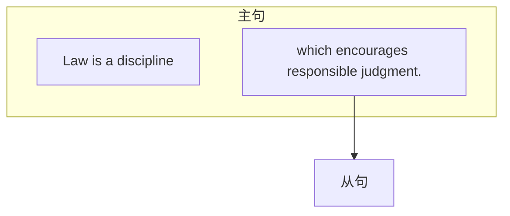
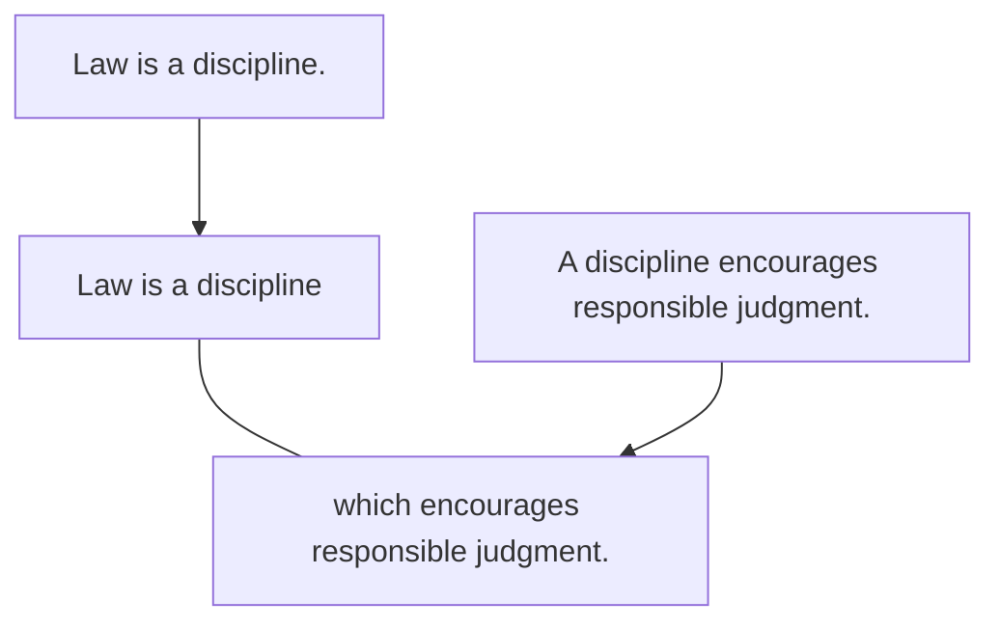
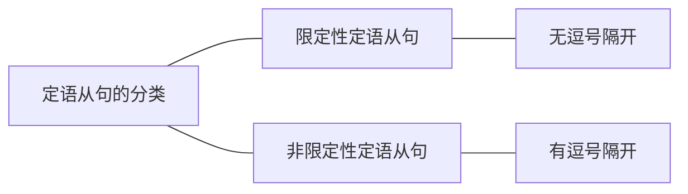

# 一、定语从句的概述
定语从句就是一个句子作定语，去修饰限定名词，位置要放在所修饰的名词后。

例:Law is a discipline which encourages responsible judgment．（2007，Reading Comprehension,Part C)[^1]
此句中，which encourages responsible judgment是定语从句，修饰限定名词discipline，表示 “一门鼓励进行责任判断的学科”。注意，翻译时通常按照中文的习惯，把定语放在名词前，翻译成“····的名词”。
其中，定语从句所修饰的名词是“先行词”，因为定语从句要放在所修饰的名词后，所以该名词一定比定语从句“先走一步”，所以叫作“先行词”，此句中先行词是discipline。引出定语从句的连接词叫作“关系词”，因为是通过它来把先行词和定语从句“联系”起来的，此句中关系词是which。

【补充】定语从句中的关系词有两个作用:一是“引导”，引导定语从句，连接从句和先行词；二是“替代”，关系词在定语从句中充当成分，替代从句中跟先行词一样的成分，见下图:

原本是两个句子，有相同的成分a discipline。两个句子合并时，为了避免重复，把相同的成分替换掉，即把a discipline替换成which（因为指物）。通过上图可以得出结论:定语从句的关系词在从句中作成分，且所作的成分是与先行词一样的（即关系词＝先行词）。

[^1]:翻译:法律是一门鼓励进行责任评断的学科。
# 二、定语从句的写法

和名词性从句差不多，定语从句的写法是“关系词＋陈述句”，关键在于关系词的选择问题。类比名词性从句，大家可以推测出:关系词的选择就看后面的陈述句中缺什么成分。定语从句中后面的陈述句缺少的成分，是由关系词来充当的，而关系词替代的成分又跟先行词相同，所以定语从句关系词的选择，就是四个字—看先行词。如果先行词是事／物，那就选择物对应的关系词which／that；如果是人，那就选择人对应的who／whom／that，依此类推，如下:

|先行词|关系词|
|:---:|:---:|
| 事／物|which/that|
|人|who/whom/that|
| 人／物 （表示人或物的所有关系，即“某人的／某物的”）|whose|
|时间|when|
|地点|where|
| 原因|why |

### 1.先行词是事／物，关系词选择which／that
例:Teachers need to be aware of the emotional，intellectual，and physical changes that young adults experience.(2003,Use of English)[^2]

例:These groups mainly rely for instilling needed dispositions into the young upon the same sort of association which keeps adults loyal to their group.(2009,Reading Comprehension,Part C)[^3]

例:Furthermore，the legal system and the events which occur within it are primary subjects for journalists.(2007,Reading Comprehension,Part C)[^4]

例:To a certain extent， our ability to excel in making the connections that drive intelligence is inherited.(2014,Use of English)[^5]

[^2]:翻译:教师应当意识到青少年所经历的情感、心智和生理上的变化。
[^3]:翻译:这些（落后的）社会群体主要在人际交往中向年轻人灌输必要的性情倾向，而正是这种交往保持了成年人对群体的忠诚。
[^4]:翻译:此外，法律体系及其中发生的事件是新闻记者报道的重要主题。
[^5]:翻译:在一定程度上，我们善于建立驱动智力发展的连接的能力是遗传的。
### 2.先行词是人，关系词选择who／whom／that
例:In France，shareholders who hold onto a company investment for at least two years can sometimes earn more voting rights in a company.(2019,Reading Comprehension,Part A Text 1)[^6]

例:Passengers who pass a background check are eligible to use expedited screening lanes. (2017,Reading Comprehension,Part A Text 1)[^7]

例:Most [[../../../生词本/archaeological|archaeological]] sites，however，are discovered by archaeologists who have set out to look for them.(2014,Reading Comprehension,Part B)[^8]

例:Retailers that master the intricacies of wholesaling in Europe may well expect to rake in substantial profits thereby.(2010,Reading Comprehension,Part B)[^9]

[^6]:翻译:在法国，持有公司投资至少两年的股东有时可以在公司获得更多的投票权。
[^7]:翻译:通过背景调查的乘客有资格使用快速安检通道。
[^8]:翻译:然而，绝大多数考古遗迹是考古学家特意搜寻才发现的。
[^9]:翻译:在欧洲那些掌握了复杂的批发流程的零售商可能轻而易举地就获取丰厚的利润。
### 3.先行词是人／物，表示人或物的所有关系，关系词选择whose
例:It also pledged not to deploy AI whose use would violate international laws or human rights.(2019,Reading Comprehension,Part A Text 3)[^10]

例:On display here are various fantasy elements whose reference， at some basic level， seems to be the natural world.(2013,Reading Comprehension,Part C）[^11]

例:This，for those as yet unaware of such a disadvantage， refers to discrimination against those whose surnames begin with a letter in the lower half of the alphabet.(2004,Reading Comprehension,Part A Text 2)[^12]

[^10]:翻译:它（指上文提过的Google）还保证不部署用途将违反国际法或人权的AI（人工智能）。
[^11]:翻译:各种各样奇幻的元素在这里展示，其参照依据，就某种基本层面来说，似乎就是大自然。
[^12]:翻译:对于那些到目前为止还没有意识到这种劣势的人来说，它指的是对姓氏字母位于字母表后半部分的人的歧视。
### 4.先行词是时间，关系词选择when
例:It is difficult to the point of impossibility for the average reader under the age of forty to imagine a time when high-quality arts criticism could be found in most big-city newspapers.(2010, Reading Comprehension,Part A Text 1)[^13]

[^13]:翻译:对于40岁以下的普通读者而言，他很难想象在大多数大城市的主流报纸上读到高质量的艺术评论的那个年代。
### 5.先行词是地点，关系词选择where
例:Today，we live in a world where GPS systems， digital maps， and other navigation apps are all available on our smartphones.(2019,Use of English)[^14]

例:But there are few places where clients have more grounds for complaint than America. (2014,Reading Comprehension,Part A Text 2)[^15]

[^14]:翻译:今天，我们生活在一个GPS系统、数字地图和其他导航应用都可以在我们的智能手机上使用的世界里。
[^15]:翻译:但是几乎没有哪里的客户比美国客户有更多抱怨的理由。我们的智能手机上使用的世界里。
### 6.先行词是原因，关系词选择why
例:That's one reason why we have launched Arc， a new publication dedicated to the near future.(2013,Reading Comprehension,Part A Text 3)[^16]

例:The other reason why costs are so high is the restrictive guild-like ownership structure of the business.(2014,Reading Comprehension,Part A Text 2)[^17]

- 【补充】关于定语从句关系词需注意的几点:
	1. 定语从句中的每一个关系词都必须作成分，包括that。that既可以指人又可以指物。
	2. 定语从句中的先行词是“事／物”时，关系词用which和that都可以，不需要区别，因为考研中不考。
	3. whom指人，只能在作宾语时使用；而who和that指人，可以作任何成分。
	4. when／where／why引导定语从句时，先行词必须与之匹配，即先行词是表示“时间／地点／原因”的名词。
	5. 关系词在定语从句中作宾语时（及物动词后的宾语或介词后的宾语），都可以省略。如下:
		- 例:Are humans actually aware of the world they live in？ （2009，Use of English）[^18]
		- 例:These rules say they must value some assets at the price a third party would pay…（2010， Reading Comprehension,Part A Text 4)[^19]
		- 例:But the regular time it takes to get a doctoral degree in the humanities is nine years．（2011， Reading Comprehension,Part B)[^20]

【补充】定语从句还有一个特殊的关系词在考研中出现过——whereby，表示“凭借，通过……”，相当于“by which”。这个不常出现，简单了解即可。

例:The definition also excludes the majority of teachers， despite the fact that teaching has traditionally been the method whereby many intellectuals earn their living.(2006,Reading Comprehension,Part C)[^21]

[^16]:翻译:那是我们出版《弧》的一个原因，《弧》是一本致力于展示不远未来的新刊物。
[^17]:翻译:花费如此高昂的另外一个原因是该行业类似于行会性质的限制性所有权结构。
[^18]:翻译:人类是否真正了解自己所居住的世界？
[^19]:翻译:这些规则指出银行必须按照第三方的出价来评估资产……
[^20]:翻译:但是，获得人文学科的博士学位通常需要九年的时间。
[^21]:翻译:这个定义也排除了大部分教师，尽管教学一直是许多知识分子的谋生手段。
# 三、定语从句的分类
定语从句主要分为两类：限定性定语从句和非限定性定语从句。其中限定性定语从句更常用，前面在“定语从句的概述和写法”中所举的例子都是限定性定语从句。其实两种定语从句写法基本一样，只不过要注意逗号的有无、不同的作用和不同的关系词选择。分析完两种从句的区别后，我们重点讲解非限定性定语从句。

- 同学们一直有一个误区，普遍认为限定性定语从句和非限定性定语从句的区别在于是否有逗号。其实逗号只是表面现象，两者间最本质的区别在于前面先行词的范围是否明确，是否需要修饰限定。对比下面两句：
	- He will call his friend who is working in London. 
	- He will call his mother,who is working in London.

第一句的定语从句先行词是his friend，这个名词的范围不明确（因为每个人都有很多的朋友），所以需要限定，后面就加上了一个限定性的定语从句。这种限定性的定语从句不能省略，否则句子的意思不完整；而且它与前面的先行词关系紧密，所以不用逗号隔开。

第二句的定语从句先行词是his mother，这个名词的范围明确（因为对每个人来说，“妈妈”只有一个），所以不需要再限定，后面就加上了一个非限定性的定语从句。这种非限定性的定语从句表达的是信息上的一种补充说明，可以省略，不影响句子的表意；它与前面的先行词关系不紧密，可以用逗号隔开。

- 综上所述，两种定语从句的本质区别就在于先行词的范围是否明确。而先行词的范围明确主要分为两种情况：
	- 一是先行词范围“绝对明确”，即先行词是专有名词或者是独一无二的，例如 the GreatWall，mother，father，the universe等，此时要使用非限定性定语从句。
		- 例：If it is trying to upset Google， which relies almost wholly on advertising，it has chosen an indirect method.(2013,Reading Comprehension,Part A Text 2)[^22]
		- 例：In Europe，where forestry is ecologically more advanced，the noncommercial tree species are recognized as members of the native forest community,to be preserved as such,within reason.(2010,Reading Comprehension,Part C)[^23]
	- 二是先行词范围“相对明确”，也就是说根据上下文可以判断出这个名词的范围是明确的，此时也可以使用非限定性定语从句。
		- 例：This trend，which we believe is still in its infancy， effectively began with retailers and travel providers such as airlines and hotels and will no doubt go further.(2011,Reading Comprehension,Part A Text 3)[^24]

为了让两种定语从句的区别更加一目了然，总结如下：

|类别/区别|限定性定语从句|非限定性定语从句|
|:---:|:---:|:---:|
|逗号|无逗号|有逗号|
|先行词|范围不明确|范围明确|
|作用|修饰限定先行词，不能省略，影响表意|补充说明先行词，可以省略，不影响表意|
|翻译|往前翻译 （译到先行词前，“……的名词”）|不用往前翻译 |
|关系词|①关系词可以用that ②作宾语可以省略 ③指人作宾语，用whom／who／that都行|①关系词不能用that ②不可以省略 ③指人作宾语，只能用whom|

例：The bills are similar to a measure recently adopted in California，which last year became the first state to require gender quotas for private companies.(2020,Reading Comprehension,Part A Text 3)[^25]

例：At the same time， Dickens，who had a reporter's eye for transcribing the life around him， especially anything comic or odd, submitted short sketches to obscure magazines.(2017,Reading Comprehension,Part B)[^26]

例：The winner， by a large margin， was a tiny Virginia company called Open Source Solutions,whose clear advantage was its mastery of the electronic world. (2003,Reading Comprehension,Part A Text 1)[^27]

[^22]:翻译：如果它（微软）尝试着去扰乱几乎完全依靠广告的谷歌，那么它就是选择了一个间接的方法。
[^23]:翻译：在林业生态更为发达的欧洲，没有商业价值的树种被合理地看成是当地森林群落的成员，并得到相应的保护。
[^24]:翻译：这一趋势，有效地开始于零售商和像航空公司、酒店等旅游供应商，我们认为它现在仍然处于开始阶段，而且无疑将会得到进一步的发展。
[^25]:翻译：这些法案类似于加利福尼亚州最近采取的一项措施，去年加利福尼亚州成为第一个要求对私营公司实行性别配额的州。
[^26]:翻译：同时，狄更斯也向不知名的（模糊的）杂志提交了简短的小品文，他有着记者一般的眼睛去描绘他周围的生活，尤其是任何滑稽或奇怪的事情。
[^27]:翻译：以绝对优势赢得比赛的是弗吉尼亚一家名为“开放资源解决方案”的小公司，它的明显优势是它在电子领域的统领地位。
# 四、定语从句的补充
## （一）限定性定语从句与同位语从句的区别
之所以要区别限定性定语从句和同位语从句，是因为两种从句都位于名词后，容易混淆。

定语从句主要用来修饰限定名词：当名词的范围不确定时，需要用定语从句来限定该名词的范围，相当于回答了“which”（哪一个／哪一些）的问题。同位语从句是用来解释说明名词：当不知道这个名词的意思时，需要用同位语从句来解释说明，相当于回答了“what”（是什么）的问题。两种从句的区别理解起来容易，但操作很难，因此把分辨方法具体到三点，如下表：

|n.＋从句||
|:---:|:---:|
|同位语从句|限定性定语从句|
|解释说明n.|修饰限定n. |
|抽象n.后 （见[[句句真研/Part2 长难句/第二章 复合句/第一节 名词性从句#四、同位语从句\|同位语从句]]）|任意n.后（抽象n.后／不抽象的n.后） 区别1：从句前若为非抽象的n．，则可判断是定语从句|
|n.＋that从句 （that不作从句的成分）|区别2：n.＋that从句（that作从句的成分） 则可判断是定语从句；反之则为同位语从句|
|同位语从句前的连接词都不能省略|区别3：n．＋省略关系词的从句 则可判断出是定语从句|

例：One possible response is for classical performers to program attractive newmusic that is not yet available on record.(2011,Reading Comprehension,Part A Text 1)[^28]
根据刚才讲过的区别1，发现从句前的名词music是不抽象的名词，不需要解释说明，所以不需要接同位语从句，则可判断该句是定语从句。

例：However，many leading American universities want their undergraduates to have a grounding in the basic canon of ideas that every educated person should possess.(2011,Reading Comprehension,Part B)[^29]
此句中，ideas是抽象名词，因此既可以接同位语从句，也可以接定语从句。但idea后的that从句中“every educated person should possess”是不完整的句子，及物动词possess后缺少宾 语，所以that要作成分。根据刚才讲过的区别2——“n.+that从句（that作从句的成分）”，则可判断该句是定语从句。

例：The idea that some groups of people may be more intelligent than others is one of those hypotheses that dare not speak its name.(2008,Use of English)[^30]
前半句中，idea是抽象名词，因此既可以接同位语从句，也可以接定语从句；但idea后的that从句中，＂some groups of people may be more intelligent than others”是完整的句子，所以that 不作成分。根据刚才讲过的区别2——“n.+that从句（that不作从句的成分）”，则可判断该句是同位语从句，用来解释说明idea是什么。
后半句中，hypotheses后的that从句中，“dare not speak its name”缺少主语（没有说是 “谁”不敢叫它的名字），所以that来作主语。根据刚才讲过的区别2——“n.＋that从句（that 作从句的成分）”，则可判断该句是定语从句。

例：…we unconsciously imitate the behavior we see every day.(2012,Reading Comprehension Text 1)[^31]
根据刚才讲过的区别3——“n.+省略关系词的从句”，则可判断该句是定语从句。

[^28]:翻译：对于古典音乐演奏者而言，一种可能的回应就是表演出唱片上没有的、吸引人的新曲目。
[^29]:翻译：然而，许多一流的美国大学想要他们的大学生在所有教育者都应该掌握的基本思想准则方面接受基础训练。
[^30]:翻译：认为一些人的智商可能高于另一些人的观点是那些没有人敢公开承认的假说之一。
[^31]:翻译：……我们无意识地模仿每天看到的行为。
## （二）特殊的非限定性定语从句（修饰整句话）
一般的非限定性定语从句都是修饰前面一个名词，即修饰先行词。但还有一种特殊的非限定性定语从句，可以修饰前面整句话，此时关系词只能用which或as，且它们在从句中都要作成分。which 和as引导这种特殊的非限定性定语从句时，用法上没有区别，区别主要在从句的位置上。which引导的特殊的非限定性定语从句只能位于主句后；而as引导的特殊的非限定性定语从句可以位于主句前、中、后。

例：Most fisheries are well below that， which is a bad way to do business． （2006，Reading Comprehension,Part A Text 3)[^32]
此句中关系词which指代的不是前面一个词，而是指代前面整句话，表示整件事（渔场都远没达到这个水平）对于经商很不利。注意which从句位于句尾（主句后）。

例：Immigrants are quickly fitting into this common culture，which may not be altogether elevating but is hardly poisonous.(2006,Reading Comprehension,Part A Text 1)[^33]
此句中关系词which指代的不是前面一个词culture，而是指代前面整句话（移民正在快速融入这种大众文化）。

例：A few generative rules are then sufficient to unfold the entire fundamental structure of a language, which is why children can learn it so quickly. (2012,Reading Comprehension,Part A Text 1）[^34]
此句中关系词which指代的不是前面的一个词language，而是指代前面的整句话。

例：Nevertheless，as any biographer knows， a person's early life and its conditions are often the greatest gift to an individual.(2011,Reading Comprehension,Part C)[^35]
非限定性定语从句中“any biographer knows”，knows（know的第三人称单数）为及物 动词，所以后面缺成分，而关系词as正好来作这个成分，指代的是后面整句话。注意as从句位置，位于主句前。

例：As a News Feature article in Nature discusses，a string of lucrative awards for researchers have joined the Nobel Prizes in recent years.(2014,Reading Comprehension,Part A Text 3)[^36]
非限定性定语从句中"a News Feature article in Nature discusses＂，discusses（discuss的第 三人称单数）为及物动词，所以后面缺成分，而关系词As正好来作这个成分，指代的是后面整句话。注意as从句位置，位于句首（主句前），此时不能用which来引导。

[^32]:翻译：大部分渔场都远没有达到这个水平，这对于经商而言是很不利的。
[^33]:翻译：移民正在快速融入这种大众文化，这种情况也许不能从总体上提升美国，但也几乎没有什么害处。
[^34]:翻译：少量的衍生规律就足以诠释所有的语言基本结构，这也是儿童为何能快速学会语言的原因。
[^35]:翻译：不过，正如任何传记作家所知的那样，一个人的早期生活和生活环境往往是他个人得到的最珍贵的礼物。
[^36]:翻译：就像《自然》杂志上一篇新闻专题所说的，近年来一系列为研究者设立的丰厚的奖项已经加入了诺贝尔奖。
## （三）介词提前的定语从句
在定语从句中，有时关系词作介词后的宾语，但为了引导定语从句，关系词要被提前到从句的开头，就会与原本在它前面的介词分离。为了让介宾结构能够“团聚”，使表意更连贯，常常把介词也提前。例如：

>介词在后：
Grade forgiveness allows students to retake a course which they received a low grade in…
介词提前：
例：Grade forgiveness allows students to retake a course in which they received a low grade…(2019,Reading Comprehension,Part A Text 2)[^37]

此句中，定语从句本来正常的语序为which they received a low grade in，其中关系词which 作介词in的宾语。而为了引导定语从句，关系词被提前，就造成了介宾结构分离。此时把介词in提前，就可以与它的宾语“团聚”了。

>介词在后：
…commercial genetic testing is only as good as the reference collections which a sample is compared to
介词提前：
例：…commercial genetic testing is only as good as the reference collections to which a sample is compared.(2009,Reading Comprehension,Part A Text 2)[^38]

此句中，定语从句本来正常的语序为which a sample is compared to，其中关系词which作介 词to的宾语（词组be compared to，表示“跟······相比较”）。而为了引导定语从句，关系词被提前，就造成介宾结构分离。此时把介词to提前，就可以与它的宾语“团聚”了。

【补充】定语从句中，与关系词搭配的介词可以提前，也可以不提前。介词提前与否，表达的意思都一样，差别只在于关系词的选择。如果介词提前，那么关系词则不能省略，不能用that，指人用“介词＋whom”，指物用“介词＋which”。

例：All of us work through problems in ways of which we're unaware， she says． （2009， Reading Comprehension,Part A Text 1)[^39]

例：Television is one of the means by which these feelings are created and conveyed…（2005， Reading Comprehension,Part C）[^40]

例：So，at the end of a decade of thesis-writing，many humanities students leave the profession to do something for whichthey have not been trained.(2011,Reading Comprehension,Part B)[^41]

【补充】除了限定性定语从句之外，非限定性定语从句也可以把介词提前。

例：This is the credibility process，through which the individual researcher's me，here，now becomes the community's anyone, anywhere,anytime.(2012,Reading Comprehension,Part A Text 3)[^42]

例：He asserted，also，that his power to follow a long and purely abstract train of thought was very limited, for which reason he felt certain that he never could have succeeded with mathematics. (2008,Reading Comprehension,Part C)[^43]

[^37]:翻译：刷分（分数的宽恕）可以让学生重新参加一门（他们获得）成绩较低的课程……
[^38]:翻译：商业基因测试的准确率取决于用于样本比对的参考数据库。
[^39]:翻译：她说：“我们都不会注意自己解决问题的方法。”
[^40]:翻译：电视是引发和传递这些感受的手段之一……
[^41]:翻译：因此，在十年的论文写作结束之后，许多人文学科的学生放弃了自己的专业，转而从事他们没有接受过专业训练的行业。
[^42]:翻译：这是取信的过程，通过这个过程单个研究者的“我”“此地”“此时”变成了科学界的“任何人”“任何地点”“任何时间”。
[^43]:翻译：他也坚持认为，自己进行长时间纯抽象思维的能力十分有限，因为这个原因他认定自己在数学方面根本不可能有大的作为。
# 内容小结
1. 定语从句的概述：一个句子作定语，修饰限定名词，放在所修饰名词后。
2. 定语从句的写法：关系词＋陈述句（重点是关系词的选择）。
3. 定语从句的分类：限定性定语从句和非限定性定语从句。
4. 定语从句的补充：
	1. 限定性定语从句与同位语从句的区别
	2. 特殊的非限定性定语从句（修饰整句话）
	3. 介词提前的定语从句
# 真题演练
1. …the most recent grade or the highest grade is the only one that counts in calculating a student's overall GPA.(2019,Reading Comprehension,Part A Text 2)
翻译：……最近的成绩或最高成绩是计入学生整体GPA的唯一（成绩）。
解析：关系词that引出限定性定语从句，修饰先行词the only one。

2. Each of these social sciences has a subfield or specialization which lies particularly close to anthropology.(2003,Reading Comprehension,Part B)
翻译：这些社会科学的每个学科中都有特别接近人类学的一个分支或专业。
解析：关系词which引出限定性定语从句，修饰先行词a subfield or specialization。 

3. In this as in much else,those who wish to influence the future must prepare for it.(2017, Reading Comprehension,Part C)
翻译：在这一点上，和其他许多事情一样，那些希望影响未来的人必须做好准备。
解析：关系词who引出限定性定语从句，修饰先行词those。

4. Ground surveys allow archaeologists to pinpoint the places where digs will be successful. (2014,Reading Comprehension,Part B)
翻译：地面勘查使考古学家能准确定位有效挖掘（挖掘将会成功）的位置。
解析：关系词where引出限定性定语从句，修饰先行词the places。

5. Aimlessness has hardly been typical of the postwar Japan whose productivity and social harmony are the envy of the United States and Europe.(2000,Reading Comprehension, Passage 4)
翻译：漫无目的不是战后日本的特征，战后日本的生产力和社会的和谐是美国和欧洲国家所羡慕的。
解析：关系词whose引出限定性定语从句，修饰先行词the postwar Japan。 

6. Anyway, the act of laughing probably does produce other types of physical feedback that improve an individual's emotional state. (2011, Use of English)
翻译：而且，笑这一行为确实可能引起改善个人情绪状态的其他类型的身体反馈。
解析：关系词that引出限定性定语从句，修饰先行词other types of physical feedback。 

 7. “Schools have always been in a society where practical is more important than intellectual,” says education writer Diane Ravitch.(2004,Reading Comprehension,Part A Text 4)
翻译：“学校一直处于一个重实际而轻才智的社会中。”教育作家戴安·拉维奇说。解析：关系词where引出限定性定语从句，修饰先行词a society。

8. Today's vessels can find their prey using satellites and sonar, which were not available 50 years ago.(2006,Reading Comprehension,Part A Text 3)
翻译：今天的船只能够使用卫星和声呐技术来寻找猎物，这个是50年前不能实现的。
解析：关系词which引出非限定性定语从句，修饰前面整句话。

9. Even those who aren't hunting for jobs may find search agents worthwhile. (2004,Reading Comprehension,Part A Text 1)
翻译：即使是不找工作的人也会觉得搜索引擎有用。
解析：关系词who引出限定性定语从句，修饰先行词those。

10. Most journalists learn to see the world through a set of standard templates (patterns) into which they plug each day's events.(2001,Reading Comprehension,Passage 3)
翻译：多数新闻记者学会了用一套标准的模式去看待世界，并把每天发生的事件套入这一模式。
解析：关系词which引出限定性定语从句，并且从句中的介词into被提前，修饰先行词a set of standard templates (patterns)。

11. Social scientists who complain about a lack of funding should not expect more in today's economic climate.(2013,Reading Comprehension,Part B)
翻译：那些抱怨缺乏资金的社会科学家不应该在当今的经济环境中期望更多了。解析：关系词who引出限定性定语从句，修饰先行词Social scientists。

12. The brain finds it best to keep smell receptors available for unfamiliar and emergency signals such as the smell of smoke, which might indicate the danger of fire.(2005,Use of English)
翻译：大脑发现最好让气味感受器可随时用于接收不熟悉的、危急的信号，例如可能意味着有火灾的烟味。
解析：关系词which引出非限定性定语从句，修饰先行词the smell of smoke。

13. Bob Herz,the FASB's chairman, cried out against those “who question our motives.”(2010, Reading Comprehension,Part A Text 4)
翻译：FASB的主席Bob Herz强烈反对那些“质疑我们动机”的人。
解析：关系词who引出限定性定语从句，修饰先行词those。

14. But we are now knowledgeable enough to reduce many of the risks that threatened the existence of earlier humans...(2013,Reading Comprehension,Part A Text 3)
翻译：但是我们现在的知识已经足够渊博，可以降低许多对早期人类生存构成威胁的危险··...
解析：关系词that引出限定性定语从句，修饰先行词many of the risks。

15. The people who've been hurt the worst are those who'vestayed too long.(2011,Reading Comprehension,Part A Text2)
翻译：受害最深的是那些待得太久的人。
解析：此句中有两个限定性定语从句都是关系词who引出的，但修饰的先行词不同，第一个修饰的先行词是people，而第二个修饰的先行词是those。

16. As Nature has pointed out before, there are some legitimate concerns about how science prizes-both new and old-are distributed. (2014,Reading Comprehension,Part A Text 3) 
翻译：就像《自然》杂志之前指出的，关于科学奖项如何分配的问题—无论新旧奖项—都存在着合理的担忧。
解析：关系词as引出非限定性定语从句，修饰后面整句话。

17. The ability to guard customer data is the key to market value, which the board is responsible for on behalf of shareholders.(2007,Reading Comprehension,Part A Text 4)
翻译：保护客户数据的能力是保证市场价值的关键，董事会有责任为了股东的利益对这个负责。
解析：关系词which引出非限定性定语从句，修饰前面整句话。

18. Furthermore,humans have the ability to modify the environment in which they live... (2003, Reading Comprehension,Part B)
翻译：而且，人类有能力改变自己生存的环境（他们在其中生存的环境）……
解析：关系词which引出限定性定语从句，并且从句中的介词in被提前，修饰先行词theenvironment。

19. A tailor named John Dane, who emigrated in the late 1630s, left an account of his reasons for leaving England that is filled with signs. (2009,Reading Comprehension,Part A Text 4)
翻译：一个名叫John Dane的裁缝，于17世纪30年代后期移居新大陆，他所留下的关于离开英国原因的叙述里充满了各种征兆。
解析：关系词who引出非限定性定语从句，修饰先行词A tailor named John Dane。关系词that引出限定性定语从句，修饰先行词an account of his reasons，注意定语从句和所 修饰的先行词之间分裂开了，因为先行词后有介词短语for leaving England修饰。

20. Straitford's briefs don't sound like the usual Washington back-and-forthing,whereby agencies avoid dramatic declarations on the chance they might be wrong.(2003,Reading Comprehension,Part A Text 1)
翻译：Straitford公司的简报听上去不像华盛顿通常的（简报）那样闪烁其词，通过这种（闪烁其词的）方式政府机构避免发布引人注目的言论，以防出错。
解析：关系词whereby引出非限定性定语从句，修饰先行词the usual Washington back-and-forthing。
# 考场攻略
定语从句的写法建议重点掌握（尤其是先行词和关系词），同时在读句子时要能准，
确找到定语从句所修饰的先行词，看懂句意；其他的定语从句用法了解即可。
## 攻略1：不纠结于定语从句和同位语从句的区别，不重要
为了保证同学们的知识体系是完整的，所以之前给大家讲解了限定性定语从句和同位语从句的区别。但是这部分内容大家了解即可，在考研真题中遇到时不要纠结，不要浪费时间去特意分，辨。因为这两种从句说到底都是对于先行词（名词）的一种修饰和补充，所以只要能够找到从句，并且能判断它是修饰和补充哪个名词即可。
## 攻略2：找到定语从句的先行词，更准确看懂句意
- 在考研真题中，首先要通过关系词找到定语从句；然后“往前看”再去找到它所修饰的先行词，尤其要注意真题中经常会出现先行词和定语从句被分开的情况（中间夹杂了其他的补充修饰成分）。如下：
	- 例:This was also found in high-functioning men with some autistic spectrum symptoms, who may tend to avoid eye contact. (2020, Reading Comprehension, Part B)[^44]
		- 此句中，根据关系词who就可以迅速地找到定语从句who may tend to avoid eye contact。然后“往前看”找先行词，马上就看到了紧挨着who的名词symptoms，但是很明显这个词并不是先行，词。因为who修饰的先行词一定得是人，而symptoms（症状，征兆）显然不符合。
		- 再继续往前看,发现了名词men,再代入到从句中,变为men may tend to avoid eye contact ( 们可能往往会避免目光接触），意思合适，则可以确定先行词为men。
	- 例:…there exists no language or dialect in the world that cannot convey complex ideas. (2005, Reading Comprehension, Part A Text4)[^45]
		- 此句中,根据关系词that就可以迅速地找到定语从句that cannot convey complex ideas。然后 “往前看”找先行词，马上就看到了紧挨着that的名词world，但是很明显这个词并不是先行词。因为“先行词=关系词”,所以把先行词world代入到从句中替换关系词that,变为world cannot convey complex ideas （世界不能表达复杂思想），意思不合适，所以要继续寻找先行词。
		- 再继续往前看，发现了名词dialect，但注意它不是一个词，而是一个并列的词组“no languageor dialect" (作为整体) ,再代入到从句中,变为no language or dialect cannot convey complex ideas （没有语言或方言是不能表达复杂思想的），意思合适，则可以确定先行词为no language or dialect。
	- 综上所述，同学们会发现，必须要准确地找到定语从句的先行词，才能正确理解句子意思，尤其注意这种先行词和定语从句被分开的情况。其实，想找到先行词也不难，就是“往前看”找名词，再“代入从句”判断意思是否合适。

[^44]:翻译：在患有某些自闭症症状的高功能人群中也可能出现这种现象，他们可能往往会避免目光接触。
[^45]:翻译：世上没有传达不了复杂思想的语言或方言。