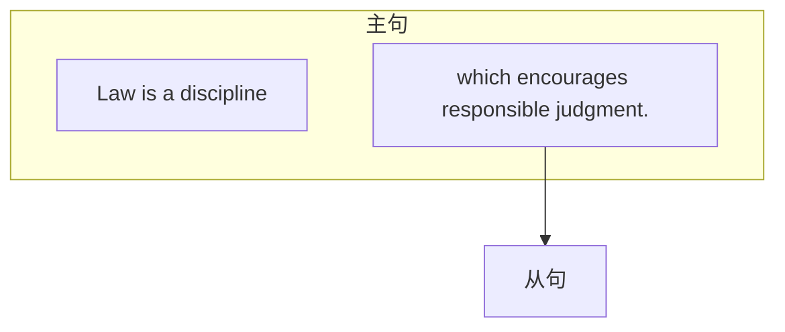
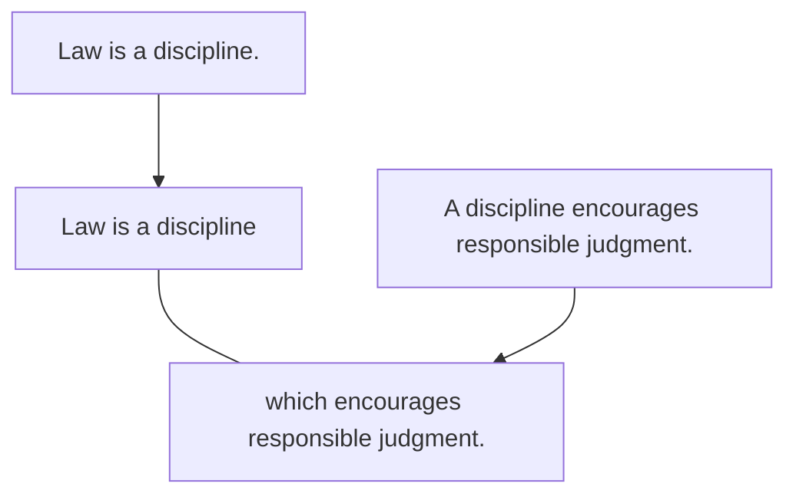

# 一、定语从句的概述
定语从句就是一个句子作定语，去修饰限定名词，位置要放在所修饰的名词后。

例: Law is a discipline which encourages responsible judgment．（2007，Reading Comprehension,Part C)[^1]
此句中，which encourages responsible judgment是定语从句，修饰限定名词discipline，表示 “一门鼓励进行责任判断的学科”。注意，翻译时通常按照中文的习惯，把定语放在名词前，翻译成“····的名词”。
其中，定语从句所修饰的名词是“先行词”，因为定语从句要放在所修饰的名词后，所以该名词一定比定语从句“先走一步”，所以叫作“先行词”，此句中先行词是discipline。引出定语从句的连接词叫作“关系词”，因为是通过它来把先行词和定语从句“联系”起来的，此句中关系词是which。

【补充】定语从句中的关系词有两个作用: 一是“引导”，引导定语从句，连接从句和先行词；二是“替代”，关系词在定语从句中充当成分，替代从句中跟先行词一样的成分，见下图: 

原本是两个句子，有相同的成分a discipline。两个句子合并时，为了避免重复，把相同的成分替换掉，即把a discipline替换成which（因为指物）。通过上图可以得出结论: 定语从句的关系词在从句中作成分，且所作的成分是与先行词一样的（即关系词＝先行词）。

[^1]: 翻译: 法律是一门鼓励进行责任评断的学科。
# 二、定语从句的写法

和名词性从句差不多，定语从句的写法是“关系词＋陈述句”，关键在于关系词的选择问题。类比名词性从句，大家可以推测出: 关系词的选择就看后面的陈述句中缺什么成分。定语从句中后面的陈述句缺少的成分，是由关系词来充当的，而关系词替代的成分又跟先行词相同，所以定语从句关系词的选择，就是四个字—看先行词。如果先行词是事／物，那就选择物对应的关系词which／that；如果是人，那就选择人对应的who／whom／that，依此类推，如下: 

|先行词|关系词|
|: ---: |: ---: |
| 事／物|which/that|
|人|who/whom/that|
| 人／物 （表示人或物的所有关系，即“某人的／某物的”）|whose|
|时间|when|
|地点|where|
| 原因|why |

### 1.先行词是事／物，关系词选择which／that
例: Teachers need to be aware of the emotional，intellectual，and physical changes that young adults experience.(2003,Use of English)[^2]

例: These groups mainly rely for instilling needed dispositions into the young upon the same sort of association which keeps adults loyal to their group.(2009,Reading Comprehension,Part C)[^3]

例: Furthermore，the legal system and the events which occur within it are primary subjects for journalists.(2007,Reading Comprehension,Part C)[^4]

例: To a certain extent， our ability to excel in making the connections that drive intelligence is inherited.(2014,Use of English)[^5]

[^2]:  翻译: 教师应当意识到青少年所经历的情感、心智和生理上的变化。
[^3]:  翻译: 这些（落后的）社会群体主要在人际交往中向年轻人灌输必要的性情倾向，而正是这种交往保持了成年人对群体的忠诚。
[^4]:  翻译: 此外，法律体系及其中发生的事件是新闻记者报道的重要主题。
[^5]:  翻译: 在一定程度上，我们善于建立驱动智力发展的连接的能力是遗传的。
### 2.先行词是人，关系词选择who／whom／that
例: In France，shareholders who hold onto a company investment for at least two years can sometimes earn more voting rights in a company.(2019,Reading Comprehension,Part A Text 1)[^6]

例: Passengers who pass a background check are eligible to use expedited screening lanes. (2017,Reading Comprehension,Part A Text 1)[^7]

例: Most archaeological sites，however，are discovered by archaeologists who have set out to look for them.(2014,Reading Comprehension,Part B)[^8]

例: Retailers that master the intricacies of wholesaling in Europe may well expect to rake in substantial profits thereby.(2010,Reading Comprehension,Part B)[^9]

[^6]:  翻译: 在法国，持有公司投资至少两年的股东有时可以在公司获得更多的投票权。
[^7]:  翻译: 通过背景调查的乘客有资格使用快速安检通道。
[^8]:  翻译: 然而，绝大多数考古遗迹是考古学家特意搜寻才发现的。
[^9]:  翻译: 在欧洲那些掌握了复杂的批发流程的零售商可能轻而易举地就获取丰厚的利润。
### 3.先行词是人／物，表示人或物的所有关系，关系词选择whose
例: It also pledged not to deploy AI whose use would violate international laws or human rights.(2019,Reading Comprehension,Part A Text 3)[^10]

例: On display here are various fantasy elements whose reference， at some basic level， seems to be the natural world.(2013,Reading Comprehension,Part C）[^11]

例: This，for those as yet unaware of such a disadvantage， refers to discrimination against those whose surnames begin with a letter in the lower half of the alphabet.(2004,Reading Comprehension,Part A Text 2)[^12]

[^10]:  翻译: 它（指上文提过的Google）还保证不部署用 途将违反国际法或人权的AI（人工智能）。
[^11]:  翻译: 各种各样奇幻的元素在这里展示，其参照依据，就某种基本层面来说，似乎就是大自然。
[^12]:  翻译: 对于那些到目前为止还没有意识到这种劣势的人来说，它指的是对姓氏字母位于字母表后半部分的人的歧视。
### 4.先行词是时间，关系词选择when
例: It is difficult to the point of impossibility for the average reader under the age of forty to imagine a time when high-quality arts criticism could be found in most big-city newspapers.(2010, Reading Comprehension,Part A Text 1)[^13]

[^13]:  翻译: 对于40岁以下的普通读者而言，他很难想象在大多数大城市的主流报纸上读到高质量的艺术评论的那个年代。
### 5.先行词是地点，关系词选择where
例: Today，we live in a world where GPS systems， digital maps， and other navigation apps are all available on our smartphones.(2019,Use of English)[^14]

例: But there are few places where clients have more grounds for complaint than America. (2014,Reading Comprehension,Part A Text 2)[^15]

[^14]:  翻译: 今天，我们生活在一个GPS系统、数字地图和其他导航应用都可以在我们的智能手机上使用的世界里。
[^15]:  翻译: 但是几乎没有哪里的客户比美国客户有更多抱怨的理由。我们的智能手机上使用的世界里。
### 6.先行词是原因，关系词选择why
例: That's one reason why we have launched Arc， a new publication dedicated to the near future.(2013,Reading Comprehension,Part A Text 3)[^16]

例: The other reason why costs are so high is the restrictive guild-like ownership structure of the business.(2014,Reading Comprehension,Part A Text 2)[^17]

- 【补充】关于定语从句关系词需注意的几点: 
	1. 定语从句中的每一个关系词都必须作成分，包括that。that既可以指人又可以指物。
	2. 定语从句中的先行词是“事／物”时，关系词用which和that都可以，不需要区别，因为考研中不考。
	3. whom指人，只能在作宾语时使用；而who和that指人，可以作任何成分。
	4. when／where／why引导定语从句时，先行词必须与之匹配，即先行词是表示“时间／地点／原因”的名词。
	5. 关系词在定语从句中作宾语时（及物动词后的宾语或介词后的宾语），都可以省略。如下: 
		- 例: Are humans actually aware of the world they live in？ （2009，Use of English）[^18]
		- 例: These rules say they must value some assets at the price a third party would pay…（2010， Reading Comprehension,Part A Text 4)[^19]
		- 例: But the regular time it takes to get a doctoral degree in the humanities is nine years．（2011， Reading Comprehension,Part B)[^20]

【补充】定语从句还有一个特殊的关系词在考研中出现过——whereby，表示“凭借，通过……”，相当于“by which”。这个不常出现，简单了解即可。

例: The definition also excludes the majority of teachers， despite the fact that teaching has traditionally been the method whereby many intellectuals earn their living.(2006,Reading Comprehension,Part C)[^21]

[^16]:  翻译: 那是我们出版《弧》的一个原因，《弧》是一本致力于展示不远未来的新刊物。
[^17]:  翻译: 花费如此高昂的另外一个原因是该行业类似于行会性质的限制性所有权结构。
[^18]:  翻译: 人类是否真正了解自己所居住的世界？
[^19]:  翻译: 这些规则指出银行必须按照第三方的出价来评估资产……
[^20]:  翻译: 但是，获得人文学科的博士学位通常需要九年的时间。
[^21]:  翻译: 这个定义也排除了大部分教师，尽管教学一直是许多知识分子的谋生手段。
# 三、定语从句的分类
定语从句主要分为两类：限定性定语从句和非限定性定语从句。其中限定性定语从句更常用，前面在“定语从句的概述和写法”中所举的例子都是限定性定语从句。其实两种定语从句写法基本一样，只不过要注意逗号的有无、不同的作用和不同的关系词选择。分析完两种从句的区别后，我们重点讲解非限定性定语从句。
限定性定语从句
无逗号隔开 定语从句的分类
非限定性定语从句
有逗号隔开
同学们一直有一个误区，普遍认为限定性定语从句和非限定性定语从句的区别在于是否有逗号。其实逗号只是表面现象，两者间最本质的区别在于前面先行词的范围是否明确，是否需要修饰限定。对比下面两句：
He will call his friend who is working in London. He will call his mother,who is working in London.
第一句的定语从句先行词是his friend，这个名词的范围不明确（因为每个人都有很多的朋友），所以需要限定，后面就加上了一个限定性的定语从句。这种限定性的定语从句不能省略，否则句子的意思不完整；而且它与前面的先行词关系紧密，所以不用逗号隔开。
第二句的定语从句先行词是his mother，这个名词的范围明确（因为对每个人来说，“妈妈”只有一个），所以不需要再限定，后面就加上了一个非限定性的定语从句。这种非限定性的定语从句表达的是信息上的一种补充说明，可以省略，不影响句子的表意；它与前面的先行

词关系不紧密，可以用逗号隔开。
综上所述，两种定语从句的本质区别就在于先行词的范围是否明确。而先行词的范围明确主要分为两种情况：
一是先行词范围“绝对明确”，即先行词是专有名词或者是独一无二的，例如 the GreatWall，mother，father，the universe等，此时要使用非限定性定语从句。
例：If it is trying to upset Google， which relies almost wholly on advertising，it has chosen an indirect method.(2013,Reading Comprehension,Part A Text 2)[86]
例：In Europe，where forestry is ecologically more advanced，the noncommercial tree species are recognized as members of the native forest community,to be preserved as such,within reason.(2010,Reading Comprehension,Part C)f87
二是先行词范围“相对明确”，也就是说根据上下文可以判断出这个名词的范围是明确的，此时也可以使用非限定性定语从句。
例：This trend，which we believe is still in its infancy， effectively began with retailers and travel providers such as airlines and hotels and willno doubt go further.(2011,Reading Comprehension,Part A Text 3)
为了让两种定语从句的区别更加一目了然，总结如下：

类别
限定性定语从句
非限定性定语从句 区别
逗号
无逗号
有逗号 先行词
范围不明确
范围明确 作用
修饰限定先行词，不能省略，影响表意
补充说明先行词，可以省略，不影响表意往前翻译
翻译
不用往前翻译 （译到先行词前，“·...·的名词”）
①关系词可以用that
①关系词不能用that关系词
②作宾语可以省略
②不可以省略 ③指人作宾语，用whom／who／that都行
③指人作宾语，只能用whom

例：The bills are similar to a measure recently adopted in California，which last year became the first state to require gender quotas for private companies.(2020,Reading Comprehension,Part A Text 3)(89)
例：At the same time， Dickens，who had a reporter＇s eye for transcribing the life around him， especially anything comic or odd, submitted short sketches to obscure magazines.(2017,Reading Comprehension,Part B)(90]
例：The winner， by a large margin， was a tiny Virginia company called Open Source Solutions,whose clear advantage was its mastery of the electronic world. (2003,Reading Comprehension,Part A Text 1)911

［84］翻译：但是，获得人文学科的博士学位通常需要九年的时间。［85］翻译：这个定义也排除了大部分教师，尽管教学一直是许多知识分子的谋生手段。

［86］翻译：如果它（微软）尝试着去扰乱几乎完全依靠广告的谷歌，那么它就是选择了一个间接的方法。
［87］翻译：在林业生态更为发达的欧洲，没有商业价值的树种被合理地看成是当地森林群落的成员，并得到相应的保护。
［88］翻译：这一趋势，有效地开始于零售商和像航空公司、酒店等旅游供应商，我们认为它现在仍然处于开始阶段，而且无疑将会得到进一步的发展。

［89］翻译：这些法案类似于加利福尼亚州最近采取的一项措施，去年加利福尼亚州成为第一个要求对私营公司实行性别配额的州。［90］翻译：同时，狄更斯也向不知名的（模糊的）杂志提交了简短的小品文，他有着记者一般的眼睛去描绘他周围的生活，尤其是任何滑稽或奇怪的事情。
［91］翻译：以绝对优势赢得比赛的是弗吉尼亚一家名为“开放资源解决方案”的小公司，它的明显优势是它在电子领域的统领地位。
