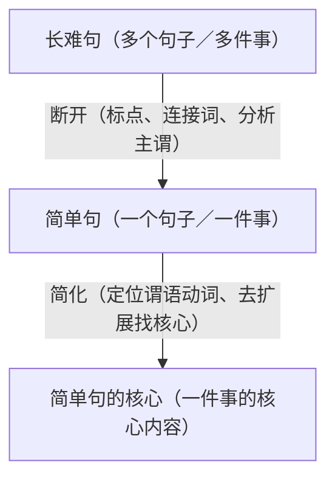

绝大部分的长难句都属于基本结构的长难句，即没有经过复杂结构变化的长难句，采用“两步分析法”就能攻克，如下：

```mermaid
flowchart
1["长难句（多个句子／多件事）"]
2["简单句（一个句子／一件事）"]
3["简单句的核心（一件事的核心内容）"]
1-->|"断开（标点、连接词、分析主谓）"|2-->|"简化（定位谓语动词、去扩展找核心）"|3
```

步骤一：断开——把长难句断成简单句，即把多件事断成一件一件事来看。

步骤二：简化——把简单句（一件事）中非核心的扩展成分去掉，找到（一件事的）核心。