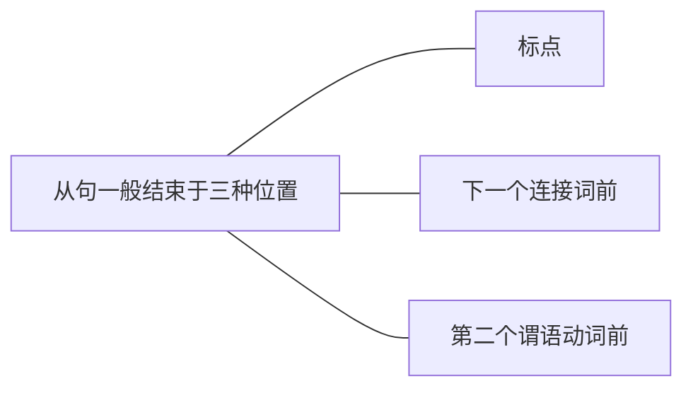

想把长难句断成简单句，即把多件事断成一件一件事来看，主要可以通过三点来实现：标点、连接词、分析主谓。
# 一、标点
考研真题中能够断开长难句的标点主要有：逗号，冒号，分号。
## （一）逗号
在长难句中，最常见的用来分隔句子的标点就是“逗号”，但注意逗号一般不能单独用来隔开或连接句子，而要跟连接词一起（并列句连接词相同，被省略且替换成逗号的情况除外）。

- 例: The idea is intuitively compelling,but it doesn't explain how ideas actually spread. (2010, Reading Comprehension, Part A Text 3)
	- 译：这种观点直觉上是令人信服的，但实际上它并没有说明观点是如何传播的。
	- 此句中，逗号可以断开前后两句话，句子1为The idea is intuitively compelling，句子2为but it doesn't explain how ideas actually spread (其中又包含了一个由how引导的宾语从句)。而在 英语中，句子之间只有逗号还不行，还要有连接词。这里的连接词but，正好说明了前后两句之间是转折关系。
## （二）冒号
- “冒号”后一般不需要连接词，通常表示后面内容是对前面句子的进一步解释说明。

- 例: It's hard to imagine that many people are dumb enough to want children just because Reese and Angelina make it look so glamorous: most adults understand that a baby is not a haircut. (2011, Reading Comprehension, Part A Text 4)
	- 译：很难想象许多人会愚蠢到，仅仅因为Reese和Angelina让生孩子看起来如此富有魅力，就决定效仿：大多数成年人都明白，养孩子不是理发（那么简单）
	- 此句中，冒号后的句子对冒号前的句子解释说明，进一步说明“大多数人都明白这个道理，自然很难想象有人那么愚蠢”。
## （三）分号
“分号”表示并列的关系，前后通常是完整的句子，表示并列的多种情况，且连接词可有可无（通常情况下不需要连接词）。

- 例：Moreover，average overall margins are higher in wholesale than in retail；wholesale demand from the food service sector is growing quickly as more Europeans eat out more often；and changes in the competitive dynamics of this fragmented industry are at last making it feasible for wholesalers to consolidate.(2010,Reading Comprehension,Part B)
	- 译：并且，批发业的平均利润要高于零售业；随着欧洲人更加频繁地外出就餐，食品服务业的批发需求也迅速增长；这个零散的产业中竞争力量的变化最终使批发商们的联合成为可能。
	- 此句中，通过分号并列了三种情况，分别是：批发业的利润更高、食品服务业的批发需求增长、产业的竞争变化导致批发商联合。

注意：有时标点两端连接的不是句子，而是词或词组，那么句子就不用在标点这里断开了，因为它对于我们的分析来说没有用。
# 二、连接词
英语是“形合”的语言，即英语的句子之间想要连接，必须要在形式上加上一个连接词表示合并，并且通过连接词说明清楚前后句子之间的关系，让人一目了然。因此，句子在“连接词”处连接，自然就可以从“连接词”处断开（将多件事断成一件一件事）。在考研真题中，断开长难句最主要的方法就是依靠连接词：找到了连接词，就找到了从句的开始。能够用来断开长难句的连接词主要有如下三类：

>并列连词：and，but，or…（用来连接并列句）
从属连词：because，if，while，although，as…（用来引导状语从句）
关系词：that，how，wh-（what，who，whom，which，whose，when，where，why，whether）

但是找到连接词，只找到了从句的开始。一个从句要有始有终，因此还要找到从句结束的位置。在考研长难句的分析中，从句结束的位置大致分为三种：

# （一）从句结束于标点
- 例：One of the reasons why the appointment came as such a surprise,however, is that Gilbert is comparatively little known.(2011, Reading Comprehension,Part A Text 1)
	译：但是，这次任命令人惊讶的原因之一是Gilbert相对而言并不是很有名气。
	- 步骤一：断开长难句，首先去看标点，这里的两个逗号都不能用来断开句子，因为中间的however不是一个句子，它只是逗号隔开的插入语，表示转折，可以不看。然后去找连接词，就发现了why和that，但这只是找到了从句的开始。
		One of the reasons ==why== the appointment came as such a surprise,==however==, is ==that== Gilbert is comparatively little known.
	- 步骤二：从句要有始有终，还要找到从句的结束，因此往后看，就发现why从句结束于逗号，而that从句结束于句号。
		注意：要回头检查一下，“why和逗号之间”以及“that和句号之间”断开后的每个小句子里都只有一个谓语动词，就说明断开成功，断开到了一件一件事。如果它们之间不止一个谓语动词，那么就说明断开不成功，因为一件事中只能有一个谓语动词，超过一个就说明还要再断开。
		1. One of the reasons why...is that...
		2. why从句：why the appointment came as such a surprise,
		3. that从句：that Gilbert is comparatively little known.
	- 步骤三：把长难句断开，断成一件一件事，才能理清句子意思，例如本句一共分成三件事（已标记数字），如左图。先看主句，“One of the reasons... is...”表示“原因之一是·····”。再看从句，reasons后面接了why从句（定语从句），修饰reasons，表示“……的原因之一”；that从句在be动词（系动词）后作表语从句，表示“原因之一是·····”。

- 例：The digital services tax now awaits the signature of President Emmanuel Macron,who has expressed support for the measure, and it could go into effect within the next few weeks.(2020,Reading Comprehension,Part A Text 4)
	译：现在，数字服务税正在等待总统伊曼纽尔·马克龙（Emmanuel Macron）签署，他对该措施表示了支持，该法案可能在未来几周内生效。
	- 步骤一：首先找到了连接词who和and，就找到了从句和并列句的开始。
		The digital services tax now awaits the signature of President Emmanuel Macron,==who== has expressed support for the measure, ==and== it could go into effect within the next few weeks.
	- 步骤二：who从句结束于标点逗号，and并列句结束于标点句号。
	- 步骤三：通过两个连接词，可以先把句子断成三段，然后再一句句来看。先看主句，“The digital services tax now awaits the signature of President Emmanuel Macron”, 表示“现在数字服务税正在等待总统伊曼纽尔·马克龙签署”；再看从句，who引出非限定性的定语从句，用两个逗号隔开相当于是句子的插入语，用来表示对于总统伊曼纽尔·马克龙的进一步补充说明；最后and引出并列句与最前面的主句相并列，接着说明“数字服务税可能在未来几周内生效”。
		1. The digital services tax now awaits the signature of President Emmanuel Macron,who…and…
		2. who从句：who has expressed support for the measure,
		3. and并列句：and it could go into effect within the next few weeks.

- 例：Some species of trees have been "read out of the party" by economics-minded foresters because they grow too slowly, or have too low a sale value to pay as timber crops.(2010,Reading Comprehension, Part C)
	译：一些种类的树已被看重经济利益的林务官“驱逐出境”，因为它们生长得太慢，或是作为木材收益太低。
	- 步骤一：首先找到连接词because和or，就找到了从句和并列句的开始。
		Some species of trees have been "read out of the party" by economics-minded foresters ==because== they grow too slowly, ==or== have too low a sale value to pay as timber crops.
	- 步骤二：从句（或并列句）开始于连接词，结束于标点。
	- 步骤三：此句中，or连接并列的两句话，且or后面的句子不完整（主语被省略），则说明它与前面的句子共享主语，因此4不断开，与前面句子合在一起作成分，表示“原因1＋原因2”，共同跟在because后，解释主句的原因。
		1. Some species of trees have been “read out of the party" by economics-minded foresters because...or...
		2. because从句（表示原因1）：because they grow too slowly,
		3. or并列句（与上句并列，表示原因2）：or have too low a sale value to pay as timber crops.

【补充】如果并列连词后的句子不完整，通常说明它后面的内容与前面的句子并列，共同作一个成分，因此要放在一起来看，不要断开。反之，如果并列句后面的句子完整，则说明它是独立的一件事，可以断开（单独）来看。例如上面两个例句，and和or引出的并列句之所以处理方式不同，就是因为如此。

- 例：Today they argue that market prices overstate losses,because they largely reflect the temporary illiquidity of markets, not the likely extent of bad debts. (2010,Reading Comprehension,Part A Text 4)
	译：现今他们（银行）认为市场的价格夸大了损失，因为他们很大程度地反映了市场的暂时不流动性，而不是坏账的可能性。
	- 步骤一：首先找到连接词that和because，就找到了从句的开始。
		Today they argue ==that== market prices overstate losses, ==because== they largely reflect the temporary illiquidity of markets,not the likely extent of bad debts.
	- 步骤二：从句开始于连接词，结束于标点。其中because从句没有结束于逗号，因为后面内容很明显不是一个完整的句子，而是与前面相关的内容，所以从句要持续到句号。
	- 步骤三：that从句位于及物动词argue后，作宾语从句；because引出原因状语从句。先看主句，然后再看从句。不要纠结于是什么类型的从句，只需要先把从句内容抽象地看成一个整体。整句表达“现今他们认为……因为……”。
		1. Today they argue that...because...
		2. that从句：that market prices overstate losses，
		3. because从句：because they largely reflect the temporary illiquidity of markets, not the likely extent of bad debts.

- 例：When we are deprived of green,of plants, of trees, most of us give in to a demoralization of spirit which we usually blame on some psychological conditions, until one day we find ourselves in a garden and feeI the oppression vanish as if by magic. (2013,Reading Comprehension,Part C)
	译：当我们被剥夺了绿色、植物以及草木时，我们大多数人通常把陷入精神颓废归咎于某些心理疾病，直到有一天我们置身花园，才顿觉压抑感神奇地消失了。
	- 步骤一：首先找到连接词when，which，until 和and，找到了从句和并列句的开始。
	- ==When== we are deprived of green, of plants, of trees, most of us give in to a demoralization of spirit ==which== we usually blame on some psychological conditions, ==until== one day we find ourselves in a garden ==and== feel the oppression vanish as if by magic.
	- 步骤二：从句和并列句开始于连接词，结束于标点。注意：其中when从句没有结束于第一个逗号，因为前后三个of短语很明显是并列在一起的（类似于中文的排比），要放在一起看，所以when从句结束于of trees后面的逗号。and后面的句子不完整，因此与前面的until从句作为一个整体，并列作一个成分，所以until从句结束于句号。
	- 步骤三：先看主句，表示“······我们大多数人陷入精神颓废···...”。后看从句，when时间状语从句补充说明“陷入精神颓废”的时间；which定语从句修饰限定前面名词a demoralization of spirit，表示“通常归咎于 某些心理疾病的精神颓废”；and并列句不完整，所以与前面句子并列，作同一个成分，因此until引出两个并列的时间状语从句。
		1. ==When==...most of us give in to a demoralization of spirit ==which==...==until== one day we find... ==and== feel... 
		2. when 从句：==When== we are deprived of green，of plants,of trees,
		3. which从句：==which== we usually blame on some psychological conditions,
		4. until从句：==until== one day we find ourselves in a garden ==and== feel the oppression vanish as if by magic. 
## （二）从句结束于下一个连接词前
- 例：But take a longer view and there is a surprising amount that we can say with considerable assurance.(2013,Reading Comprehension,Part A Text 3)
	译：但是，从更加长远的角度看，我们可以相当确定地说该数量很惊人。
	- 步骤一：首先找到连接词and和that，就找到了并列句和从句的开始。
		- But take a longer view ==and== there is a surprising amount ==that== we can say with considerable assurance. 
	- 步骤二：并列句和从句开始于连接词，结束于下一个连接词前和标点。
	- 步骤三：and表示并列，且后面的句子完整，就说明前后是独立的两件事，则可以从and这断开句子。that在从句中作成分（say及物动词后缺宾语，that作宾语），所以判断出它是定语从句（判断方法详见定语从句），修饰前面的名词a surprising amount， 表示“我们可以确定地说该数量很惊人”。
		1. But take a longer view and there is a surprising amount that...
		2. and并列句：and there is a surprising amount
		3. that从句：that we can say with considerable assurance.

- 例：Certainly，there are valid concerns about the patchwork regulations ==that== could result ==if== every state sets its own rules.(2012,Reading Comprehension, Part A Text 2)
	译：当然，假设各州都制定自己的法规，那么对会产生补丁法规的担忧也是合理的。
	- 步骤一：首先找到连接词that和if，就找到了从句的开始。
		- Certainly,there are valid concerns about the patchwork regulations ==that== could result ==if== every state sets its own rules.
	- 步骤二：两个从句都开始于连接词，但that从句结束于下一个连接词前，而if从句结束于标点。
		1. Certainly,there are valid concerns about the patchwork regulations that…if…
		2. that从句：that could result
		3. if从句：if every state sets its own rules．
	- 步骤三：先看主句there are valid concerns about the patchwork regulations，是倒装句的 “there be句型”，表示“有（对于补丁法规的）担忧”。that从句在名词后，同时that在从句中作成分，所以为定语从句，修饰限定名词regulations，表示“……的补丁法规”。 if条件状语从句，表示产生担忧的条件。

- 例: That whispered message, half invitation and half forcing, is ==what== most of us think of ==when== we hear the words peer pressure. (2012, Reading Comprehension, Part A Text 1)
	译：这种半邀请半强制的耳语，是我们大部分人听到同济压力这个词时所想到的。
	- 步骤一：首先找到两个逗号，发现不能用来断开句子，因为中间的部分不是句子（无谓语动词），只是用于隔开插人语的。然后找到连接词what和when，就找到了从句的开始。
		- That whispered message, half invitation and half forcing, is ==what== most of us think of ==when== we hear the words peer pressure.
	- 步骤二：两个从句都开始于连接词，分别结束于下一个连接词前和标点。
	- 步骤三： what从句位于is （系动词）后，为表语从句，表示“这种耳语是……”。when引出时间状语从句，补充说明前面内容的时间。
		1. That whispered message...is whatmost of us think
		of when…
		2. what从句: what most of us think of
		3. when从句: when we hear the words peer pressure.

- 例：However，the Justices said that Arizona police would be allowed to verify the legal status of people who come in contact with law enforcement. (2013,Reading Comprehension,Part A Text 4)
	译：然而，法官们说亚利桑那州的警察将被允许核实介入法律执行过程中的人的合法身份。
	- 步骤一：首先找到连接词that和who，就找到了从句的开始。
		- However,the Justices said ==that== Arizona police would be allowed to verify the legal status of people ==who== come in contact with law enforcement.
	- 步骤二：两个从句都开始于连接词，分别结束于下一个连接词前和标点。
	- 步骤三：that从句位于及物动词said后，为宾语从句，表示“法官们说了……”。who引出定语从句，修饰前面的people，表示“……的人”。
		1. However,the Justices said that…people who…
		2. that从句：that Arizona police would be allowed to verify the legal status of people
		3. who从句：who come in contact with law enforcement.

- 例: Now the nation's top patent court appears completely ready to scale back on business-method patents, which have been controversial ever since they were first authorized 10 years ago. (2010, Reading Comprehension, Part A Text 2)
	译：现在国家最高专利法院似乎已经做好了充分的准备来成比例地缩减商业方法专利的数量，这一类专利自从十年前首次被授予以来一直饱受争议。
	- 步骤一:首先找到连接词(或词组) which 和ever since，就找到了从句的开始。其中ever since作为一个整体引导从句。
		- Now the nation's top patent court appears completely ready to scale back on business-method patents, ==which== have been controversial ==ever since== they were first authorized 10 years ago.
	- 步骤二：两个从句都开始于连接词，分别结束于下一个连接词前和标点。
	- 步骤三：先看主句，表示“国家最高专利法院似乎准备好缩减商业方法专利的数量”。which引导非限定性定语从句，补充说明前面的名词词组business-method patents，说明它是一直饱受争议的，其中时态用的是现在完成时have been，表示从过去到现在。ever since引出时间状语从句，表示“自从……时候直到现在”，正好呼应了上句中的现在完成时（表示从过去到现在）
		1.  Now the nation's top patent court appears completely ready to scale back on business-method patents, which…ever since…
		2. which从句: which have been controversial
		3.  ever since从句: ever since they were first authorized 10 years ago.

- 例: The principle of British welfare is no longer that you can insure yourself against the risk of unemployment and receive unconditional payments if the disaster happens. (2014, Reading Comprehension, Part A Text 1)
	译：英国福利制度的原则已不再是如果灾难（暗指失业）发生，你能够为自己投保来抵御失业的风险，并无条件地获得福利。
	- 步骤一：首先找到连接词that，and和if，就找到了从句和并列句的开始。
		- The principle of British welfare is no longer ==that== you can insure yourself against the risk of unemployment ==and== receive unconditional payments ==if== the disaster happens.
	- 步骤二：通常从句和并列句都开始于连接词，分别结束于下一个连接词前和标点前，但此句中and并列句比较特殊（见下一步说明）。
	- 步骤三： that从句位于系动词is后，作表语从句，表示“英国福利的原则已不再是……”。and引出并列句，但后面的句子不完整（缺主语），所以不能断开成独立句，要与前面的表语从句合并成一个整体。if条件状语从句表示“英国福利的原则已不再是……”的条件。整句话可以理解为： “英国福利的原则已不再是……和……，如果……”。
		1.  The principle of British welfare is no longer that you can insure... and receive...if the disaster happens.
		2.  that从句: that you can insure yourself against the risk of unemployment and receive unconditional payments
		3. if从句: if the disaster happens.

- 例：In the idealized version of how science is done,facts about the world are waiting to be observed and collected by objective researchers who use the scientific method to carry out their work. (2012,Reading Comprehension,Part A Text 3)
	译：在科学是如何展开的理想化版本中，世界的事实正等待着客观的研究者使用科学的方法去观察和收集。
	- 步骤一：首先找到连接词how、and和who，就找到了从句和并列句的开始。
		- In the idealized version of ==how== science is done, facts about the world are waiting to be observed ==and== collected by objective researchers ==who== use the scientific method to carry out their work.
	- 步骤二：how从句和who从句都开始于连接词，分别结束于标点。and并列句不完整，所以不断开（不独立），与前面的facts...are waiting to be observed合并成一个整体。 
	- 步骤三：how从句位于介词of后，作宾语从句，of表示属性，通常翻译为“的”，所以这部分表示“在科学是如何展开的理想化版本中”。and引出并列句，且和前一句作为一个整体来看，根据之前讲过的并列结构，可以判断collected 与observed并列，因此前 面的facts about the world are waiting to be为 共享的部分，意思为“关于世界的事实等待着去被观察和收集”。who引出定语从句，修饰限定前面的名词objective researchers， 表示“……的客观的研究者”。
		1. In the idealized version of how...facts about the world are waiting to be observed and collected by objective researchers who...
		2. how从句：how science is done，
		3. who从句：who use the scientific method to carry out their work.

## （三）从句结束于第二个谓语动词前
为什么从句要结束于第二个谓语动词前？原因很简单，从句也是一个句子，因此只能有一个谓语动词。所以从连接词开始往后数，第一个谓语动词是这个从句的，而第二个就不是了，所以从句要结束于第二个谓语动词前。

- 例: The hardest task that television asks of anyone is to turm the power offafter he has turned it on. (2012, Reading Comprehension, Part B)
	译：电视要求人们做的最难的事情就是打开它之后再关上它。
	- 步骤一：找到连接词that和after，就找到了从句的开始。
		- The hardest task ==that== television asks of anyone is to turn the power off ==after== he has turned it on.
	- 步骤二：从句要有始有终，所以要找到从句的结束。after从句比较好找，结束于句尾的标点。that从句不能到下一个连接词前结束,因为that television asks of anyone is to turn the power off中包括了两个谓语动词(asks和is),所以that从句要结束在第二个 谓语动词之前，这样就能保证从句中只包含个谓语动词，符合英语中简单句（一件事）“一主一谓”的要求。通过以上的分析，可以得出结论，从句要结束于第二个谓语动词前，即is的前面，所以从句的部分为that television asks of anyone。
	- 步骤三： after引出时间状语从句，补充说，明主句的时间是“在……之后”。that从句，位于名词后，且that作成分（从句中及物动词asks后缺宾语， that来作宾语），所以为定语从句，修饰名词The hardest task，表示“……的最难的事情”。整句话可以理解为“……的最难的事情就是关上它，在……时间之后”
		1. The hardest task that... is to turn the power off
		after…
		2. that从句: that television asks of anyone
		3.  after从句: after he has turned it on.

- 例：Until now，many sellers that have a physical presence in only a single state or a few states have been able to avoid charging sales taxes when they ship to addresses outside those states. (2019, Reading Comprehension,Part A Text 4)
	译：到目前为止，许多只在一个州或几个州有实体店的卖家，在运送到这些州以外的地址时，已经能够避免征收销售税。
	- 步骤一：找到连接词that和when，就找到了从句的开始。注意句中的并列连词or前后连接的不是句子，因此不能用来断开。
		- Until now,many sellers ==that== have a physical presence in only a single state or a few states have been able to avoid charging sales taxes ==when== they ship to addresses outside those states.
	- 步骤二：when从句结束于句尾的标点。that从句从连接词开始往后数，第一个谓语动词是have，第二个是have been，所以从句要结 束于第二个谓语动词have been前，从句为that have a physical presence in only a single state or a few states。
	- 步骤三：that引出定语从句，修饰manysellers，表示“……的许多卖家”。when引出时间状语从句，补充说明主句“避免征收销售税”的时间。
		1. Until now,many sellers that...have been able to avoid charging sales taxes when...
		2. that从句：that have a physical presence in only a single state or a few states
		3. when从句：when they ship to addresses outside those states.

- 例：Second,the majority of people who use networked computers to upload are not even aware of the significance of what they are doing.(2012, Reading Comprehension,Part B)
	译：其次，大部分使用联网电脑上传资料的用户甚至还未意识到他们的举动所带来的重要性。
	- 步骤一：找到连接词who和what，就找到了从句的开始。
		- Second,the majority of people ==who== use networked computers to upload are not even aware of the significance of ==what== they are doing.
	- 步骤二：what从句结束于句尾的标点。who从句从连接词开始往后数，第一个谓语动词为use，第二个为are，所以从句要结束于第二个谓语动词are前，从句为who use networked computers to upload。
	- 步骤三：who引出定语从句，修饰people，定语从句通常往前翻译，表示“……的大多数人”。what从句位于介词of后，为宾语从句。介词短语“A of B”通常翻译为“B的A”，所以the significance of what…可以翻译为“……的重要性”。整句可理解为“……的大多数人甚至没有意识到……的重要性”。
		1. Second,the majority of people who...are not even aware of the significance of what...
		2. who从句：who use networked computers to upload
		3. what从句：what they are doing． 

- 例：If the bar exam is truly a stern enough test for a would-be lawyer,those who can sit it earlier should be allowed to do so.(2014,Reading Comprehension,Part A Text 2)
	译：如果律师资格考试对于想要成为律师的人来说足够严格的话，那么有能力提前参加考试的那些人应该被允许去这么做（参加考试）。
	- 步骤一：找到连接词if和who，就找到了从句的开始。
		- ==If== the bar exam is truly a stern enough test for a would-be lawyer,those ==who== can sit it earlier should be allowed to do so.
	- 步骤二：if从句结束于标点。who从句从连接词开始往后数，第一个谓语动词为can sit，第二个为should be allowed，所以从句要结束 于第二个谓语动词should be allowed前，从句 为who can sit it earlier。
	- 步骤三：if引出条件状语从句。who引出定语从句，修饰those。整句话可以理解为“如果……，……的那些人应该被允许去这么做”。
		1. If...those who...should be allowed to do so.
		2. if从句：If the bar exam is truly a stern enough
		test for a would-be lawyer,
		3. who从句：who can sit it earlier

- 例：Of course,the image of parenthood that celebrity magazines like Us Weekly and People present is hugely unrealistic, especially when the parents are single mothers like Bullock.(2011, Reading Comprehension,Part A Text 4)
	译：当然，像《美国周刊》与《人物》这样的名人杂志提供的父母形象是非常不切合实际的，特别是当父母是像Bullock这样的单身母亲的时候。
	- 步骤一：找到连接词that和when，就找到了从句的开始。
		- Of course,the image of parenthood ==that== celebrity magazines like Us Weekly and People present is hugely unrealistic,especially ==when== the parents are single mothers like Bullock.
	- 步骤二：when从句结束于句尾的标点。that从句从连接词开始往后数，第一个谓语动词为present，第二个为is，所以从句要结束于第二个谓语动词is前，从句为that celebrity magazines like Us Weekly and People present。 
	- 步骤三：that从句位于名词词组the image of parenthood后，且作成分（后面从句中及物动词present后缺宾语，that作宾语），所以为定语从句。when引出时间状语从句，补充说明主句的时间。整句话可以理解为：“当然，……的父母形象是非常不切合实际的，特别是当……的时候”。
		1.  Of course, the image of parenthood that…is hugely unrealistic,especially when…
		2. that 从句：that celebrity magazines like Us Weekly and People present
		3. when从句：when the parents are single mothers like Bullock.

以上内容阐述了虽然从句结束于三种不同的位置，但都开始于连接词。要特别注意一下，如果连接词前后的不是句子（即没有谓语动词），则这个连接词无效，不需要从这里断开，因为分析长难句的目标是“断开句子”。如下：

- 例：Take a broader look at our species' place in the universe,and it becomes clear that we have an excellent chance of surviving for tens,if not hundreds,of thousands of years.(2013,Reading Comprehension,Part A Text 3)
	译：以一个更加宽泛的视角看我们在宇宙中的位置，很明显，我们人类即使活不了几十万年，但是活几万年的机会还是很大的。
	- 步骤一：找到三个连接词，依次为and、that和if。其中if无效，不能用来断开句子，因为它后面接的不是句子（无谓语动词）。
		- Take a broader look at our species' place in the universe,==and== it becomes clear ==that== we have an excellent chance of surviving for tens, if not hundreds,of thousands of years.
	- 步骤二：and后是完整的句子，则为独立的一件事，可以与之前的句子断开来看。that从句结束于句尾的句号，因为中间的if和逗号前后连接的都不是句子，所以都不能断开，且从that开始一直到句尾只有一个谓语动词have，那必然是一件事（一个整体）。
	- 步骤三：and前是第一件事。and后是第二件事it becomes clear that…，其中it为形式主语， that引导了主语从句（真正的主语后置），表示“……事变得清楚（明显）”。先看主句1和2，再看从句3。
		1. Take a broader look at our species' place in the universe,and...that...
		2. and并列句：and it becomes clear
		3. that从句：that we have an excellent chance of surviving for tens, if not hundreds, of thousands of years.

- 例：It is financially terrifying，psychologically embarrassing and you know that support is minimal and extraordinarily hard to get.(2014,Reading Comprehension,Part A Text 1)
	译：它（失业）会在经济上使人害怕，在心理上使人尴尬，并且你知道能得到的支持微乎其微并且还极难获得。
	- 步骤一：找到三个连接词，依次为and、that和and。其中第三个连接词and无效，不能用来断开句子，因为后接的不是句子。
		- It is financially terrifying,psychologically embarrassing ==and== you know ==that== support is minimal and extraordinarily hard to get.
	- 步骤二：第一个and后是完整的句子，则为独立的一件事，可以与之前的句子断开来看。that从句结束于句尾的句号。
	- 步骤三：and前是第一件事，而and后为第二件事。其中that从句位于及物动词know后，作主句and you know后的宾语从句，表示“你知道······事”。先看主句1和2，再看从句3。
		1. It is financially terrifying,psychologically embarrassing and...that...
		2. and并列句：and you know
		3. that从句：that support is minimal and extraordinarily hard to get.

- 例: The commission ignores that for several decades America's colleges and universities have produced graduates who don't know the content and character of liberal education and are thus deprived of its benefits. (2014, Reading Comprehension, Part A Text 4)
	译：委员会忽略了数十年来存在的问题，美国大学所培养出来的毕业生并未真正了解人文教育的内容和特点，因此并没有从中获益。
	- 步骤一：找到五个连接词，依次为that、and， who， and和and。其中第二个连接词和第四个连接词and是无效的连接词，因为前或后接的是词，而不是句子。
		- The commission ignores ==that== for several decades America's colleges and universities have produced graduates ==who== don't know the content and character of liberal education ==and== are thus deprived of its benefits.
	- 步骤二： that从句结束于下一个连接词who前，who从句结束于句尾的标点。因为and后接的不是完整的句子，所以不能独立，要与之前的who从句合并在一起。
	- 步骤三： that从句位于及物动词ignores后，作宾语从句，表示“委员会忽略了……事”。who从句作定语从句，修饰前面的graduates，表示“……的毕业生”。
		1. The commission ignores that…who…and…
		2. that从句: that for several decades America's colleges and universities have produced graduates
		3. who从句: who don't know the content and character of liberal education and are thus deprived of its benefits.

- 【补充】句中有that出现，不一定就可以用来断开句子，因为that除了作连接词（引导从句）之外，还可以作代词，表示“那个，那种”。如下：
	- 例：When the competitive environment pushed our ancestors to achieve that potential，they could in turn afford more education.(2009,Reading Comprehension,Part A Text 3)
		- 译：当竞争的环境促使我们的祖先去实现那种潜能的时候，他们反过来又能提供更多的教育。
		- 此句中，that是代词，表示“那种”，而不是引导从句的连接词，自然也就不能用来断开句子，而且可以很明显地看到that后面接的是词potential，而不是句子。
	- 例：In 2009 the number of unionists in America's public sector passed that of their fellow members in the private sector.(2012,Reading Comprehension,Part A Text 4)
		- 译：2009年美国公共部门中工会的会员人数超过了私营部门中的会员人数。
		- 此句中，that是代词，用来指代上文提过的the number，而不是引导从句的连接词，自然也就不能用来断开句子。句中想表示比较，“公共部门中工会的会员人数超过了私营部门中会员的人数”，也就是将the number of unionists in America's public sector与that （指代the number）of their fellow members in the private sector相比较。

## 真题演练
1. Amazon.com...also collects sales tax in every state ==that== charges it, ==though== third-party sellers who use the site don't have to.(2019,Reading Comprehension,Part A Text 4)
	- 翻译：亚马逊网站……还在每个收取销售税的州征收销售税，不过（尽管）使用该网站的第三方卖家不必这样做。
	- Amazon.com…also collects sales tax in every state 主句
	- that charges it，定语从句（开始于连接词，结束于标点）
	- though third-party sellers who use the site don't have to.让步状语从句中包含了who定语 从句（开始于连接词，结束于第二个谓语动词前）

2. That's a lie ==that== we have perpetuated,==and== it fosters commonness.(2009,Reading Comprehension,Part A Text 1)
	- 翻译：那是我们长久以来制造的一个谎言，它造就了平庸。
	- That's a lie 主句
	- that we have perpetuated，定语从句（开始于连接词，结束于标点） 
	- and it fosters commonness.并列句（开始于连接词，结束于标点）

3. These receptors are the cells ==which== sense smells ==and== send messages to the brain. (2005,Use of English)
	- 翻译：这些感受器是一些可以感知气味并向大脑发送信息的细胞。
	- These receptors are the cells 主句
	- which sense smells 定语从句（开始于连接词，结束于下个连接词前）
	- and send messages to the brain.并列句（开始于连接词，结束于标点） 
	- 注意：and并列句不完整（缺主语），与前面的which定语从句共享主语，因此这两句可以合并在一起看。

4. People ==who== perceived greater social support were less likely to come down with a cold,and the researchers calculated that the stress-reducing effects of hugging explained about 32 percent of that beneficial effect.(2017,Use of English)
	- 翻译：（那些认为）社会支持更大的人更不容易感冒，研究人员计算出拥抱的减压效果解释了这种有益效果的32％左右。
	- People who perceived greater social support were less likely to come down with a cold，主句中包含了who定语从句（开始于连接词，结束于第二个谓语动词前）
	- and the researchers calculated……并列句（开始于连接词，结束于下一个连接词前）
	- that the stress-reducing effects of hugging explained about 32 percent of that beneficial effect.宾语从句（开始于连接词，结束于标点）
	- 注意：and并列句其实到下一个连接词that前并没有完全结束，而是包含了that从句作谓语动词calculated的宾语从句，这是我们稍后会讲到的嵌套结构。

5. You could argue ==that== art became more skeptical of happiness ==because== modern times have seen so much misery.(2006,Reading Comprehension,Part A Text 4)
	- 翻译：你可能会认为艺术对快乐产生越来越多的怀疑，因为现代社会经历了太多太多的痛苦。
	- You could argue...主句
	- that art became more skeptical of happiness 宾语从句（开始于连接词，结束于下个连接词前）
	- because modern times have seen so much misery.原因状语从句（开始于连接词，结束于标点）

6. We have to suspect that continuing economic growth promotes the development of education even when governments don't force it.(2009,Reading Comprehension,Part A Text 3)
	- 翻译：我们不得不猜想，甚至当政府不强制推行教育时，经济持续增长也会促进教育的发展。
	- We have to suspect...主句
	- that continuing economic growth promotes the development of education 宾语从句（开始于连接词，结束于下一个连接词前）
	- even when governments don't force it.时间状语从句（开始于连接词，结束于标点）

7. Dr. Myers and Dr.Worm argue that their work gives a correct baseline,which future management efforts must take into account.(2006,Reading Comprehension,Part A Text 3) 
	- 翻译：Myers博士和Worm博士认为他们的工作将提供一个准确的捕捞数量基准，这是未来管理层必须要考虑的事情。
	- Dr.Myers and Dr.Worm argue...主句
	- that their work gives a correct baseline，宾语从句（开始于连接词，结束于标点）
	- which future management efforts must take into account.定语从句（开始于连接词，结束于标点）

8. We are not aware of the usual smell of our own house, but we notice new smells when we visit someone else's.(2005,Use of English)
	- 翻译：我们察觉不到自己家里常有的气味，但是当我们拜访其他人的家时就会注意到不熟悉的气味。
	- We are not aware of the usual smell of our own house，主句
	- but we notice new smells 并列句（开始于连接词，结束于下一个连接词前）
	- when we visit someone else's.时间状语从句（开始于连接词，结束于标点）

9. It would be a shame to raise prices too much because it would drive away the young people who are Stratford's most attractive clientele. (2006,Reading Comprehension,Part A Text 2)
	- 翻译：把价格提高太多将是一件令人遗憾的事，因为这样做将会赶走Stratford最有吸引力的客户群—年轻人。
	- It would be a shame to raise prices too much 主句
	- because it would drive away the young people 原因状语从句（开始于连接词，结束于下 一个连接词前）
	- who are Stratford's most attractive clientele.定语从句（开始于连接词，结束于标点） 

10. The notion is that people have failed to detect the massive changes which have happened in the ocean becausethey have been looking back only a relatively short time into the past.(2006, Reading Comprehension,Part A Text 3)
	- 翻译：这种观点认为人们还未发觉海洋中发生的巨大变化，因为他们只回顾了过去相当短的一段时期的情况。
	- The notion is...主句
	- that people have failed to detect the massive changes 表语从句（开始于连接词，结束于 下一个连接词前）
	- which have happened inthe ocean 定语从句（开始于连接词，结束于下一个连接词前） because they have been looking back only a relatively short time into the past.原因状语从 句（开始于连接词，结束于标点）

11. This means that a DNA database may have a lot of data from some regions and not others, so a person's test results may differ depending on the company that processes the results.(2009, Reading Comprehension,Part A Text2)
	- 翻译：这意味着某个DNA数据库可能有来自某些地区的大量数据，但缺乏其他地区的数据。因此，同一个人的检查结果会因为处理研究结果的公司不同而存在差异。
	- This means...主句
	- that a DNA database may have a lot of data from some regions and not others，宾语从句（开 始于连接词，结束于标点）
	- so a person's test may differ depending on the company 并列句（开始于连接词，结束于 下一个连接词前）
	- that processes the results.定语从句（开始于连接词，结束于标点）

12. At the end of the day, there's probably little reason to pay attention to our dreams at all unless they keep us from sleeping or “we wake up in a panic,”Cartwright says. (2005,Reading Comprehension,Part A Text 3)
	- 翻译：Cartwright认为，说到底，只要梦不使我们无法睡眠或“从梦中惊醒”，就没有理由太在意所做的梦。
	- At the end of the day， there's probably little reason to pay attention to our dreams at all 主句
	- unless they keep us from sleeping 条件状语从句（开始于连接词，结束于下个连接词前）
	- or “we wake up in a panic，”并列句（开始于连接词，结束于标点）

13. We don't call those deaths homicides because the doctors didn't intend to kill their patients, although they risked their death. (2002,Reading Comprehension,Part A Text 4)
	- 翻译：尽管医生冒着导致病人死亡的危险，我们也不能称那些死亡为谋杀，因为医生并没有想杀死病人。
	- We don't call those deaths homicides 主句
	- because the doctors didn't intend to kill their patients，原因状语从句（开始于连接词，结 束于标点）
	- although they risked their death.让步状语从句（开始于连接词，结束于标点）

14. Leaders of the animal rights movement target biomedical research because it depends on public funding, and few people understand the process of health care research. (2003, Reading Comprehension,Part A Text 2)
	- 翻译：动物权利运动的领导者将矛头指向生物医学研究，原因在于它依赖公共资金的资助，并且很少有人懂得医疗保健研究的过程。
	- Leaders of the animal rights movement target biomedical research 主句
	- because it depends on public funding，原因状语从句（开始于连接词，结束于标点）
	- and few people understand the process of health care research.并列句（开始于连接词， 结束于标点）

15. They are the possessions of the autonomous (self-governing) man of traditional theory,and they are essential to practices in which a person is held responsible for his conduct and given credit for his achievements.(2002,Reading Comprehension,Part B)
	- 翻译：他们是传统理论定义下的自由人，他们重视实践，认为在实践中一个人应对自己的行为负责，对于表现好的应给予奖励。
	- They are the possessions of the autonomous （self-governing） man of traditional theory，主句
	- and they are essential to practices 并列句（开始于连接词，结束于下一个连接词前）
	- in which a person is held responsible for his conduct and given credit for his achievements.介 词提前的定语从句（开始于连接词，结束于标点）
	- 注意：第二个and并列句不完整（缺主语），与前面的in which定语从句共享主句，因此这两句可以合并在一起看。
# 三、分析主谓
有时从句的连接词会被省略，此时就不能再依靠连接词来断开长难句，那么就只能通过分析主谓来断开。分析主谓时，由于主语的变化形式很多，所以不好找，因此要先找到谓语动词，谓语动词前的自然就是主语（倒装句除外）。通过对历年的考研长难句进行分析和汇总，得出主谓结构通常分为两种：主谓主谓和主主谓谓。
## （一）主谓主谓，则后面的为从句
- 例: **The IASB**（主） ==says==（谓） **it**（主） ==does not want==（谓） to act without overall planning...(2010, Reading Comprehension, Part A Text 4) 
	译： IASB说（表示）不想在没有周全的计划之前采取行动……
	- 步骤一：句子中包含两个谓语动词，分别为says和does not want，就说明是两件事。句中没有可以断开句子的连接词，所以只能分析主谓。找到谓语动词后，自然就可以找到它前面的主语。通过分析，发现此句的结构是“主谓主谓”。
	- 步骤二： “主谓主谓”结构中后面的为从句，即从句为it does not want to act without overall planning…
		- The IASB says it does not want to act without overall planning...
	- 步骤三：从句位于及物动词says后，作宾语从句，表示“IASB说……”。
		1. The IASB says...
		2. 宾语从句: it does not want to act without overall planning...

- 例：**Allen's contribution**（主）==was==（谓）to take an assumption **we**（主） all ==share==（谓）...(2011,Reading Comprehension,Part C)
	译：Allen的贡献就在于，他拿出了······这一我们都共享的（公认的）假设。
	- 步骤一：句子中包含两个谓语动词，分别为was和share，就说明是两件事，但没有连接词帮助断开，所以需要通过分析主谓断开。通过分析，发现此句的结构是“主谓主谓”。注意：to take是非谓语动词（to do）的形式，所以在分析主谓（找谓语动词）时不考虑。
	- 步骤二：“主谓主谓”结构中后面的为从句，即从句为we all share。
		- Allen's contribution was to take an assumption ==we all share==...
	- 步骤三：从句we all share...位于名词assumption 后，且关系词被省略了，是定语从句，表示“我们都共享的（公认的）假设”。
		1. Allen's contribution was to take an assumption...
		2. 定语从句（修饰assumption）：we all share...

- 例：In those far-off days, it was taken for granted that **the critics of major papers**（主） ==would write==（谓） in detail and at length about the events **they**（主） ==covered==（谓）.(2010,Reading Comprehension,Part A Text 1) 
	译：在那些遥远的日子，主流报刊的评论家们详尽地评论所报道的事件，这被认为是理所当然的。
	- 步骤一：“it was taken for granted that...”中it作形式主语，that引导主语从句，表示“····被认为是理所当然的”。在主语从句中，包含两个谓语动词，分别为would write和covered，就说明是 两件事，需要通过分析主谓断开。通过分析，发现此句的结构是“主谓主谓”。
	- 步骤二：“主谓主谓”结构中后面的为从句，即从句为they covered。
		- In those far-off days,it was taken for granted that the critics of major papers would write in detail and at length about the events ==they covered==.
	- 步骤三：从句they covered位于名词events后，且关系词被省略了，是定语从句，表示“他们所报道的……”。
		1. In those far-off days, it was taken for granted that...
		2. that主语从句：that the critics of major papers would write in detail and at length about the events...
		3. 定语从句（修饰events）：they covered． 
## （二）主主谓谓，则中间的为从句
- 例：When the court deals with social policy decisions,**the law**（主） **it**（主） ==shapes==（谓） ==is==（谓） inescapably political...(2012,Use of English)
	译：当法院处理社会决策时，其所促成的法律不可避免地具有政治色彩……
	- 步骤一：此句中有连接词when，可以断开句子的前一半。但句子的后一半还包含两个谓语动词，分别为shapes和is，就说明是两件事，但中间没有连接词帮助断开，所以需要通过分析主谓断开。通过分析，发现此句的结构是“主主谓谓”。
	- 步骤二：在“主主谓谓”结构中，中间的为从句，即从句为it shapes。
		- When the court deals with social policy decisions,the law ==it shapes== is inescapably political...
	- 步骤三：主句the law is inescapably political，表示“法律不可避免地具有政治色彩”。when引出时间状语从句，补充说明主句的时间。从句it shapes 位于名词law后，且关系词被省略了，是定语从句，它修饰主句中的law，表示“它所促成的法律”。
		1. When...,the law...is inescapably political...
		2. when时间状语从句：When the court deals with social policy decisions,
		3. 定语从句（修饰law）：it shapes

- 例：**The way**（主） **consumers**（主） now ==approach==（谓） the process of making purchase decisions ==means==（谓） that marketing's impact stems from a broad range of factors beyond conventional paid media.(2011,Reading Comprehension,Part A Text 3)
	译：如今消费者做出购买决策的方式，表明市场营销的影响力来自传统付费媒介之外的众多因素。
	- 步骤一：that后引出从句，可以先断开句子的后一半。that之前的句中包含两个谓语动词，分别为approach和means，就说明是两件事，但没有连接词可以断开，所以需要通过分析主谓断开。通过分析，发现此句的结构是“主主谓谓”。
	- 步骤二：“主主谓谓”结构中，中间的为从句，即从句为consumers now approach the process of making purchase decisions。
		- The way ==consumers now approach the process of making purchase decisions== means that marketing's impact stems from a broad range of factors beyond conventional paid media. 
	- 步骤三：从句consumers now approach the process of making purchase decisions位于名词way后， 省略了连接词，所以为定语从句，表示“……的方式”。that从句位于及物动词means后，作宾语从句。整句可以理解为“……的方式意味着……”。
		1. The way...means that...
		2. 定语从句（修饰名词way）：consumers now approach the process of making purchase decisions
		3. that 宾语从句：that marketing's impact stems from a broad range of factors beyond conventional paid media.

## 真题演练
1. ...the way you present yours has an impact.(2016,Reading Comprehension,Part B)
“主主谓谓”的结构中，中间的主谓是从句，即you present yourself为从句的部分；从句位于名词后且连接词被省略，所以是定语从句，修饰先行词the way。
翻译：······你呈现自己的方式会产生影响。

2. Cartwright believes one can exercise conscious control over recurring bad dreams.(2005, Reading Comprehension,Part A Text 3)
“主谓主谓”的结构中，后面的主谓是从句，即 one can exercise conscious control over recurring bad dreams为从句的部分；从句位于及物动词believes后，所以是宾 语从句。
翻译：Cartwright认为一个人可以练习有意识地控制疆梦的重演。

3. But the regular time it takes to get a doctoral degree in the humanities is nine years.(2011, Reading Comprehension,Part B)
“主主谓谓”的结构中，中间的主谓是从句，即 it takes to get a doctoral degree in the humanities为从句的部分，是定语从句，修饰先行词the regular time。
翻译：但是，获得人文学科的博士学位通常需要的时间是九年。‘

4. ...we unconsciously imitatethe behavior we see every day.(2012,Reading Comprehension, Part A Text 1)
“主谓主谓”的结构中，后面的主谓是从句，即we see every day为从句的部分，是定语从句，修饰先行词the behavior。
翻译：······我们无意识地模仿每天看到的行为。

5. Today the messages the average Westerner is surrounded with are not religious but commercial,and forever happy.(2006,Reading Comprehension,Part A Text 4)
“主主谓谓”的结构中，中间的主谓是从句，即the average Westerner is surrounded with为从句的部分，是定语从句，修饰先行词the messages。注意本句中的but和and，它们虽然是连接词，但在这里前后连接的不是句子，所以在分析断开句子时不做考虑。
翻译：如今一个普通西方人面对的（被围绕的）信息轰炸不是宗教的，而是商业的，而且是永远快乐的。

6. Anyone can see this trendunsustainable.（2003,Reading Comprehension,Part A Text 4) 
“主谓主谓”的结构中，后面的主谓是从句，即this trend is unsustainable为从句的部分； 从句位于及物动词see后，所以是宾语从句。
翻译：人人都能明白（看到）这种趋势不可持续。

7. ...they must value some assets at the price a third party would pay...(2010,Reading Comprehension,Part A Text 4)
“主谓主谓”的结构中，后面的主谓是从句，即a third party would pay为从句的部分，是定语从句，修饰先行词the price。
翻译：……他们（银行）必须按照第三方的出价来评估资产……

8. As a result,they have lost the parachute they once had in times of financial setback...(2007, Reading Comprehension,Part A Text 3)
“主谓主谓”的结构中，后面的主谓是从句，即they once had in times of financial setback 为从句的部分，是定语从句，修饰先行词the parachute。
翻译：结果，他们失去了他们在经济困难时期曾经拥有的降落伞（保护伞）……

9. In addition,the computer programs a company uses to estimate relationships may be patented and not subject to peer review or outside evaluation.(2009,Reading Comprehension,Part A Text 2)
“主主谓谓”的结构中，中间的主谓是从句，即a company uses to estimate relationships为 从句的部分，是定语从句，修饰先行词the computer programs。
翻译：另外，公司用于判定血亲关系的计算机程序可能申请了专利保护，不易接受同行的审查或外界的评估。

10. As a physician,I know the most costly and dramatic measures may be ineffective and painful.(2003,Reading Comprehension,Part A Text 4)
“主谓主谓”的结构中，后面的主谓是从句，即 the most costly and dramatic measures may be ineffective and painful为从句的部分；从句位于及物动词know后，所以是宾语从句。注意本句中的两个and，它们虽然是连接词，但在这里前后连接的不是句子，所以在分析断开句子时不做考虑。
翻译：作为一名医生，我知道最昂贵和最激进的手段可能是无效和痛苦的。

11. Instead,the new habits we deliberately press into ourselves
create parallel pathways that can bypass those old roads.(2009,Reading Comprehension,Part A Text 1)
首先，找到连接词that，就可以从这里先断开，that引出定语从句修饰先行词parallel pathways。然后，句子的前一半还需要再断开，因为有两个谓语动词所以应该再断成两句。没有连接词可以用来断开，只能分析主谓，在“主主谓谓”的结构中，中间的主谓是从句，即we deliberately press into ourselves为从句的部分，是定语从句，修饰先行词the new habits。
翻译：而我们刻意给自己强加的新习惯创造了可以绕过这些老路的平行道路。
# 考场攻略
通过连接词断开长难句至关重要，尤其要注意从句结束于哪三种位置，建议重点掌握；而通过标点和分析主谓来断开长难句，基本会用即可。
## 攻略1：断开长难句只看谓语动词，不考虑非谓语动词
谓语动词是一件事的核心，且一件事中只能有一个谓语动词，因此既可以通过谓语动词的数量帮助判断一个长难句中包含了几件事，也可以通过位置帮助断开长难句（从句的结束和分析主谓都会用到）。但要注意分析长难句时，只需要看谓语动词，不需要看非谓语动词（即doing、done和todo），因为非谓语动词不是组成句子的最核心成分。

例：...an inability to consider the big picture was leading decision-makers to be biased by the daily samples of information they were working with.(2013,Use of English）[^1]
分析此句时，只需要看谓语动词was leading和were working，而非谓语动词to consider和to be biased可以先忽略，它们都是句子的补充成分（即非核心），可以先去掉不看。

[^1]: 翻译：缺乏考虑大局的能力会导致决策者受日常生活所接触信息的影响而形成偏见。
## 攻略2：先找从句，但先看主句
找，要先找从句；但看，要先看主句。先找从句，是因为从句好找，找到连接词就可以定位从句，而从句余下的部分自然就是主句。先看主句，是因为主句才是主要表达的意思。

在分析长难句的过程中，找到从句后，同学们不需要纠结于它到底是一个什么从句，只要把它看成一个整体（一件事），找到它所修饰补充的对象，或是找到它跟着谁作成分即可。

例：The Dutch giant Elsevier，which claims to publish 25％ of the scientific papers produced in the world, made profits of more than £900m last year, while UK universities alone spent more than E210m in 2016 to enable researchers to access their own publicly funded research...(2020,Reading Comprehension,Part A Text 2)[^2]
找到连接词which和while，就断开了从句和主句。先看主句The Dutch giant Elsevier...made profits of more than £900m last year…，表示“荷兰巨头Elsevier……去年实现利润超过9亿英镑……”。再看从句，which引导非限定性定语从句，补充说明荷兰巨头Elsevier；while表示“然而”，引出转折并列。其实就算不知道具体是什么从句也没关系，只要大家能看懂连接词的含义，并且能看出修饰补充什么，自然也能看懂句意。

[^2]: 翻译：声称要发表世界上25％的科学论文的荷兰巨头Elsevier公司，去年实现利润超过9亿英镑，然而仅英国大学在2016年就花费了超过2.1亿英镑，以使研究人员能够使用自己的由公共部门资助的研究……