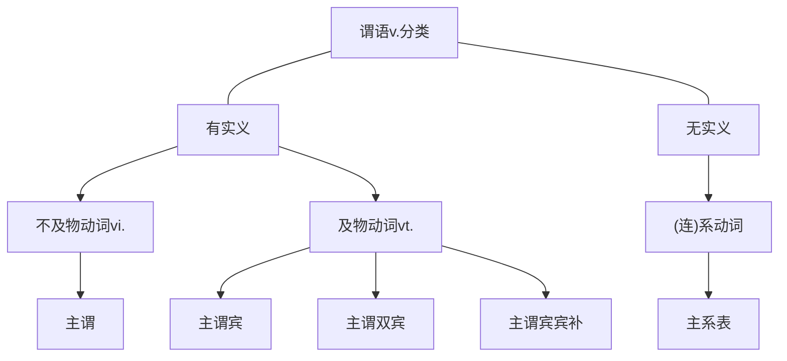

[2](D:\BaiduNetdiskDownload\01.简单句的核心构成（英语一）【公众号：研料库，料最全】.mp4)
- 在写作当中，想写出一个简单句，那么得先写核心，有了核心再慢慢加入补充、说明、修饰、限定的扩展成分就可以把一个句子由短到长的写出来。
- 在读句子的过程当中这个过程和写简单句是反过来的，因为在阅读当中我们经常遇到的一些长的句子，句子太长看不懂，可以先去掉补充说明修饰限定的扩展成分，先去找到这些核心，看懂之后再把这些补充的加回来。

- 在马克思与哲学当中有这样的一句话“世界（事物）的本质是物质的，物质是运动的。”因此想描述清楚一件事，要抓住最本质的两大要素——物质+运动，也就是n.+v.%%名词+动词%%，就可以把一件事情说清楚了，比如说：
	- 鸟飞。Birds fly.
	Birds(n.)+fly(v.)，先说鸟，在干什么？飞。这个时候名词+动词，物质+运动，就把一件事说清楚了。
	- 如果上升到语法的专业术语的话，n.+v.%%名词+动词%%=主语+谓语，在古汉语当中，“谓”表示说话，所以前面有了主语——说话的对象，后面有了谓语——说话的内容，这个时候就把一件事儿说清楚了。
	- 简单句描述的是一件事儿，由于是一件事儿，所以在一个句子当中，一个主语只能搭配一个谓语动词，多了不行少了也不行，一主搭配一谓，多了不行，没有谓语动词也不行，一主搭配一谓就能写出一个简单句。
	- 简单句最必要的核心就是一主一谓，但是除了这一主一谓之外，由于谓语动词的不同，这个简单句还可以再细分为5类：
		- 主+谓
		- 主+谓+宾
		- 主+谓+宾1+宾2%%主谓双宾%%
		- 主+谓+宾+宾补
		- 主+系+表
# 谓语v.分类

## 有实义的实义动词
- 实义动词是指一说到这个动作你就能想到它实实在在对应的这个动作的含义，比如说：
	- swim v.游泳  有游的动作
	- dance v.跳舞  有跳的动作
### 主谓、主谓宾
- 有实义动词v.
	- [[简单句的核心构成#^ogz3u2|不及物动词vi.→主谓]]
	- [[简单句的核心构成#^rzdr13|及物动词vt.→主谓宾]]
	- 不及物动词和及物动词最大的区别在于这个动作是不是能由主语独立的完成。
		- 如果主语可以独立的完成这个动作，它就不需要作用在别的人或物身上，既然不用作用在别的人、物身上，这个时候后面就不涉及别的人或物，这种时候就叫做不及物动词。比如： ^ogz3u2
			- Birds fly. 鸟飞。 飞这个动作是由鸟独立完成就行了，它不需要飞谁或飞什么，所以这种主语可以独立完成的动作，后面不涉及到别的对象的，这种就是不及物动词，一主一谓就够了，后面什么都不用再接了。
			- Everybody else loses.(2019,Reading Comprehension,Part B)
			每一个其他的人，他们都输了，失败了。
			“loses”失败，不需要接失败了谁、失败了什么，这些人失败了就完事儿了，主语独立完成一个动作，动作也没有作用在别的人或物身上，因此一主一谓就结束了。
			- Smaller species survived.(2006,Reading Comprehension,Part A Text 3)
			更小的，小小的种族%%种类%%，它们存活下来、幸存下来了。
			“suevived”幸存，不需要接别的了，就说它们幸存下来了就结束了。到主谓这里就截止了。
		- 有些动作就不能由主语独立完成，这个动作必须作用在别的人或物身上，比如： ^rzdr13
			- I love……  我爱……   说到这儿还没有结束，我爱谁啊？
			I love you. 我爱你。  这个时候就说完整了。这个时候就是及物动词，后面得要加上涉及到的对象，这个涉及到的对象就叫作宾语。
			- 一主一谓像是一对夫妻构成的小家庭，这个时候如果想再加一个人进来，它不能作主人，只能作宾客，所以叫“主谓宾”。
		- 如何判断一个动词及物不及物？
			- 有些动作肯定是及物的，比如说：
				- 打，“我打……”这句话没说完，得说打到了谁、打到了什么东西，后面得把涉及到的对象加上，否则这个动作就不能叫“打”，它只能叫挥手。
				- kiss vt.亲吻。  这个单词及物，“亲吻”这个动作必然得亲到人或者亲到什么东西，要不然只能叫“掘嘴”。
				- Everybody loves a fat pay rise.(2005,Reading Comprehension,Part A Text 1)
				“每个人都喜欢非常胖的薪水上涨。”→“每个人都喜欢非常丰厚的涨薪。”是典型的主谓宾结构。
				- In both cases,we need a rebalancing of power.(2020,Reading Comprehension,Part A Text 2)
				“在这两个案例中，我们需要力量的重新平衡。”这也是典型的主谓宾结构。
				- Yet science has a cultural history,too……（2017，Reading Comprehension,Part A Text 2）
				“科学有一个文化的历史。”也是及物vt.主谓宾结构。 ^ct0ims
				- Several of his staff members have military-intelligence backgrounds.(2003,Reading Comprehension,Part A Text 1)
					- “several of”表示“……当中的几个”。
					- “他的员工之中有几个有军事情报的背景。”与[[简单句的核心构成#^ct0ims|此句]]同样表示“有”，前者是第三人称单数的“has”，后者是“have”，同样都是动词“有”，同样都是主谓宾结构，怎么看起来这么不一样呢？其实这两个句子虽然单词不一样、意思不一样甚至长度、内容的深度、难度都不一样，但是他们的语法结构都一样，都是主谓宾结构——“谁（主）+有（谓）+什么（宾）”。
### 主谓双宾
[14:31](file:///D:/%5CBaiduNetdiskDownload%5C01.%E7%AE%80%E5%8D%95%E5%8F%A5%E7%9A%84%E6%A0%B8%E5%BF%83%E6%9E%84%E6%88%90%EF%BC%88%E8%8B%B1%E8%AF%AD%E4%B8%80%EF%BC%89%E3%80%90%E5%85%AC%E4%BC%97%E5%8F%B7%EF%BC%9A%E7%A0%94%E6%96%99%E5%BA%93%EF%BC%8C%E6%96%99%E6%9C%80%E5%85%A8%E3%80%91.mp4#t=871.375456)
主谓双宾：动词后面涉及两个对象
比如：I give you a book.

They gave justices permanent positions...(2012,Use of English)
他们给这些法官永久的职位。

...railroads charged all customers the same average rate...(2003,Reading Comprehension,Part A Text 3)
铁路对顾客收取相同的平均的费率。

双宾语的特点是一个宾语是谁，一个宾语是什么，可以理解为“人+物”，判断那些动词能接双宾语，看它能否同时接“人+物”，如果可以，那就证明能接双宾。

- 可以接双宾语的动词举例：
	- tell  tell sb sth.告诉某人某事。
	- send  send sb sth.寄给某人某物。

- 不可以接双宾语动词举例：
	- eat
		- 可以说eat sth.
		- 不可以说eat sb.
		- eat这个词不能同时接“人+物”，因此它就不能接双宾语。

双宾语接的“人+物”中的人并不一定是活人，它其实也可以指一些类似于人的对象，比如某一个机构、某一个公司、某一个政府。

- 主谓双宾结构有两种写法，表示“人”的宾语和表示“物”的宾语都有可能被放在前面。
	- They gave justices permanent positions...(2012,Use of English) 他们给法官永久的职位。
		- 现在的双宾语写法是“人+物”，人在前。
		- 还可以调过来，物在前，此时不能直接“物+人”，需要在“人”的前面加上一个介词“to”或者是“for”。
			- 如果表达的是方向性的，朝着哪个方向，用“to”。
			- 如果表达的是目的，用“for”。
		- 本句可以改为：They gave permanent positions to justices...
	- I bought you a gift.我过去买给你一个礼物。
		- I bought a gift for you.
		- 此时是为了你买，所以用介词“for”。

在英语语法中，双宾语还有一种分法，一个叫直接宾语，一个叫间接宾语。直接、间接的分法和前后位置没关系，“物”永远是直接宾语，因为这个动作是直接作用在“物”上面的然后间接传递给人的。但是这个知道与否不影响答题。

- 有的时候句子的结构虽然全了，但是意思并没有全：
	- I find Hongkong.
		- “我发现香港。”
		- 主谓宾全了，但是意思很奇怪，咱又不是哥伦布，还能发现个新大陆不成？
		- 所以这句话还没有说完，应该是“我发现香港怎么样”，虽然这句话结构全了，但是意思还缺一点儿。
		- 可以补充为“I find Hongkong beautiful.”我发现香港漂亮，这就是主谓宾宾补结构。
	- 宾补补充说明的是宾语。“宾补”的全称是“宾语补足语”，是补充说明宾语的。而且这个宾语和宾补有逻辑上的主谓关系。大白话是宾语和宾补合在一起能凑成一件事儿。

- 主谓宾宾补真题例句：
	- You always keep your eyes open...(2004,Reading Comprehension,Part A Text 1)
		- “You”→主语；“always”副词修饰动词，表示“你总是使”；“keep your eyes”谓语动词和宾语虽然已经写完了，意思不全；“open”为宾语补足语，睁开着。
		- 你使你的眼睛睁开着。实际翻译为：你时刻保持警惕着。
	- The spooks call it "open source intelligence,"...
		- spook 间谍
		- open source intelligence 公开来源的情报
		- “这个间谍称它为……”没说完，接着说“公开来源的情报”
		- 宾语是"it"，跟后面"open source intelligence"公开来源的情报正好能构成逻辑上的主谓；这个时候是主谓宾宾补
	- ...changes in the economy...make gainful employment increasingly difficult...(2004,Use of English)
		- gainful来自动词gain“获得”，gainful表示有收获的、丰厚的
		- employment可以表示就业、工作
		- increasingly difficult表示逐渐增加的困难，即越来越困难
		- 在经济上的改变使找到丰厚报酬的就业越来越困难。
		- "make sth 宾补"使……怎么样，是典型的主谓宾宾补的结构
## 无实义的动词
- 不是所有的动词都有对应的动作，比如：
	- 我是老师。这个“是”——“is”没有实实在在对应的动作。
	- become v.变得  也是动词，无实义。

主系表特殊在动词无实义，没有什么实际动作的含义，起到的是前后连系的作用，前后连系的作用也不可或缺。

我非常高兴。字对字翻译为"I very happy."不是一个完整的句子，因为中间缺了谓语动词，想构成一个句子必备的两大成分是名词+动词，一主搭配一谓，并且这一个谓语动词既不能多也不能少，所以句子当中没有谓语动词就构不成句子，所以要加一个谓语动词，同时又不能改变原意，如果加上一个实义动词比如"sing"虽然能够构成句子，但有一个巨大的问题就是改变了句子的意思，这个时候可以加（连）系动词。系动词既起到有动词构成句子的作用，同时它又没有任何的实义，只起到前后连系的作用，比如最典型的"be"，表示我现在非常高兴是"I am very happy."表示我过去非常高兴是"I was very happy."

这是一个危险的游戏。
This is a dangerous game...(2005,Reading Comprehension,Part A Text 2)

找到了系动词，就能够找到主系表句型，自然就能够找到后面的表语，甚至是一个句子作表语，找到表语从句。

- 主系表-系动词
	1. be动词  单独使用
		- 不是所有的be动词都是系动词，得是单独出现的，即一个句子当中，如果只有be动词这一个谓语动词，那么它就是系动词，主系表结构。
		- 如果它和别的动词一块出现，比如be doing、be done，那这个时候它就不是be动词，不是主系表。
			- I am a teacher. "am"是一个be动词，我是一个老师，只有"am"一个be动词，这是主系表。
			- I am teaching English. "am"、"teaching"两个动词，这里是be doing，be动词不是单独出现的，不是主系表结构。我教英语。这是一个主谓宾结构，只不过中间的谓语动词变成了进行时态。
	2. get become turn go grow  “变得”
		- 这5个词出现不一定是主系表，同时得表达“变得……”的含义，才是主系表结构。
			- He gets angry. 他变得生气。 "get"表示变得，为主系表。
			- He gets a new car.他得到一辆新车。 "get"表示得到，为主谓宾结构。
	3. look sound smell taste feel  感官动词
		- “看/听/闻/尝/感觉起来……”
		- 这些感官动词出现的时候不一定是主系表，得是表示“看起来怎么样”、“听起来怎么样”、“闻起来怎么样”
		- You look at me. 你看着我。不是“你看起来我”，不是主系表。
		- You look beautiful.你看起来漂亮。 是“看起来”，是主系表。
	4. seem appear/keep remain/prove
		- "seem appear"→“看起来似乎……”表示一种不确定性 You seem tired. 你似乎挺累的。
		- "keep remain" 保持着……，一直是……状态。
		- "prove" 证明出……

Trust is a tricky business.(2018,Use of English)
tricky 非常狡猾的，令人捉摸不透的
trust 信任
business 商业、事情
"is"是单个出现的"be"，是系动词，信任是令人捉摸不透的事。

...many discussions are not so successful.(2019,Reading Comprehension,Part B)
许多讨论并不是非常成功，这里只有一个谓语动词"are"，准确的说是"are not"，单个的动词"be"，所以是主系表。

...their behavior became markedly different.(2005,Reading Comprehension,Part A,Text 1)
behavior  行动
markedly different  极其的不同
became  "become"变得的过去式
他们的行为过去变得极其的不同。动词"become"表示"变得"主系表结构

This courageous attitude in fact becomes a requirement for the performers of Beethoven's music.(2014,Reading Comprehension,Part C)
courageous  有勇气的
attitude  态度
in fact  事实上，实际上
requirement  要求，条件
performer  表演者，来自动词"perform"
Beethoven's music  贝多芬的音乐
核心动词是"become"，"变得……"也是主系表结构。实际上这种有勇气的态度变成演奏贝多芬音乐演奏者的必要条件。

They look cute.(2005,Reading Comprehension,Part A Text 1)
他们看起来可爱。主系表结构。

And most folks still feel pretty comfortable about their ability...(2004,Reading Comprehension,Part A text 3)
most folks  大多数人
feel  感觉
comfortable  舒服
ability  能力
pretty  漂亮
这里的"pretty comfortable"不是表示既漂亮又舒服"，pretty单独出现可以作形容词表示漂亮的，相当于beautiful，比如you are pretty=you are beautiful，如果"pretty"后面加了别的形容词、副词，这个时候"pretty"表示副词，表示“很、非常的意思”。这里pretty comfortable=very comfortable，非常舒服的意思。you are pretty ugly=you are very ugly你非常丑。
大多数的人仍然对于自己的能力感觉非常舒服（字面）=大多数人仍然对自己的能力非常有信心。

The prospect seems remote.(2010,Reading Comprehension,Part A Text 1)
前景似乎是非常遥远=前景似乎是渺茫的。
"seem"表示不确定性

Nonetheless,unification of sorts remains a major goal.(2021,Reading Comprehension,Part C)
nonetheless  然而，但是
unification  统一化、统一性
sort  种类
sorts  很多种类
很多种类的统一性=多样化的统一
然而，很多种类的统一性仍然保持着是一个主要的目标。

...the retreat from predominance proved painful.(2000,Reading Comprehension,Passage 1)
retreat  退后，衰退
predominance  处于统治地位
prove  证实出
painful  很痛苦的
来自于统治地位、领先地位的衰退，证明出是非常痛苦的。

补充
The social sciences are flourishing.(2013,Reading Comprehension,Part B)
flourishing  繁荣、蓬勃发展
社会科学繁荣蓬勃发展。
这句话不是主系表结构，虽然有"are"这个be动词，但它不是单独出现的，"are flourishing",are doing是两个动词合在一起的。be动词只要不是单独出现的，它就一定不是主系表。are doing是从动词原型变为进行时态。
谓语动词是flourish，判断谓语动词可以把时态还原，即The social sciences floursh.的主谓结构。只不过这个谓语动词变成了进行时态。主谓结构谓语动词改变时态不改变主谓结构。